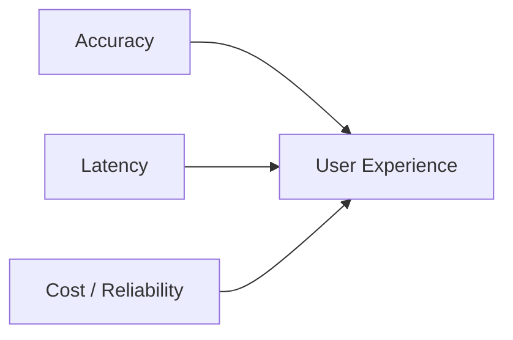

# Accuracy, Latency, Cost, and User Experience

## Force 1: Accuracy

Accuracy measures how often the model is correct. Higher accuracy enables:

- More reliable fraud detection
- Better search ranking
- Safer or fairer automated decisions

**Mechanics**: In many architectures, higher accuracy requires deeper networks, more parameters, and **higher cost per request**. Each extra percentage point of accuracy often brings disproportionate increases in latency and infrastructure spend.

**Key question**: Is this extra accuracy worth what it does to latency and cost?

---

## Force 2: Latency

Latency is the elapsed time between sending a request and receiving a prediction.

### Human Perception Thresholds

| Latency range | User perception |
|---------------|-----------------|
| ~100–200 ms | Feels almost instant |
| ~500 ms – 1 s | Noticeable delay |
| > 1–2 s | Slow, frustrating interface |

Users never see offline metrics like AUC or F1. They **feel** whether the product is responsive. That is why latency is a powerful — and sometimes invisible — force in the trade-off space.

### Accuracy vs Latency: A Concrete Comparison

| | Model A | Model B |
|---|---------|---------|
| Accuracy | ~1–2 pp higher | Slightly lower |
| Speed | 3× slower | Much faster |
| Offline leaderboard | Looks like winner | Looks inferior |

In production, Model B may be correct if:

- Model A breaks the P95 latency target
- Model B keeps the experience snappy
- Model B handles more traffic on the same hardware

**Model engineering often chooses a model that is "good enough" on accuracy but much better on latency and cost.**

---

## Force 3: Cost

Cost is driven by:

- Number and type of machines (GPU vs CPU)
- Storage and network usage
- Engineering effort to maintain the system

Pushing latency lower often requires **more replicas** or **more powerful instances** — both increase monthly cloud bills.

**Key question for every change**: Is the extra accuracy or lower latency worth the increase in cost for this product or user segment?

---

## Force 4: User Experience (UX)

UX combines:

- How fast the system **feels**
- How often it is **right**
- How often it **fails or times out**
- Whether users **trust** it

| System profile | UX outcome |
|----------------|------------|
| Perfectly accurate, painfully slow | Bad UX |
| Fast but often wrong | Bad UX |
| Slightly lower accuracy + good latency + reliability | Often **best** UX |

UX is where accuracy, latency, cost, and reliability become **visible** to users and the business.

---

## Common Pitfalls / Exam Traps

- **Trap**: Choosing the offline leaderboard winner without checking P95 latency under production load.
- **Trap**: Using average latency instead of P95/P99 — tail latency drives perceived slowness.
- **Trap**: Assuming users value marginal accuracy gains they cannot perceive.
- **Trap**: Forgetting that cost and latency are coupled — cheaper often means slower unless architecture changes.

---

## Quick Revision Summary

- Accuracy improves with model complexity but raises latency and cost per request.
- Human UX is sensitive to latency: ~100–200 ms feels instant; >1 s feels slow.
- Users feel responsiveness, not AUC — latency is an invisible but critical force.
- Cost scales with replicas, instance type, and engineering overhead.
- UX synthesises speed, correctness, reliability, and trust — it is the ultimate product metric.
