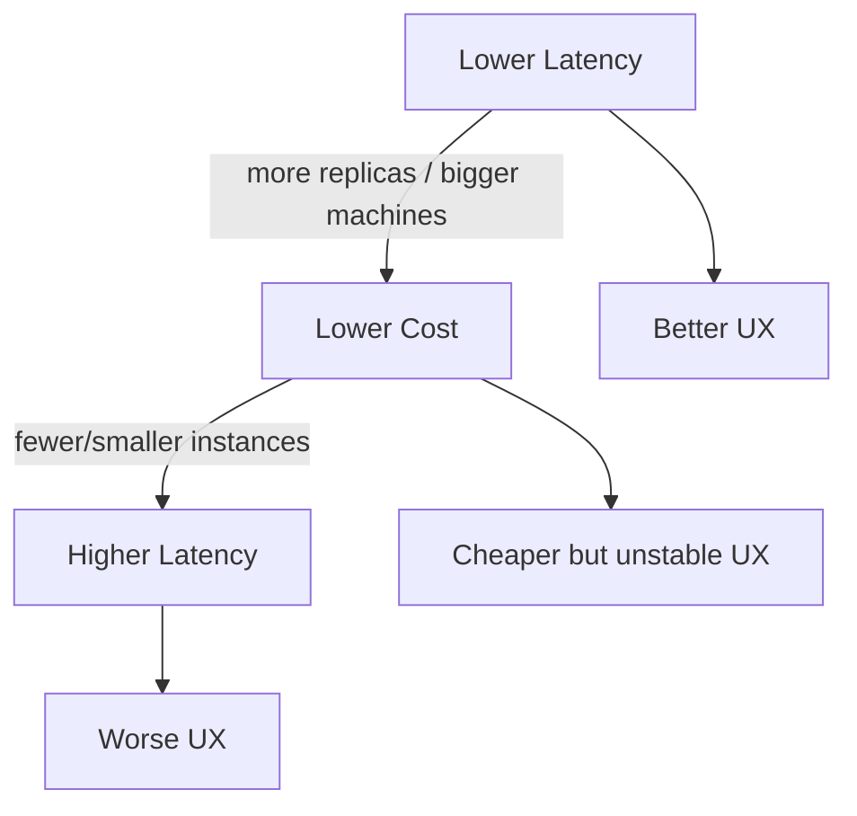
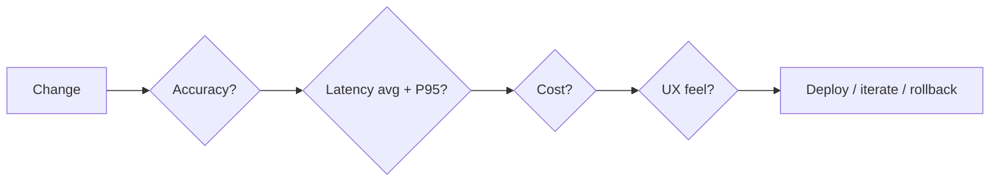

# The Latency–Cost–UX Triangle

## Three Forces in Tension

Accuracy was covered separately; three operational forces form a tight triangle:

| Goal | Typical action | Effect on cost | Effect on UX |
|------|----------------|----------------|--------------|
| Reduce latency | Add replicas or upgrade to GPU/larger instances | Increases | Improves (if sized correctly) |
| Reduce cost | Shrink instances or reduce replica count | Decreases | Degrades if taken too far — jitter, timeouts, instability |

Under load, under-provisioned systems see rising latency, rising error rates, and violated SLOs — all visible as poor UX.

Scaling patterns (vertical, horizontal, autoscaling) and cost levers (spot, serverless, batching) exist to navigate this triangle more intelligently.

---

## The Four-Question Checklist

For **any** production change — new model, config change, infrastructure change — answer:

| Question | What to measure |
|----------|-----------------|
| **Accuracy** | Did offline/online quality metrics go up, down, or stay flat? By how much? |
| **Latency** | What happened to **average** and **P95** latency? |
| **Cost** | Impact on cost per request and monthly bills? |
| **User experience** | Does the change feel snappier, more helpful, or more frustrating? |

If you cannot answer all four, you may be missing an important effect.

---

## Practical Application

**Example — new model version**:

1. Offline: accuracy +1.5 pp
2. Staging load test: P95 latency +40%
3. Cost: same replica count but each request uses 40% more GPU time → effective cost up
4. UX: checkout flow feels sluggish → conversion risk

Without the four-question checklist, the team might ship based on accuracy alone.

---

## Common Pitfalls / Exam Traps

- **Trap**: Measuring only average latency — P95/P99 drive SLA violations and user frustration.
- **Trap**: Reducing cost without load testing — instability under spikes destroys UX.
- **Trap**: Adding replicas to fix latency without checking cost per request at target QPS.
- **Trap**: Skipping the UX question because metrics "look fine" — qualitative feel matters for product flows.

---

## Quick Revision Summary

- Latency, cost, and UX form a triangle: lower latency usually costs more; aggressive cost cuts raise latency and hurt UX.
- Use a **four-question checklist** (accuracy, latency, cost, UX) for every production change.
- Always track both average and P95 latency.
- Inability to answer all four questions signals a blind spot in the change evaluation.
