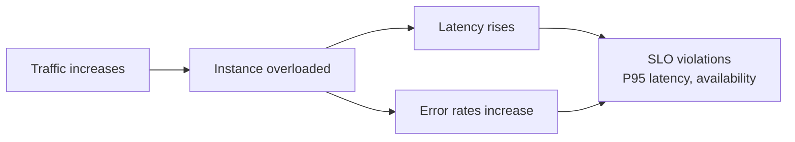
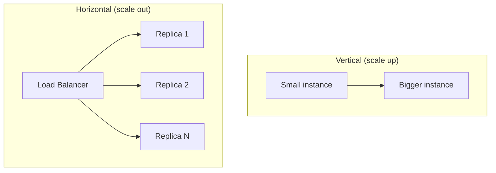

# Why ML Services Need to Scale

## From Trade-Offs to Capacity

The four-way tug-of-war (accuracy, latency, cost, UX) sets the constraints. When traffic grows, a separate question emerges: **how do we keep latency and UX under control without blowing up cost?**

Three classical patterns address this:

1. **Vertical scaling (scale up)** — bigger machine
2. **Horizontal scaling (scale out)** — more replicas + load balancer
3. **Autoscaling** — dynamic replica count based on load metrics

Each pattern ties back to latency, cost, and UX.

---

## Why Scaling Matters

Real ML APIs do not see flat, predictable traffic. They see:

- Spikes during marketing campaigns or major events
- Daily/weekly usage patterns
- Steady growth as the product succeeds

### What Happens With a Fixed Single Instance

If capacity is fixed while load grows:

- Latencies rise as the instance saturates
- Error rates can increase (timeouts, queue overflow)
- SLOs on P95 latency and availability are violated

**Scaling** adds capacity in a controlled way so latency and error rates stay within targets as load changes.

---

## Two Fundamental Ways to Add Capacity

| Pattern | Mechanism | Mental model |
|---------|-----------|--------------|
| **Vertical scaling** | Replace existing machine with a bigger one (more CPU, RAM, GPU) | One stronger box |
| **Horizontal scaling** | Run multiple copies of the service; load balancer distributes traffic | Many identical boxes |

Both aim to increase **requests per second** the system can handle while keeping latency acceptable.

---

## Connection to the Four Forces

| Force | Scaling impact |
|-------|----------------|
| Latency | More capacity → lower queueing delay under load |
| Cost | More/bigger instances → higher spend (unless offset by efficiency levers) |
| UX | Stable latency under spikes → reliable product feel |
| Accuracy | Scaling does not change model quality — but enables serving the chosen model at required speed |

---

## Common Pitfalls / Exam Traps

- **Trap**: Assuming traffic is flat — ML services almost always have spikes and growth curves.
- **Trap**: Confusing vertical and horizontal scaling — they have different failure modes and cost profiles.
- **Trap**: Scaling without SLO targets — "add more machines" without knowing P95 target is guesswork.
- **Trap**: Believing scaling fixes a slow model — a 3× slower model needs 3× capacity for the same latency.

---

## Quick Revision Summary

- ML traffic is spiky and grows over time; fixed capacity leads to rising latency and SLO violations.
- **Vertical scaling**: bigger machine — simple but limited.
- **Horizontal scaling**: more replicas + load balancer — standard at scale.
- **Autoscaling**: dynamically adjusts replica count based on metrics.
- Scaling keeps latency/UX stable under load; cost must still be managed deliberately.
