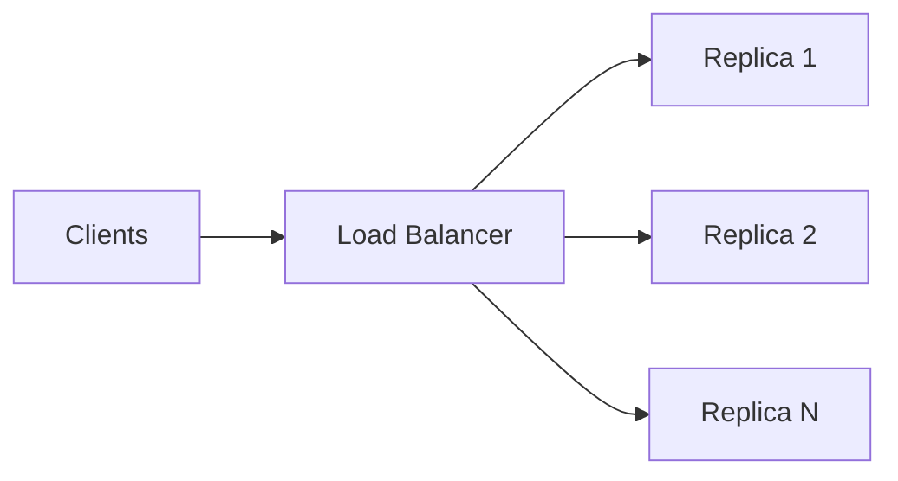
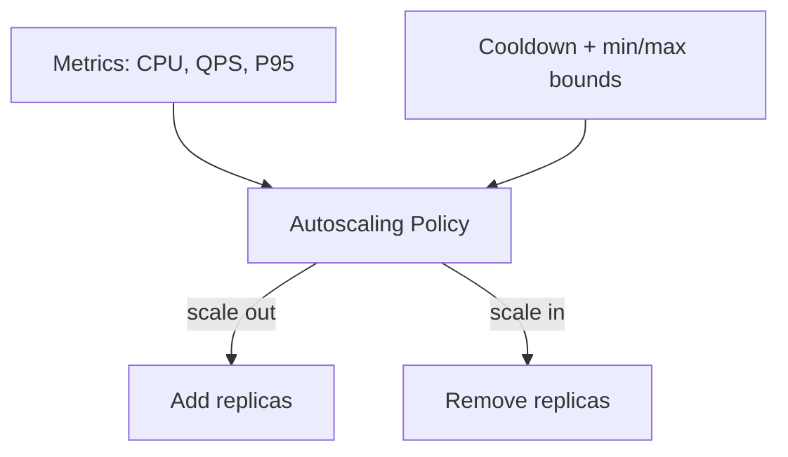

# Vertical Scaling, Horizontal Scaling, and Autoscaling

## Vertical Scaling (Scale Up)

**Mechanism**: Run the existing service on a **bigger machine** — more vCPUs, more memory, optionally adding a GPU where none existed before.

### Advantages

- Minimal application code changes
- Architecture stays largely the same
- Natural first step for small teams or new products

### Trade-offs

| Pros | Cons |
|------|------|
| Easy to implement | Hard upper limit on single-machine size |
| Manage one (or few) instances | Single point of failure — if the box dies, service is down |
| Fine for prototypes and low–medium traffic | Large instances often have **worse price/performance** per CPU/RAM unit |
| Quick latency win for small systems | Eventually impossible or not cost-effective to scale further |

At some point, vertical scaling hits a ceiling — that is when horizontal scaling becomes necessary.

---

## Horizontal Scaling (Scale Out)

**Mechanism**: Run **multiple replicas** of the same model service. A **load balancer** distributes incoming requests across replicas.

### Benefits

- Higher total throughput — latency stays low when many requests arrive concurrently
- **High availability** — if one replica crashes or restarts, others continue serving
- Backbone of most production ML services at scale
- Gradual growth: 2 → 3 → 10 replicas as traffic increases

### Challenges

| Challenge | Why it matters |
|-----------|----------------|
| **State management** | In-memory cache or session state on one instance must move to shared external store (Redis, DB) |
| **Deployment coordination** | Rolling deploys, health checks, version consistency across replicas |
| **Cost control** | Unlimited replica growth → runaway cloud bills |

---

## Autoscaling

**Mechanism**: Automatically adjust replica count based on observed metrics.

### Common Trigger Metrics

- **CPU utilisation** — e.g. scale out when average CPU > 70%
- **QPS** (queries per second) — scale when request rate exceeds threshold
- **Latency** — e.g. P95 latency exceeds target

### Configuration Parameters

| Parameter | Purpose |
|-----------|---------|
| Minimum replicas | Always-on baseline capacity |
| Maximum replicas | Cost ceiling — prevent runaway spend |
| Scale-out threshold | When to add capacity |
| Scale-in threshold | When to remove capacity |
| Cooldown period | Wait time between scale events |

Autoscaling **matches capacity to load dynamically** — the standard approach for handling spikes with horizontal scaling.

### Flapping: The Autoscaling Failure Mode

If the system reacts too aggressively to tiny spikes:

- Rapid scale-out followed by scale-in
- Instances constantly starting and stopping
- **Cost and stability both suffer**

### Safeguards

- Cooldown periods (e.g. wait several minutes between scale events)
- Rolling averages or percentiles — not single outlier data points
- Sensible min/max replica bounds
- Strong monitoring (metrics and alerts) to tune rules

---

## Pattern Comparison

| Pattern | Best for | Latency under load | Availability | Cost profile |
|---------|----------|-------------------|--------------|--------------|
| Vertical | Small/medium traffic, quick wins | Good until machine saturates | Single point of failure | Expensive at top tier |
| Horizontal | High sustained traffic, HA requirements | Stable with enough replicas | High — replica redundancy | Grows with replica count |
| Autoscaling + horizontal | Spiky or growing traffic | Adapts to load | High | Variable — must cap max replicas |

---

## Common Pitfalls / Exam Traps

- **Trap**: Using vertical scaling indefinitely — every machine has a size limit and diminishing returns.
- **Trap**: Horizontal scaling without shared state strategy — sticky sessions break when replicas restart.
- **Trap**: Autoscaling on raw CPU spikes without cooldown → flapping.
- **Trap**: Setting max replicas too high or unlimited — cost explosion during misconfigured alerts.

---

## Quick Revision Summary

- **Vertical scaling**: bigger box — simple, limited, single point of failure.
- **Horizontal scaling**: more replicas + load balancer — standard at scale, needs state and deploy coordination.
- **Autoscaling**: dynamic replica count from CPU, QPS, or P95 triggers — requires min/max bounds and cooldowns.
- **Flapping** = rapid scale in/out from over-sensitive rules — hurts cost and stability.
- Good monitoring is essential for sensible autoscaling policy design.
