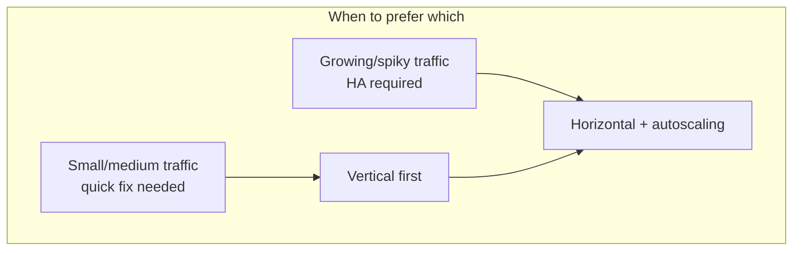
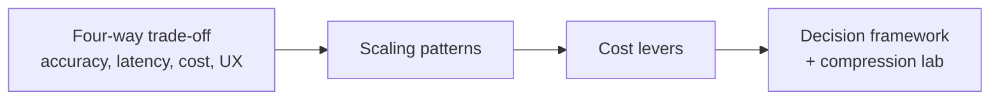

# Scaling Patterns Compared: Latency, Cost, and Stability

## Side-by-Side Pattern Evaluation

| Pattern | Latency impact | Cost impact | Best stage / traffic |
|---------|----------------|-------------|----------------------|
| **Vertical scaling** | Quick improvement for small–medium systems | Large instances can be expensive per unit; ceiling exists | Early product, moderate traffic |
| **Horizontal + autoscaling** | Keeps P95 more stable as load grows | Grows with replica count — needs upper limits | Spikes, high sustained traffic |

**Choice depends on**: product stage, traffic pattern, and budget — not a one-size-fits-all answer.

---

## Vertical Scaling in Context

- Often the **fastest** way to improve latency for small-to-medium systems
- Requires no architectural rewrite
- Eventually hits technical limits and poor marginal economics
- Single point of failure unless paired with redundancy patterns

---

## Horizontal Scaling + Autoscaling in Context

- **Standard** for production ML at scale
- Absorbs traffic spikes while targeting stable P95 latency
- Must watch **total replica count** and enforce **max replica caps** for cost control
- Needs mature monitoring to avoid flapping and under/over-provisioning

---

## Bridge to Cost Optimisation

Scaling keeps systems fast under load but **directly affects cost**. The next layer of optimisation includes:

| Lever | Role |
|-------|------|
| **Spot / preemptible instances** | Discounted compute with interruption risk — batch and non-critical workloads |
| **Serverless inference** | Pay-per-invocation — spiky, low-volume workloads |
| **Batching / micro-batching** | Improve GPU/CPU utilisation — lower cost per request |

These levers connect back to latency, reliability, and UX — not just the cloud bill.

---

## End-to-End Picture

Scaling patterns are the **backbone** of how production ML systems stay fast and reliable as they grow. Cost levers and decision frameworks sit on top to make that growth **sustainable**.

---

## Common Pitfalls / Exam Traps

- **Trap**: Jumping to horizontal scaling for a prototype with 10 RPS — vertical may suffice and be simpler.
- **Trap**: Autoscaling without max replica limit — financial incident waiting to happen.
- **Trap**: Treating scaling as separate from cost optimisation — they are coupled decisions.
- **Trap**: Forgetting that spot/serverless/batching address different workload shapes than core online API scaling.

---

## Quick Revision Summary

- Vertical scaling: quick latency win for small systems; hits limits and cost inefficiency at scale.
- Horizontal + autoscaling: standard for spikes and high traffic; stabilises P95 with proper caps.
- Pattern choice depends on stage, traffic shape, and budget.
- Cost levers (spot, serverless, batching) complement scaling — they do not replace it.
- Scaling + cost optimisation + decision framework form the full production engineering toolkit.
