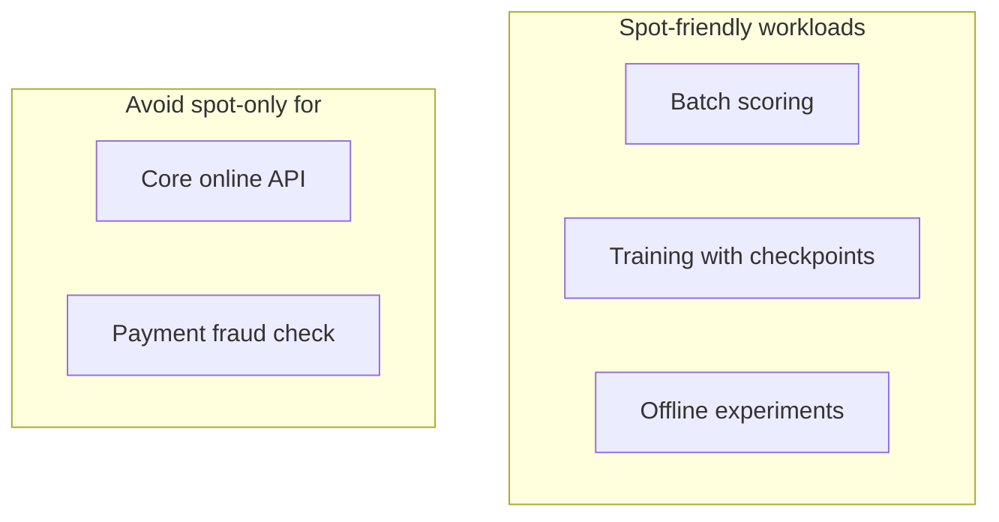

# Inference Cost and Spot / Preemptible Instances

## Where Inference Cost Comes From

Before optimising cost, identify the drivers:

| Cost driver | Description |
|-------------|-------------|
| **Compute** | Number and type of machines (GPU vs CPU instances) — usually the largest line item |
| **Idle capacity** | Instances running but underutilised — paying for unused headroom |
| **Network & storage** | Data movement, model artefacts, logs |
| **Engineering time** | Maintenance, incident response, pipeline upkeep |

**Goal**: Pay only for capacity actually needed and use that capacity as efficiently as possible.

---

## Cloud Compute Pricing Models

| Model | Commitment | Price | Best for |
|-------|------------|-------|----------|
| **On-demand** | None — pay as you go | Highest per-hour rate | Flexible, latency-critical core services |
| **Reserved / committed use** | 1–3 year commitment | Discounted vs on-demand | Steady, predictable load |
| **Spot / preemptible** | None — but interruptible | Heavily discounted (often 60–90% off) | Fault-tolerant batch and offline work |

---

## Spot / Preemptible Instances

**Mechanism**: Cloud provider offers spare capacity at steep discount. Provider can **reclaim instances with short notice** when capacity is needed elsewhere.

### Why They Are Attractive

- Often **much cheaper** than on-demand for equivalent compute
- Ideal when work can be **retried or resumed**

### The Reliability Trade-off

Interruption hurts:

- Low-latency online APIs that must always be available
- User-facing prediction paths with strict SLAs
- UX — sudden capacity loss → latency spikes or errors

### Good Use Cases

- **Batch jobs** that can restart from checkpoints
- **Offline scoring** — nightly churn prediction, backfills
- **Training jobs** with checkpoint resume
- **Non-urgent experiments**

---

## Hybrid Pattern: Base + Burst

A common production pattern:

1. **On-demand or reserved** instances for the **core online service** — guaranteed availability and responsiveness
2. **Spot instances** for non-urgent tasks — batch scoring, backfills, experiments
3. **Mixed overflow** — spot as extra capacity during heavy load, with graceful degradation if interrupted

This captures **some cost savings** without putting critical user experience at excessive risk.

| Layer | Instance type | Purpose |
|-------|---------------|---------|
| Core online API | On-demand / reserved | Always available, low latency |
| Batch / offline | Spot / preemptible | Cost-efficient throughput |
| Overflow (optional) | Spot | Extra capacity; system survives interruption |

---

## Connection to the Four Forces

| Force | Spot instance impact |
|-------|---------------------|
| Cost | Major reduction for eligible workloads |
| Latency | Unpredictable if interruption mid-job — fine for batch, bad for online |
| UX | Online spot-only → reliability risk; batch spot → invisible to users |
| Accuracy | Unaffected — cost lever, not model lever |

---

## Common Pitfalls / Exam Traps

- **Trap**: Running latency-critical API entirely on spot — interruptions violate availability SLOs.
- **Trap**: Using spot for stateful jobs without checkpointing — lost work on preemption.
- **Trap**: Ignoring idle capacity cost — reserved/on-demand over-provisioning wastes money too.
- **Trap**: Confusing spot with serverless — spot is discounted VMs; serverless is pay-per-invocation functions.

---

## Quick Revision Summary

- Inference cost is dominated by compute, idle capacity, network/storage, and engineering overhead.
- **On-demand**: flexible, most expensive; **reserved**: cheaper for steady load; **spot**: cheapest, interruptible.
- Spot suits batch, offline scoring, training with checkpoints — not sole infrastructure for critical online APIs.
- Hybrid pattern: on-demand core + spot for batch/overflow balances cost and reliability.
- Cost levers must be evaluated against latency and UX, not just monthly bills.
