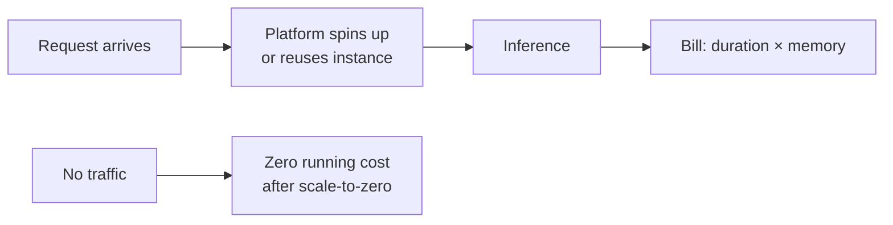

# Serverless Inference

## What Serverless Inference Is

Deploy the model as a **serverless function**. The cloud platform:

- Provisions instances automatically
- Scales active instance count up and down with traffic
- Bills per **request**, **execution time**, and **memory** allocated

**Core idea**: Pay only when code is actually running — no charge for idle servers.

---

## When Serverless Fits Well

| Workload shape | Why serverless works |
|----------------|---------------------|
| **Spiky traffic** | Scales to zero between spikes — no idle cost |
| **Low average volume** | Cheaper than 24/7 dedicated instances |
| **Prototypes & internal tools** | No server management overhead |
| **Unpredictable demand** | Platform handles capacity planning |

---

## Benefits vs Trade-offs

| Benefits | Trade-offs |
|----------|------------|
| No server management | **Cold starts** — first request after idle period is slower while platform cold-boots the function |
| Built-in autoscaling | Memory, execution time, and package size limits |
| Pay-per-use economics | **Vendor lock-in** — provider-specific config and integration |
| Ideal for sporadic workloads | Less control over hardware (GPU availability varies by provider) |

### Cold Start Impact

After a period of no traffic, the first request incurs extra latency while the platform:

- Allocates compute
- Loads the model into memory
- Initialises the runtime

For **latency-critical paths with strict SLAs**, cold starts can violate P95 targets unless mitigated (provisioned concurrency, keep-warm pings, hybrid architecture).

---

## Serverless vs Dedicated Service

| Dimension | Serverless | Dedicated cluster |
|-----------|------------|-------------------|
| Idle cost | Near zero (scale to zero) | Always paying for running instances |
| Cold start | Yes — variable first-request latency | No — model always loaded |
| Max latency control | Limited — platform-dependent | Full — sized replicas, warm pools |
| Ops burden | Low | Higher — capacity planning, patching |
| Best traffic | Spiky, low volume | Constant, high QPS |

---

## Real-World Example

An internal model evaluation tool called a few times per hour:

- **Dedicated service**: paying 24/7 for an instance that is idle 99% of the time
- **Serverless**: pay only for the few seconds of inference per call — dramatically lower cost

Contrast with a payment fraud API at thousands of QPS — dedicated horizontally scaled service with warm replicas is typically appropriate.

---

## Connection to the Four Forces

| Force | Serverless effect |
|-------|-------------------|
| Cost | Excellent for low/spiky traffic; can exceed dedicated cost at very high sustained QPS |
| Latency | Cold starts hurt tail latency; warm paths can be competitive |
| UX | Fine for async/internal; risky for sub-100 ms user-facing flows without mitigation |
| Accuracy | Unchanged — infrastructure choice only |

---

## Common Pitfalls / Exam Traps

- **Trap**: Using serverless for high-QPS GPU inference without checking limits — memory/time caps may block deployment.
- **Trap**: Ignoring cold start in SLA planning — P95 measured only on warm requests misleads.
- **Trap**: Assuming serverless is always cheaper — at sustained high traffic, reserved dedicated instances often win.
- **Trap**: Large model artefacts exceeding deployment package limits — may require external model storage + lazy load.

---

## Quick Revision Summary

- Serverless inference: model as a function; platform scales and bills per use.
- Best for spiky, low-volume, prototype, and internal workloads.
- **Cold starts**, resource limits, and vendor lock-in are the main trade-offs.
- Latency-critical online APIs need careful evaluation of cold-start impact on P95.
- At high sustained QPS, dedicated services with autoscaling often outperform serverless economically.
