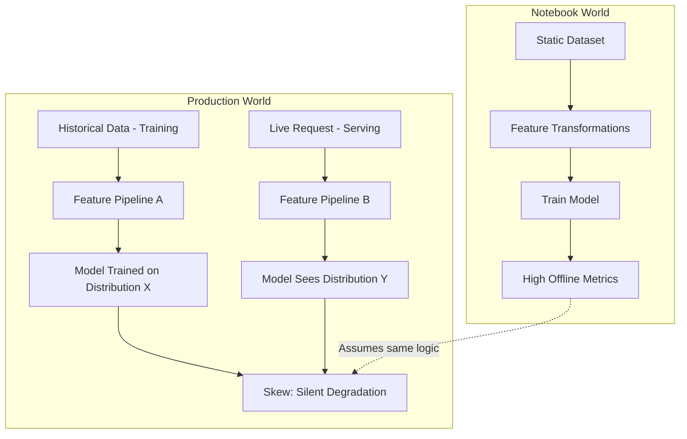

# Feature Engineering in Production: Module Introduction

## Beyond the Notebook

Feature engineering in a Jupyter notebook feels straightforward: load a CSV, transform columns, train a model, inspect metrics. That workflow assumes a **static dataset**, a **single compute environment**, and **no serving path**. Production ML breaks all three assumptions.

The central problem this module addresses is **training-serving skew** — a silent failure mode where features are computed one way during training and differently during inference. Offline evaluation looks excellent; production performance collapses, with no obvious error in logs.

---

## Why Notebook Feature Engineering Is Insufficient

In a notebook, feature engineering typically covers:

- Scaling or normalising numeric columns
- Encoding categories (one-hot, label encoding)
- Bucketing continuous values (age, income)
- Computing aggregations (counts, sums, averages, ratios)

This works on an in-memory DataFrame from a **snapshot** of data. The model never leaves the notebook. There is no second code path, no latency budget, and no freshness requirement.

Production introduces a **dual-world problem**:

| Dimension | Training | Serving |
|-----------|----------|---------|
| Data volume | Millions of rows, batch | One entity per request |
| Compute pattern | Heavy joins, aggregations | Fast lookup or lightweight transform |
| Latency budget | Minutes to hours | Milliseconds (often 10–20 ms total) |
| Freshness | As of last batch run | Recent minutes/hours of activity |
| Code location | Notebook, Spark job, SQL | API service, microservice |

The same feature — e.g., `customer_30d_avg_spend` — must be **semantically identical** in both worlds, yet **operationally optimised** for each.

---

## The Two Production Constraints

### 1. Consistency

A feature must mean the same thing whether computed over historical data for training or retrieved for a single live request. Divergence in code path, time window, data source, or filter logic produces **training-serving skew**. The model learns weights and thresholds against one distribution; production feeds another.

### 2. Performance and Freshness

Training pipelines can afford multi-way joins on billion-row tables. Serving cannot run warehouse-scale aggregations per request. The architectural response is **precomputation**, **caching**, and dedicated **online feature infrastructure**.

---

## Module Roadmap

This module builds a complete mental model for production feature engineering:

1. **Training-serving skew** — definition, causes, and debugging difficulty
2. **Offline vs online features** — separate compute patterns for the same feature concept
3. **Feature stores** — central systems that define features once and materialise them consistently
4. **Ecosystem tools** — Feast, Tecton, Hopsworks as implementations of a stable pattern
5. **Organisational benefits** — reusability, metadata, lineage, governance
6. **Hands-on labs** — pandas offline tables, Python-dict online stores, skew demonstration and fix

---

## Real-World Stakes

A churn model trained on 30-day spend patterns deployed with a serving team that accidentally computes 7-day spend will:

- Return predictions with no HTTP errors
- Show features present in every log line
- Pass offline backtests
- Underperform on conversion, retention, or fraud KPIs

The root cause is architectural, not model quality. Feature stores exist to make this class of bug structurally impossible.

---

## Common Pitfalls / Exam Traps

- **"Good features = good production model"** — Feature quality without consistency across training and serving is worthless.
- **Assuming notebook logic ports directly** — Batch group-by on a full DataFrame is not equivalent to per-request aggregation.
- **Debugging skew via model retraining** — Retraining cannot fix a serving pipeline that computes different semantics.
- **Treating skew as a data drift problem** — Skew is a *pipeline* mismatch, not a natural distribution shift over time.
- **Ignoring the two-world split** — Any production feature design must explicitly address both offline and online paths.

---

## Quick Revision Summary

- Notebook feature engineering operates on static snapshots with no serving counterpart.
- Production splits feature computation into **training (batch)** and **serving (real-time)** worlds.
- **Training-serving skew** occurs when these worlds compute features differently despite sharing names.
- Skew silently degrades model quality while offline metrics remain strong.
- Two core production constraints: **consistency** (same semantics) and **performance/freshness** (latency, precomputation).
- Feature stores are the architectural answer to enforcing a single source of truth.
- This module covers theory (skew, offline/online, stores, governance) and labs (pandas + dict simulation).
