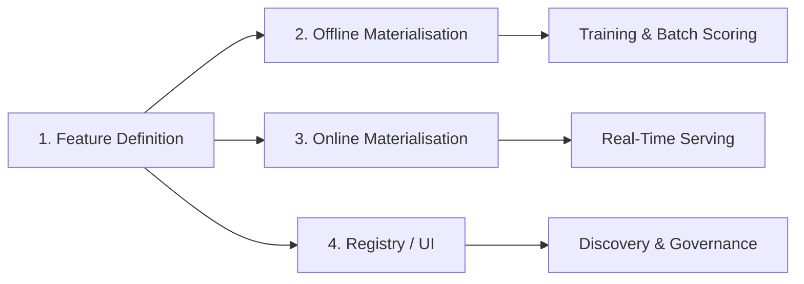

# The Common Feature Store Pattern: Practical Takeaways

## The Universal Pattern

Stepping back from Feast, Tecton, and Hopsworks, all feature stores implement the same core workflow:

1. **Define** features in code or configuration
2. **Materialise** to offline store for training
3. **Materialise** to online store for serving
4. **Maintain** a registry for discovery and management

Where tools differ: self-hosted vs managed, ecosystem integrations, UI richness, governance depth. The pattern is constant.

---

## What Model Engineers Should Recognise

### Situations Where Feature Stores Make Sense

| Signal | Why a Feature Store Helps |
|--------|--------------------------|
| Repeated training-serving skew incidents | Enforces single definition across paths |
| Many teams reimplementing same features | Central registry + reuse eliminates duplication |
| Growing low-latency online feature demand | Built-in online materialisation and serving API |
| Multi-model feature sharing | One definition serves churn, fraud, recommendation models |
| Compliance and access control needs | Governance layer for sensitive features |

### Questions to Ask About Any Feature Store

Regardless of vendor, a model engineer should be able to answer:

1. **Where do feature definitions live?** — Code repo, YAML, UI, or all three?
2. **How are offline and online views kept in sync?** — Same definition, different materialisation, or separate definitions?
3. **What does the registry/catalogue look like?** — Searchable? Metadata? Lineage?
4. **How do we add new features safely?** — Versioning, testing, staged rollout, deprecation?

These questions transfer to Feast, Tecton, Hopsworks, or a custom internal platform.

---

## Vendor Comparison: What Actually Differs

| Differentiator | Examples |
|----------------|----------|
| Hosting model | Self-hosted (Feast) vs fully managed (Tecton) |
| Data ecosystem | BigQuery-native vs Snowflake-native vs lakehouse |
| Serving ecosystem | SageMaker, Databricks, custom K8s |
| UI and governance | Minimal registry vs enterprise dashboards |
| Streaming depth | DIY vs native Kafka/Kinesis integration |
| Platform scope | Feature store only vs full ML platform (Hopsworks) |

**What does NOT differ**: the define-once, materialise-twice, serve-via-API pattern.

---

## Organisational Layer Preview

Technical consistency (offline/online) is necessary but not sufficient. The next layer covers:

| Topic | Value |
|-------|-------|
| **Reusability** | Features as shared assets across models |
| **Metadata** | Owner, schema, freshness, quality status |
| **Lineage** | Upstream sources → features → downstream models |
| **Governance** | Access control, PII policies, versioning, lifecycle |

A feature store is not just infrastructure — it is an organisational platform for reliable, responsible ML.

---

## Lab Connection

Hands-on labs simulate a minimal feature store:

| Component | Lab Implementation | Production Equivalent |
|-----------|-------------------|----------------------|
| Offline store | pandas DataFrame | BigQuery / Parquet |
| Online store | Python dictionary | Redis / DynamoDB |
| Feature definition | Shared Python function | Feast feature view / Tecton definition |
| Skew demo | 7-day vs 30-day bug | Real-world team divergence |
| Fix | Import shared function | Feature store materialisation |

The labs make training-serving skew tangible and demonstrate how a shared definition eliminates it.

---

## Adaptability Principle

The goal is not expertise in one tool. The goal is **pattern recognition**:

- See a system with feature definitions + offline store + online store + registry → recognise it as a feature store
- Evaluate any implementation against the four building blocks
- Adapt practices from Feast/Tecton/Hopsworks to whatever platform your organisation uses

---

## Common Pitfalls / Exam Traps

- **Treating vendor choice as the core learning objective** — Pattern recognition and good questions matter more.
- **Assuming managed platforms eliminate feature engineering work** — Definitions, semantics, and quality are always human responsibilities.
- **Ignoring the organisational layer** — Technical consistency without governance still leads to misuse and duplication.
- **"We built a Redis cache, so we have a feature store"** — A cache without a registry, shared definitions, and offline path is not a feature store.
- **Not asking about sync mechanisms** — The most important question for any platform: how do offline and online stay consistent?

---

## Quick Revision Summary

- Universal pattern: define → offline materialise → online materialise → registry.
- Vendor differences: hosting, integrations, UI, governance — not core architecture.
- Model engineers should recognise when feature stores are needed and ask four key questions.
- Organisational benefits (reuse, metadata, lineage, governance) extend beyond technical consistency.
- Labs simulate the pattern with pandas + dict + shared function.
- Adaptability: recognise the pattern in any tool, including custom internal platforms.
