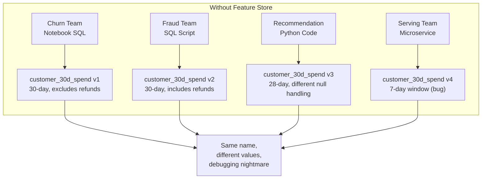
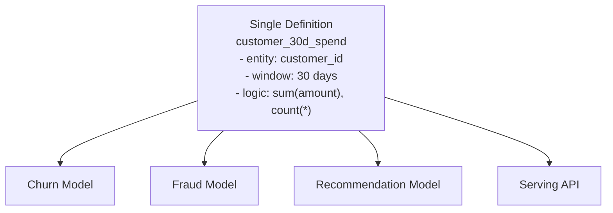

# Feature Reuse: Solving Duplication and Inconsistency

## The Organisational Problem

Technical consistency (offline/online sync) solves training-serving skew. But without a feature store, organisations face a parallel problem: **the same feature is implemented multiple times** by different teams, with slightly different logic each time.

A feature store is not just infrastructure — it turns features into **reusable, governed organisational assets**.

---

## The Pain Without a Feature Store

### Symptoms

| Symptom | Impact |
|---------|--------|
| 3–4 versions of "the same" feature | Inconsistent model inputs across teams |
| Copy-paste ETL code | Duplicated effort, divergent bug fixes |
| Same feature name, different semantics | Numbers don't match across dashboards and models |
| No single owner | Nobody responsible when values change unexpectedly |
| Slow onboarding | New use cases rebuild features from scratch |

---

## Features as Reusable Assets

A feature store inverts the pattern:

### How Reuse Works

1. **Define once** — `customer_30d_spend` specified with entity key (`customer_id`), event time column, 30-day aggregation window, and transformation logic in code or configuration.
2. **Register** — feature enters the catalogue with metadata (owner, schema, description).
3. **Reuse** — any model or team references the same definition.
4. **Materialise** — offline for training, online for serving, from the same source.

### Benefits

| Benefit | Description |
|---------|-------------|
| Reduced duplication | One ETL pipeline, not four |
| Fewer bugs | Fix once, all consumers benefit |
| Faster onboarding | New models build on a battle-tested feature library |
| Consistent semantics | Same name = same meaning everywhere |
| Shared maintenance | One team owns the feature; all consumers inherit updates |

---

## Reuse vs Inheritance

| Concept | Meaning |
|---------|---------|
| **Reuse** | Multiple models consume the same feature definition |
| **Versioning** | Feature evolves (v1 → v2) while consumers can pin to a version |
| **Composition** | A feature service bundles features for a specific model |
| **Derivation** | New features built from existing ones (with lineage tracked) |

Reuse does not mean every model uses identical feature sets. Models select subsets from the shared catalogue.

---

## Real-World Example

An e-commerce company has three models using customer spend features:

| Model | Features Used | Source |
|-------|--------------|--------|
| Churn prediction | `customer_30d_spend`, `customer_30d_txn_count` | Feature store |
| Fraud detection | `customer_30d_spend`, `customer_7d_velocity` | Feature store |
| Product recommendation | `customer_30d_spend`, `category_affinity` | Feature store |

All three reference `customer_30d_spend` from the same definition. When the data engineering team fixes a refund-handling bug, all three models benefit from a single fix.

Without a feature store, each team would have its own SQL query with slightly different refund logic.

---

## Reuse and Training-Serving Consistency

Reuse and skew prevention are deeply connected:

- **Reuse** eliminates cross-team duplication
- **Consistency** eliminates training-serving divergence
- A feature store achieves both through the **single definition** principle

A feature defined once and materialised to both offline and online stores is simultaneously reusable across models and consistent across training and serving.

---

## Common Pitfalls / Exam Traps

- **"Reuse means all models share all features"** — Models select relevant subsets; the catalogue is shared, not monolithic.
- **Copying feature SQL into a new notebook = reuse** — Reuse requires referencing the canonical definition, not duplicating code.
- **Ignoring version pinning** — When a feature updates (30d → 60d window), models must explicitly migrate or pin to old version.
- **Assuming reuse eliminates need for documentation** — Metadata (owner, schema, freshness) is essential for trust.
- **Treating reuse as only a data science concern** — ML engineers, data engineers, and platform teams all benefit.

---

## Quick Revision Summary

- Without feature stores: same feature reimplemented 3–4 times with subtle differences.
- Symptoms: duplication, inconsistency, debugging nightmares, slow onboarding.
- Feature store solution: define once, register, reuse across models and teams.
- Benefits: less duplicated ETL, fewer bugs, faster new use cases, consistent semantics.
- Reuse and training-serving consistency both stem from the single-definition principle.
- Features become shared organisational assets, not per-project ad hoc scripts.
