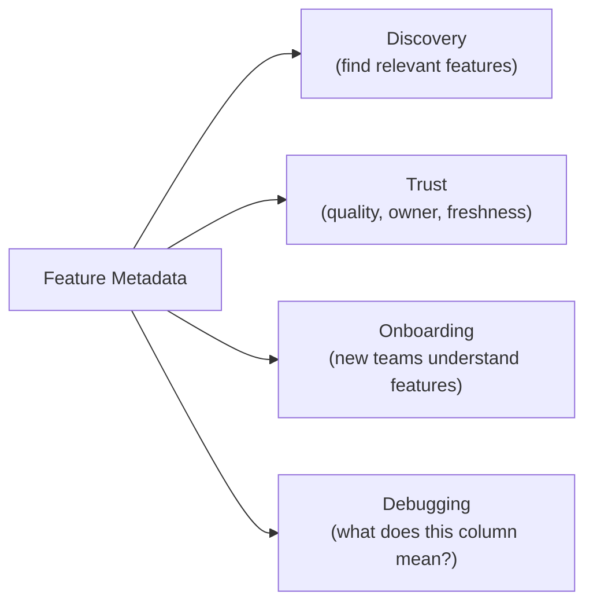
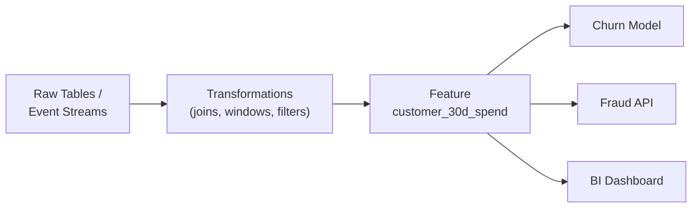

# Metadata and Lineage: Understanding and Tracing Features

## Why Metadata Matters

A feature store is only useful if teams can **find, understand, and trust** features. Rich metadata transforms opaque columns in pipelines into documented, discoverable assets.

Without metadata, teams pass "mystery columns" between pipelines — columns with no description, unknown owner, unclear freshness, and ambiguous semantics.

---

## Feature Metadata

A typical feature store maintains the following metadata per feature:

| Field | Description | Example |
|-------|-------------|---------|
| **Name** | Canonical identifier | `customer_30d_total_spend` |
| **Description** | Human-readable explanation | "Sum of completed transaction amounts in last 30 days" |
| **Units** | Measurement unit | USD, count, ratio, days |
| **Owner** | Responsible team or individual | Data Platform / Jane Smith |
| **Schema** | Data type, allowed values | `Float64`, non-negative, nulls not expected |
| **Freshness** | Update frequency and last update | "Updated hourly; last run 2025-06-05 14:00 UTC" |
| **Quality status** | Data quality check results | Passing / failing (null rate, range checks) |
| **Usage** | Downstream models and services | Churn model v3, fraud API, dashboard X |

### Value of Metadata

- **Discovery**: data scientists search the catalogue instead of rebuilding
- **Trust**: freshness and quality status indicate reliability
- **Onboarding**: new team members understand features without tribal knowledge
- **Debugging**: when values look wrong, metadata provides context

---

## Feature Lineage

**Lineage** traces where a feature comes from (upstream) and where it goes (downstream).

### Upstream Lineage

Answers: **what raw data and transformations produced this feature?**

| Question | Lineage Answer |
|----------|----------------|
| Which raw table? | `transactions.events` |
| Which event stream? | Kafka topic `txn-completed` |
| What transformations? | 30-day window aggregation, refund filter, group by `customer_id` |
| What time column? | `event_timestamp` |

### Downstream Lineage

Answers: **what consumes this feature?**

| Question | Lineage Answer |
|----------|----------------|
| Which models? | Churn v3, fraud classifier v2 |
| Which APIs? | `/predict/risk` endpoint |
| Which dashboards? | Customer health dashboard |
| Which teams? | Growth, risk, product analytics |

---

## Lineage Use Cases

### 1. Debugging

A feature value suddenly changes. Lineage enables:

- Trace upstream to the source table or pipeline that broke
- Identify whether the issue is in raw data, transformation logic, or materialisation
- Narrow investigation from "something is wrong" to "the refund filter changed in ETL job X"

### 2. Impact Analysis

A data team plans to change a table schema or deprecate a field. Lineage reveals:

- Which features depend on that table
- Which models and APIs will break
- Which teams need notification before the change

### 3. Regulatory Audits

For regulated industries (finance, healthcare), auditors need to know:

- How raw data flows into model inputs
- Which features influence critical decisions (credit scoring, medical diagnosis)
- Whether sensitive attributes (PII, protected classes) are used

A feature store with lineage provides an auditable data flow map.

---

## Metadata + Lineage Together

| Capability | Metadata | Lineage |
|------------|----------|---------|
| **Scope** | Properties of a single feature | Relationships between features, sources, and consumers |
| **Primary question** | "What is this feature?" | "Where does it come from and where does it go?" |
| **Debugging** | Understand expected behaviour | Trace breakage path |
| **Impact analysis** | Limited (usage list) | Full upstream/downstream graph |
| **Compliance** | Documents sensitivity, owner | Documents data flow for audits |

Together, they make a feature store a **central source of truth** for the organisation's ML data assets.

---

## Real-World Context

A bank's compliance team requests documentation for a credit scoring model:

- **Metadata** shows: `debt_to_income_ratio` is owned by Risk Analytics, updated daily, non-null, type `Float64`
- **Upstream lineage** shows: computed from `loan_applications.income` and `credit_bureau.total_debt`
- **Downstream lineage** shows: consumed by `credit_score_model_v4` and the loan approval API

Without lineage, the compliance team would need manual interviews with every data engineer and data scientist.

---

## Common Pitfalls / Exam Traps

- **Confusing metadata with lineage** — Metadata describes a feature; lineage describes its relationships in the data graph.
- **"We have a data catalogue, so we don't need feature metadata"** — Generic catalogues lack ML-specific fields (freshness SLAs, model usage, point-in-time semantics).
- **Ignoring downstream lineage** — Knowing sources but not consumers makes impact analysis impossible.
- **Stale metadata** — Metadata not updated when features change is worse than no metadata (false confidence).
- **Lineage without automation** — Manual lineage documentation drifts immediately; feature stores capture it at definition time.

---

## Quick Revision Summary

- Metadata: name, description, units, owner, schema, freshness, quality, usage per feature.
- Enables discovery, trust, onboarding, and debugging.
- Lineage: upstream (sources, transformations) and downstream (models, APIs, dashboards).
- Lineage use cases: debugging breakage, impact analysis for schema changes, regulatory audits.
- Metadata answers "what is this?"; lineage answers "where from and where to?"
- Feature store is the central place to capture both, automatically from definitions.
