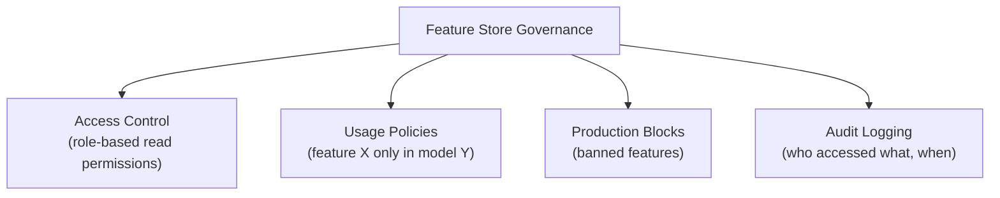
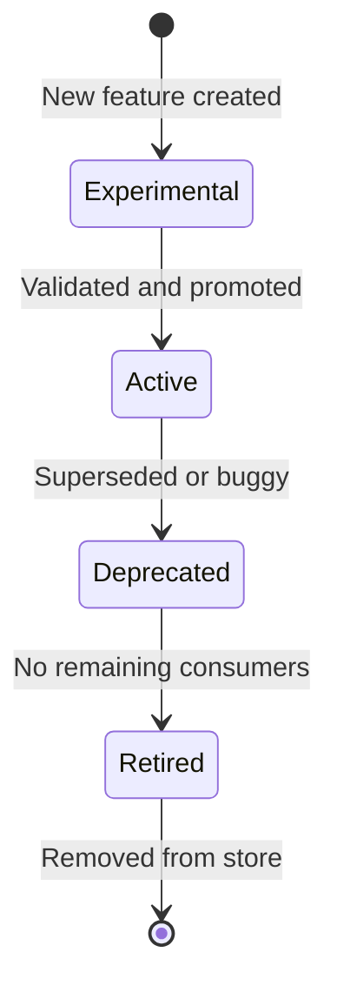
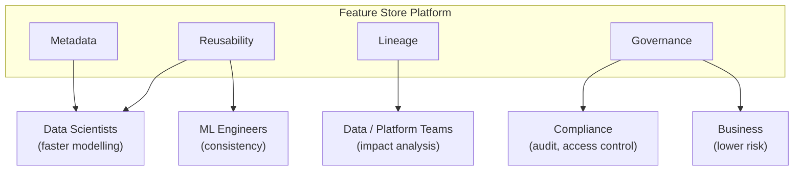

# Feature Governance and Lifecycle Management

## Not All Features Are Equal

Some features carry legal, ethical, or security risk. A feature store provides **governance** — policies, access controls, and audit trails — to ensure sensitive features are used safely and features evolve through a managed lifecycle.

---

## Sensitive Feature Categories

| Category | Examples | Risk |
|----------|----------|------|
| **PII** | Email, phone, home address, national ID | Privacy violations, GDPR/CCPA breaches |
| **Protected attributes** | Race, gender, religion, age | Discrimination, regulatory bans on use in scoring |
| **Financial data** | Credit scores, income, account balances | PCI/financial regulation, fair lending |
| **Health data** | Diagnosis codes, prescriptions | HIPAA and medical privacy rules |

Using these features in models without proper controls creates legal liability and ethical harm.

---

## Governance Capabilities

A feature store enforces governance through:

### Access Control

- Define which roles and teams can **read** which features
- Data scientists see general behavioural features; only compliance-approved roles see PII
- Serving systems receive only features authorised for their model

### Usage Policies

- Certain features permitted only in specific models (e.g., `income_estimate` only in credit model, not in marketing)
- Protected attributes blocked from production inference entirely in some jurisdictions
- Experimental features restricted to sandbox environments

### Audit Logging

- Log every feature access: who, which feature, when, which model/service
- Essential for security investigations and regulatory compliance
- Demonstrates due diligence in responsible AI practices

---

## Feature Lifecycle

Features are not static. They evolve through a managed lifecycle:

### Lifecycle Stages

| Stage | Description | Example |
|-------|-------------|---------|
| **Experimental** | Under development; limited access | `customer_60d_spend_v2` in testing |
| **Active** | Production-ready; available to authorised consumers | `customer_30d_spend_v1` |
| **Deprecated** | Superseded; existing consumers warned | `customer_30d_spend_v1` after v2 launch |
| **Retired** | No remaining dependencies; removed | Old feature cleaned up |

### Versioning

Features are versioned explicitly:

- `customer_30d_spend_v1` — 30-day window, original refund logic
- `customer_30d_spend_v2` — 60-day window, improved null handling

Versioning enables:

- **Safe rollout** — test v2 while v1 remains in production
- **Dependency tracking** — see which models still use v1
- **Gradual migration** — teams migrate at their own pace
- **Cleanup** — retire unused versions without breaking active models

---

## Organisational Benefits

Combining reusability, metadata, lineage, and governance:

| Stakeholder | Benefit |
|-------------|---------|
| **Data scientists** | Library of trusted, reusable features; less plumbing, more modelling |
| **ML engineers** | Consistent offline/online features; fewer skew bugs; safer rollouts |
| **Data / platform teams** | Clear ownership, lineage, access control, compliance |
| **Business** | More reliable models, faster iteration, lower data misuse risk |

---

## Governance and Responsible AI

Feature governance connects directly to responsible AI:

- **Fairness**: block or restrict protected attributes from model inputs
- **Transparency**: lineage documents how features influence predictions
- **Accountability**: audit logs show who approved sensitive feature usage
- **Compliance**: demonstrate regulatory requirements are met (GDPR right to explanation, fair lending)

---

## Real-World Context

A lending platform governs features for its credit model:

- `annual_income` — accessible to risk team only; audit logged
- `zip_code` — permitted in credit model; blocked in marketing personalisation
- `gender` — blocked from all production models (fair lending compliance)
- `debt_to_income_v2` — active; `debt_to_income_v1` — deprecated, 2 models still pinned to v1
- Compliance dashboard shows all feature access for the last 90 days

---

## Common Pitfalls / Exam Traps

- **"Governance = IT security only"** — Feature governance includes ML-specific policies (fairness, model-specific usage, lifecycle).
- **No lifecycle management** — Without versioning and deprecation, feature stores accumulate dead features that confuse consumers.
- **Blocking features without downstream impact analysis** — Check lineage before blocking; models may break.
- **Ignoring audit logs until an incident** — Proactive audit review catches misuse early.
- **Treating experimental and active features identically** — Experimental features need restricted access and clear labelling.

---

## Quick Revision Summary

- Sensitive features: PII, protected attributes, financial, health data — require special handling.
- Governance: access control, usage policies, production blocks, audit logging.
- Feature lifecycle: experimental → active → deprecated → retired.
- Versioning enables safe rollout, dependency tracking, and gradual migration.
- Benefits span data scientists, ML engineers, platform teams, and business.
- Feature stores are central to responsible AI: fairness, transparency, accountability, compliance.
