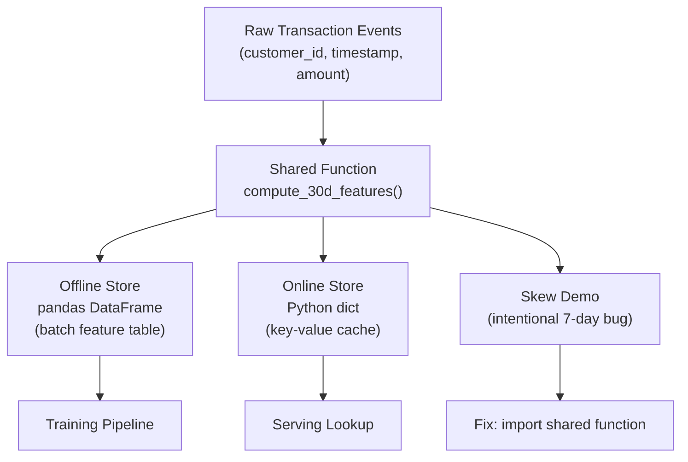
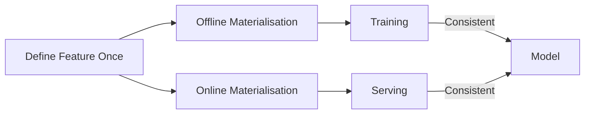

# From Feature Governance to Hands-On Practice

## Bridging Theory and Labs

The organisational layer — reusability, metadata, lineage, governance — completes the feature store value proposition. The hands-on labs translate these abstractions into a concrete, debuggable simulation using tools every ML practitioner knows: **pandas** and **Python dictionaries**.

---

## Lab Architecture

| Lab Component | Simulates | Production Equivalent |
|---------------|-----------|----------------------|
| `features.py` | Offline feature table build | Warehouse batch pipeline |
| `onlinestore.py` | Online feature store | Redis / DynamoDB |
| `skew.py` | Skew demonstration and fix | Feast / Tecton consistency |
| `compute_30d_features()` | Single source of truth | Feature view definition |

---

## What the Labs Demonstrate

### 1. Offline Feature Table (pandas)

- Start from raw transaction events
- Define a 30-day lookback window from the latest timestamp (point-in-time simulation)
- Group by `customer_id`, aggregate sum and count
- Derive `avg_ticket = total_spend / txn_count`
- Add `as_of_date` for traceability
- Output: one row per customer — the batch feature table training consumes

### 2. Online Feature Store (Python dict)

- Encapsulate feature logic in `compute_30d_features()` — parameterized for a single customer
- Iterate over customers, compute features, store in a dictionary keyed by `customer_id`
- Serving: `get_online_features(customer_id)` — O(1) lookup
- This process is **materialisation**; the dict simulates Redis/DynamoDB

### 3. Training-Serving Skew (intentional bug)

- Load offline features for customer C001 (ground truth: 30-day values)
- A "different team" reimplements with `compute_7d_features_bug()` — 7-day window
- Result: offline shows $170 spend; online shows $0 — pure skew
- Fix: import and call the same `compute_30d_features()` used in the online store
- Result: values match perfectly — skew eliminated

### 4. Organisational Concepts in Miniature

Even in a small demo, reusability and lineage appear:

- **Reusability**: one function used by offline table, online store, and skew fix
- **Lineage**: raw transactions → `compute_30d_features()` → offline table / online dict
- **Consistency**: shared definition prevents the bug class entirely

---

## Module 9 Theory Summary

| Topic | Key Ideas |
|-------|-----------|
| **Production FE** | Two worlds (training batch vs serving real-time); consistency and performance constraints |
| **Training-serving skew** | Different distributions in training vs serving; silent degradation |
| **Offline features** | Batch-computed, warehouse-stored, throughput-optimised |
| **Online features** | Precomputed, key-value stored, latency-optimised |
| **Feature store** | Define once, materialise offline + online, serve via API + registry |
| **Ecosystem** | Feast (OSS baseline), Tecton (managed), Hopsworks (ML platform) |
| **Organisational** | Reuse, metadata, lineage, governance, lifecycle |

**Big idea**: feature stores transform feature engineering from ad hoc scripts into a shared, reliable, governed platform.

---

## The Fundamental Promise

What the labs simulate with a shared Python function, production tools like Feast and Hopsworks implement at scale — with consistency, governance, and discovery for all features.

---

## Common Pitfalls / Exam Traps

- **"The lab is trivial, so feature stores are trivial"** — The lab isolates the core pattern; production adds scale, streaming, governance, and multi-team coordination.
- **Using different functions for offline and online in the lab** — Defeats the learning objective; always use the shared function.
- **Skipping the skew demo** — The bug/fix cycle is the most important learning moment in the module.
- **Treating governance as separate from the lab** — Even the demo exhibits reuse (one function) and lineage (raw → transform → store).
- **Forgetting `as_of_date`** — The offline table includes it for traceability; exams may test point-in-time concepts.

---

## Quick Revision Summary

- Labs simulate a feature store: pandas offline table + Python dict online store + shared function.
- Lab 1: build offline feature table with 30-day aggregations and `as_of_date`.
- Lab 2: encapsulate logic in `compute_30d_features()`, materialise to dict, serve via lookup.
- Lab 3: demonstrate skew (7-day bug) and fix (shared function) — core learning moment.
- Module theory: skew, offline/online, feature stores, ecosystem, governance.
- Big idea: feature stores turn ad hoc scripts into a shared, governed platform.
- Production tools (Feast, Hopsworks) scale the lab pattern with governance and discovery.
