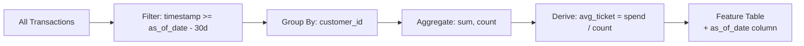
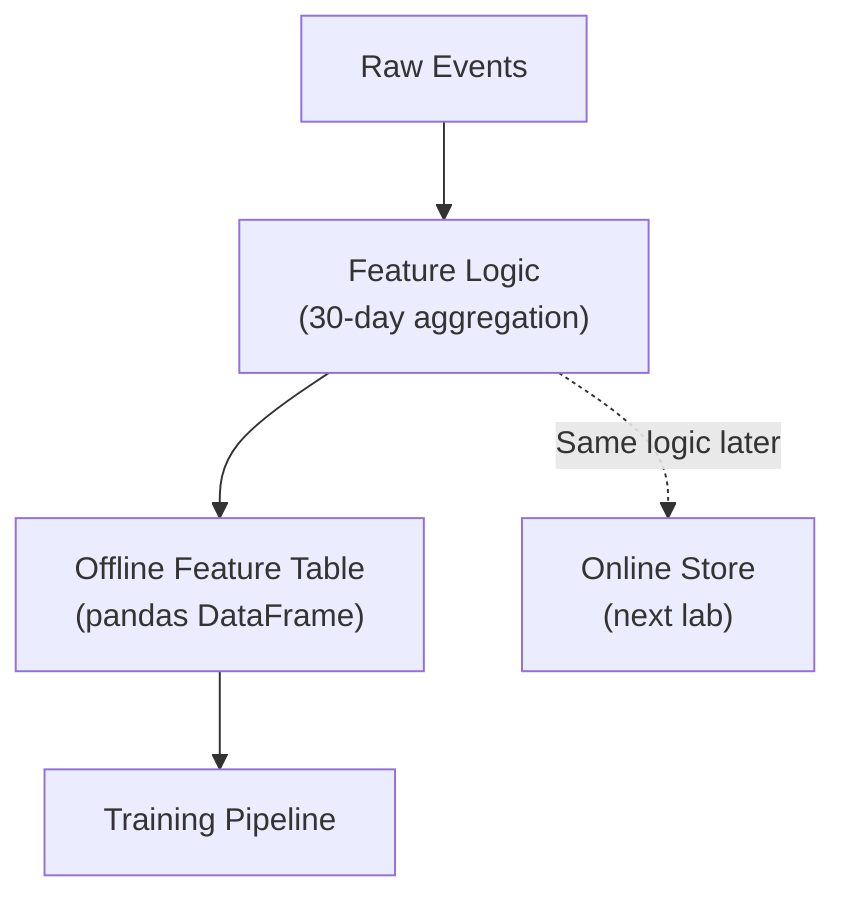

# Building an Offline Feature Table in Pandas

## Objective

Transform raw event-level transaction data into a clean, aggregated **offline feature table** suitable for model training. This is the batch-processing path — optimised for throughput, not latency.

---

## Starting Point: Raw Event Data

ML models cannot consume raw events directly. Starting data resembles warehouse event tables:

| Column | Type | Description |
|--------|------|-------------|
| `customer_id` | string | Entity key |
| `timestamp` | datetime | Event time |
| `amount` | float | Transaction value |
| `category` | string | Transaction category (optional) |

This is event-level granularity — one row per transaction. The model needs **entity-level features** — one row per customer.

---

## Feature Engineering Goal

For each customer, compute behavioural features over the last 30 days:

| Feature | Computation |
|---------|-------------|
| `customer_30d_total_spend` | Sum of `amount` |
| `customer_30d_txn_count` | Count of transactions |
| `customer_30d_avg_ticket` | `total_spend / txn_count` |

---

## Point-in-Time Window

Production feature tables must be **point-in-time correct**. The lab simulates this:

1. Find the **latest timestamp** in the dataset → this becomes the `as_of_date`
2. Define the window: `[as_of_date - 30 days, as_of_date]`
3. Filter transactions within this window
4. Aggregate per `customer_id`



**Why `as_of_date` matters**: training joins features with labels at a specific point in time. Without it, you cannot guarantee temporal correctness.

---

## Core Logic: GroupBy Aggregation

The heart of offline feature computation:

```python
# Conceptual logic (illustrative)
as_of_date = transactions["timestamp"].max()
window_start = as_of_date - timedelta(days=30)

windowed = transactions[
    (transactions["timestamp"] >= window_start) &
    (transactions["timestamp"] <= as_of_date)
]

features = windowed.groupby("customer_id").agg(
    customer_30d_total_spend=("amount", "sum"),
    customer_30d_txn_count=("amount", "count"),
).reset_index()

features["customer_30d_avg_ticket"] = (
    features["customer_30d_total_spend"] / features["customer_30d_txn_count"]
)
features["as_of_date"] = as_of_date
```

**Key operations**:

- **Filter** — restrict to the time window
- **GroupBy** — partition by entity key
- **Aggregate** — sum and count within each group
- **Derive** — compute ratio features from aggregates

---

## Output: Offline Feature Table

| customer_id | customer_30d_total_spend | customer_30d_txn_count | customer_30d_avg_ticket | as_of_date |
|-------------|--------------------------|------------------------|-------------------------|------------|
| C001 | 170.00 | 4 | 42.50 | 2025-06-01 |
| C002 | 320.00 | 8 | 40.00 | 2025-06-01 |

**Structural properties**:

- One row per customer (entity-level)
- One column per engineered feature
- `as_of_date` for traceability and point-in-time joins
- Clean, aggregated data ready for model consumption

---

## Training Join

The feature table joins with target labels:

$$\text{training\_data} = \text{feature\_table} \bowtie_{\text{customer\_id}} \text{labels}$$

For churn modelling: join on `customer_id` with a label column `did_churn`. The `as_of_date` ensures features reflect what was knowable at the time of the label event.

---

## Batch Processing Characteristics

| Property | Offline Feature Table |
|----------|----------------------|
| Execution | Scheduled batch job (nightly, hourly) |
| Data volume | Large historical datasets |
| Optimisation | Throughput (rows processed per second) |
| Latency | Minutes to hours (acceptable) |
| Storage | DataFrame / Parquet / warehouse table |
| Serving | Not used directly for real-time inference |

This process is the **offline materialisation** step in a feature store. In production, the same logic runs in Spark or SQL; here, pandas provides an accessible simulation.

---

## Connection to Feature Store Architecture



The offline table is one half of the feature store. The next step wraps the same logic in a reusable function and materialises to an online store.

---

## Common Pitfalls / Exam Traps

- **Forgetting the time window filter** — Aggregating all data without a window is not a "30-day" feature.
- **Missing `as_of_date`** — Without it, point-in-time joins with labels are ambiguous.
- **Computing avg before aggregation** — Average ticket is derived from aggregated sum/count, not row-level average of amounts.
- **Assuming this table serves real-time requests** — Offline tables are for batch; serving needs the online store.
- **Not handling zero-transaction customers** — Division by zero for `avg_ticket` when `txn_count = 0`; define explicit null/zero policy.

---

## Quick Revision Summary

- Raw events (customer_id, timestamp, amount) → aggregated entity-level features.
- 30-day window: latest timestamp as `as_of_date`, lookback 30 days, filter, groupby, aggregate.
- Features: total spend (sum), txn count (count), avg ticket (spend/count).
- Output: one row per customer with `as_of_date` for traceability.
- Join with labels on `customer_id` for training.
- Batch processing: throughput-optimised, not latency-optimised.
- This is offline materialisation — the training-side of a feature store.
