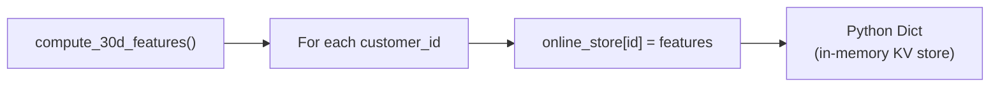
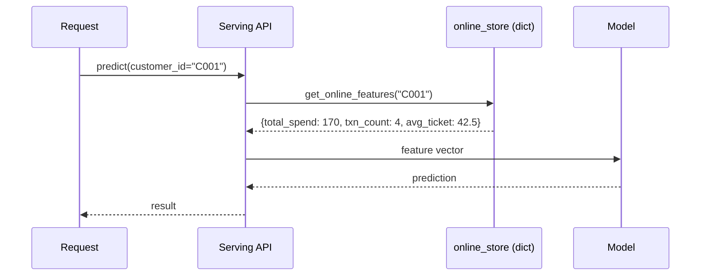
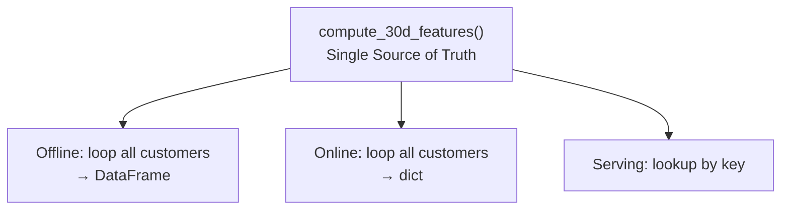

# Simulating an Online Feature Store with a Dict Cache

## The Problem

An offline feature table works for training but cannot serve real-time predictions. When a live request arrives for a single customer, running a batch `groupby` over the entire warehouse per request is infeasible.

**Online feature stores** solve this with precomputed, key-based lookups in milliseconds.

---

## Step 1: Encapsulate Feature Logic

The critical move toward consistency is extracting feature computation into a **reusable function** — the single source of truth:

```python
def compute_30d_features(transactions_df, customer_id, as_of_time):
    """
    Compute 30-day spend features for a single customer.
    Same logic as offline batch, parameterized for one entity.
    """
    window_start = as_of_time - timedelta(days=30)
    customer_txns = transactions_df[
        (transactions_df["customer_id"] == customer_id) &
        (transactions_df["timestamp"] >= window_start) &
        (transactions_df["timestamp"] <= as_of_time)
    ]
    total_spend = customer_txns["amount"].sum()
    txn_count = customer_txns["amount"].count()
    avg_ticket = total_spend / txn_count if txn_count > 0 else 0.0

    return {
        "customer_30d_total_spend": total_spend,
        "customer_30d_txn_count": txn_count,
        "customer_30d_avg_ticket": avg_ticket,
    }
```

**Key properties**:

- Contains the **exact same logic** as the offline batch script
- Parameterized for a **single customer** at a specific `as_of_time`
- Returns a dictionary of feature values
- This function is the **single source of truth**

---

## Step 2: Build the Online Store (Materialisation)

**Materialisation** = compute features and push them into the online store:

```python
online_store = {}
as_of_time = transactions["timestamp"].max()

for customer_id in transactions["customer_id"].unique():
    features = compute_30d_features(transactions, customer_id, as_of_time)
    online_store[customer_id] = features
```



| Lab Implementation | Production Equivalent |
|-------------------|----------------------|
| Python dictionary | Redis, DynamoDB, Cassandra |
| In-process loop | Distributed streaming/batch materialisation job |
| Single machine | Horizontally scaled cache cluster |

---

## Step 3: Serve Features at Request Time

When a prediction request arrives:

```python
def get_online_features(customer_id):
    return online_store[customer_id]  # O(1) lookup
```

**Serving flow**:



- Lookup completes in microseconds (dictionary access)
- No aggregation at request time
- Feature values were precomputed during materialisation

---

## Offline vs Online in the Lab

| Aspect | Offline (Lab 1) | Online (Lab 2) |
|--------|-----------------|----------------|
| Storage | pandas DataFrame | Python dict |
| Compute | Batch groupby (all customers) | Per-customer via shared function |
| Access | Full table scan / join | O(1) key lookup |
| Function | Inline in script | `compute_30d_features()` (shared) |
| Use case | Training | Real-time serving |

Both derive from the **same feature logic** — the foundation for avoiding skew.

---

## Why a Shared Function Matters



Without encapsulation:

- Offline script has one implementation
- Online store has a reimplemented copy
- Serving team might write a third copy
- → Training-serving skew (demonstrated in the next lab)

With encapsulation:

- One function, three usage patterns
- Semantics guaranteed identical
- → Skew architecturally prevented

---

## Production Scaling Notes

| Lab Simplification | Production Reality |
|-------------------|-------------------|
| Dict in memory | Distributed Redis cluster with replication |
| Full recomputation on each materialisation | Incremental updates from event stream |
| Single process | Horizontal scaling across nodes |
| No TTL or expiry | TTL policies, stale feature detection |
| No monitoring | Freshness metrics, cache hit rate, P99 latency |

The lab isolates the **pattern** (define once, materialise, lookup by key). Production adds scale, freshness, and observability.

---

## Common Pitfalls / Exam Traps

- **Reimplementing logic for online instead of reusing the function** — The most common source of skew.
- **Running batch groupby per request** — Defeats the purpose of an online store; use precomputed lookup.
- **Forgetting materialisation step** — Online store must be populated before serving; lookup on empty store fails.
- **Different `as_of_time` between offline and online** — Must use the same reference time for consistency.
- **Treating the dict as production-ready** — It simulates the pattern; Redis/DynamoDB provide persistence, distribution, and TTL.

---

## Quick Revision Summary

- Online features: precomputed, retrieved by entity key in milliseconds.
- Step 1: encapsulate logic in `compute_30d_features()` — single source of truth.
- Step 2: materialise — iterate customers, compute, store in dict keyed by `customer_id`.
- Step 3: serve — `get_online_features(customer_id)` is O(1) dict lookup.
- Python dict simulates Redis/DynamoDB; materialisation simulates streaming/batch push.
- Shared function used by both offline and online paths → consistency guaranteed.
- Next lab: intentionally break consistency (skew), then fix with shared function.
