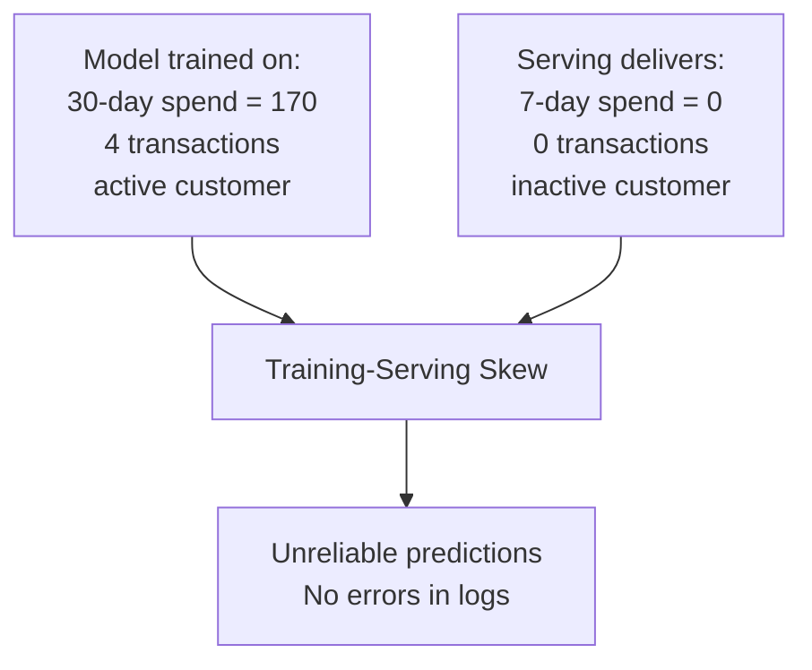
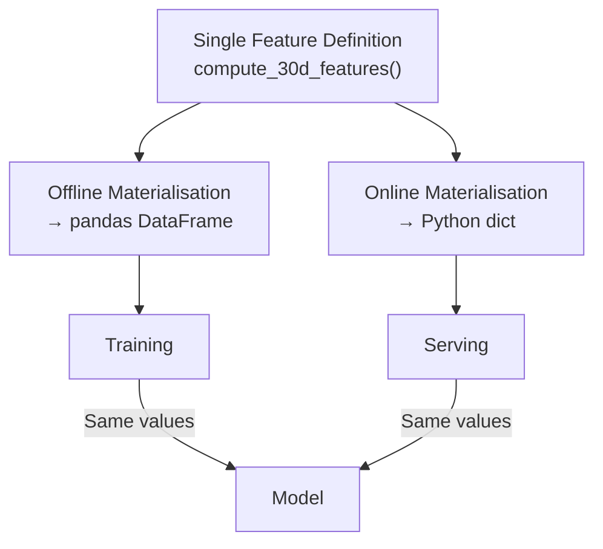

# Avoiding Training-Serving Skew with a Tiny Feature Store

## The Most Dangerous Production Bug

Training-serving skew is subtle, silent, and devastating. This lab **creates the bug intentionally**, observes its impact, and **fixes it** using the feature store pattern — a shared function as single source of truth.

---

## Setup: Ground Truth from Offline Features

Load the offline feature table for customer C001 — these are the values the model was trained on:

| Feature | Offline Value (30-day) |
|---------|----------------------|
| `customer_30d_total_spend` | 170.0 |
| `customer_30d_txn_count` | 4 |
| `customer_30d_avg_ticket` | 42.5 |

These represent the **ground truth** — what the model learned to expect.

---

## The Bug: Reimplemented Feature Logic

A separate team responsible for the online prediction service reimplements the feature logic from scratch. They introduce `compute_7d_features_bug()`:

```python
def compute_7d_features_bug(transactions_df, customer_id, as_of_time):
    """BUG: 7-day window instead of 30-day."""
    window_start = as_of_time - timedelta(days=7)  # Should be 30!
    # ... same aggregation logic but wrong window
```

**Mistake**: 7-day window hardcoded instead of 30-day. A common, easy error under time pressure.

---

## Observing the Skew

| Feature | Offline (30-day) | Online Buggy (7-day) | Match? |
|---------|-------------------|---------------------|--------|
| `customer_30d_total_spend` | 170.0 | 0.0 | No |
| `customer_30d_txn_count` | 4 | 0 | No |
| `customer_30d_avg_ticket` | 42.5 | 0.0 | No |



**What happened**:

- Customer C001 had transactions in the 30-day window but **none in the last 7 days**
- The buggy function returns all zeros
- The model sees an apparently inactive customer instead of an active spender
- Predictions become completely unreliable
- No HTTP errors, no missing features, no obvious pipeline failure

This is training-serving skew in its purest form.

---

## The Fix: Single Source of Truth

The answer is architectural, not a parameter tweak:

> Do not have two implementations in the first place.

```python
# Instead of the buggy function:
from onlinestore import compute_30d_features

online_features = compute_30d_features(transactions, "C001", as_of_time)
```

| Feature | Offline (30-day) | Online Fixed (shared fn) | Match? |
|---------|-------------------|--------------------------|--------|
| `customer_30d_total_spend` | 170.0 | 170.0 | Yes |
| `customer_30d_txn_count` | 4 | 4 | Yes |
| `customer_30d_avg_ticket` | 42.5 | 42.5 | Yes |

**Skew eliminated.** Values match perfectly because both paths call the same function.

---

## The Feature Store Promise



| Lab Simulation | Production (Feast / Hopsworks) |
|----------------|-------------------------------|
| Shared Python function | Feature view definition in registry |
| pandas DataFrame | Parquet / BigQuery offline store |
| Python dict | Redis / DynamoDB online store |
| Manual import | `get_online_features()` API |
| One team, one notebook | Multi-team, governed platform |

The fundamental promise is identical: **define feature logic once, reuse for both offline and online materialisation**. This architecturally eliminates the entire class of skew bugs.

---

## Why Retraining Does Not Fix Skew

| Approach | Outcome |
|----------|---------|
| Retrain model on correct 30-day features | Model still receives 7-day features at serving → still broken |
| Fix serving to use 30-day logic | Skew eliminated without retraining |
| Feature store with shared definition | Skew prevented for all current and future models |

Skew is a **pipeline bug**, not a model bug.

---

## Detection in Production

How to catch skew before it reaches users:

| Method | Description |
|--------|-------------|
| **Offline vs online comparison** | For sample entities, compare batch features with serving features |
| **Feature distribution monitoring** | Histogram of training features vs live serving features |
| **Shadow mode** | Run both pipelines on production traffic; alert on divergence |
| **Contract tests** | Assert serving output equals batch output for golden test cases |
| **Shared definition enforcement** | Feature store makes divergence structurally difficult |

---

## Common Pitfalls / Exam Traps

- **"The feature name is the same, so values should match"** — Names do not enforce semantics; only shared logic does.
- **Fixing skew by retraining** — Serving pipeline must be fixed first; retraining alone is insufficient.
- **Assuming the bug would be obvious** — Skew produces no errors; only metric degradation reveals it.
- **Two implementations with "almost" the same logic** — Subtle filter or null-handling differences cause skew even with the same window.
- **Treating skew as data drift** — Skew is an implementation mismatch from deployment; drift is temporal distribution change.

---

## Quick Revision Summary

- Skew demo: offline 30-day features (spend=170) vs buggy online 7-day features (spend=0).
- Customer appears active in training, inactive in serving — predictions unreliable.
- No errors in logs; skew is silent and dangerous.
- Fix: import and use `compute_30d_features()` — same function for both paths.
- Fixed values match offline perfectly; skew eliminated.
- Feature store promise: define once, materialise offline + online, architecturally prevent skew.
- Production tools (Feast, Hopsworks) scale this pattern with governance and discovery.
