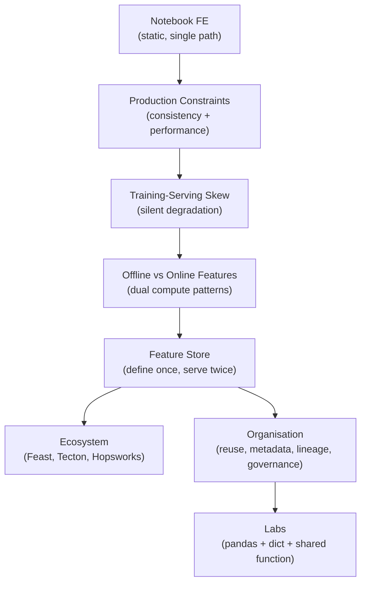

# Module 9 Summary: Feature Engineering in Production

## Module Arc

This module traced the journey from notebook feature engineering to production-grade feature infrastructure — covering the problems that emerge, the architectural solutions, and hands-on demonstration.

---

## Topic 1: Production Feature Engineering

### Notebook World

- Scaling, encoding, bucketing, aggregations on static in-memory data
- Single code path, no latency constraints, no serving counterpart

### Production World

Two distinct execution contexts:

| | Training | Serving |
|---|----------|---------|
| Data | Large historical datasets | Single entity per request |
| Compute | Batch aggregations | Precomputed lookups |
| Latency | Minutes to hours | Milliseconds |
| Freshness | Last batch run | Near real-time |

### Core Constraints

1. **Consistency** — same feature semantics in both worlds
2. **Performance and freshness** — precomputation, caching, online infrastructure

---

## Topic 2: Training-Serving Skew

**Definition**: model sees different feature distributions during training vs serving.

**Causes**: different code paths, time windows, data sources, filters, or unsynchronised ETL changes.

**Classic example**: `customer_30d_avg_spend` computed over 30 days in training, 7 days in serving — same name, different semantics.

**Danger**: offline metrics look great; production performance degrades silently; no errors in logs.

**Root cause**: fragmented feature logic across notebooks, SQL, and serving code.

**Fix**: single source of truth per feature, reused for offline and online materialisation.

---

## Topic 3: Offline and Online Features

### Offline Features

- Batch-computed on historical data
- Stored in data lake/warehouse (Parquet, BigQuery, Snowflake)
- Used for training and batch scoring
- Optimised for throughput; point-in-time correct with `as_of_date`

### Online Features

- Precomputed, retrieved per entity at request time
- Stored in key-value systems (Redis, DynamoDB)
- Used for real-time prediction
- Optimised for latency (milliseconds) and freshness

### Feature Store

Central system that defines features once and materialises them into both stores, with APIs and a registry for discovery.

**Four responsibilities**: feature definition, offline materialisation, online materialisation, serving API + catalogue.

---

## Topic 4: Feature Store Ecosystem

| Tool | Type | Key Trait |
|------|------|-----------|
| **Feast** | Open-source, self-hosted | Mental baseline; Python/YAML definitions |
| **Tecton** | Managed enterprise | Runs pipelines, rich UI, deep streaming integration |
| **Hopsworks** | ML platform | Feature store + notebooks + model registry |

**Universal pattern** (stable across all vendors):

1. Feature definitions
2. Offline store
3. Online store
4. Registry / catalogue

Vendor differences: hosting, integrations, UI, governance — not core architecture.

---

## Topic 5: Organisational Benefits

| Capability | Value |
|------------|-------|
| **Reusability** | Define once, use across churn/fraud/recommendation models |
| **Metadata** | Owner, schema, freshness, quality — enables discovery and trust |
| **Lineage** | Upstream sources → features → downstream models; debugging and impact analysis |
| **Governance** | Access control, PII policies, versioning, lifecycle management |
| **Lifecycle** | Experimental → active → deprecated → retired |

### Stakeholder Benefits

- **Data scientists**: trusted feature library, less plumbing
- **ML engineers**: consistent offline/online, fewer skew bugs
- **Platform teams**: ownership, lineage, compliance
- **Business**: reliable models, faster iteration, lower risk

---

## Labs Summary

| Lab | What It Demonstrates |
|-----|---------------------|
| **Offline table (pandas)** | Batch 30-day aggregation → feature table with `as_of_date` |
| **Online store (dict)** | Shared `compute_30d_features()` → materialise to dict → O(1) lookup |
| **Skew demo (skew.py)** | 7-day bug → values mismatch → fix with shared function → values match |

The labs prove that a shared Python function eliminates skew — production feature stores enforce the same principle at scale with governance and discovery.

---

## The Big Idea

Feature stores transform feature engineering from a **mess of ad hoc scripts** into a **shared, reliable, governed platform**:

$$\text{Define once} \rightarrow \text{Materialise offline} + \text{Materialise online} \rightarrow \text{Serve consistently}$$

This is one of the most impactful abstractions in modern ML infrastructure.

---

## Common Pitfalls / Exam Traps

- **"Good features = good production model"** — Consistency across training and serving is equally critical.
- **Confusing skew with data drift** — Skew is pipeline mismatch; drift is temporal distribution change.
- **"Feature store = database"** — It is definition + materialisation + serving + governance.
- **Ignoring organisational layer** — Technical consistency without reuse, metadata, and governance is incomplete.
- **Assuming vendor expertise is the learning goal** — Pattern recognition and the four building blocks matter most.
- **Retraining to fix skew** — Fix the serving pipeline first; retraining alone does not help.
- **Treating online store as optional** — Real-time prediction requires online materialisation.

---

## Quick Revision Summary

- Production FE has two worlds: batch training vs real-time serving.
- Training-serving skew: different feature distributions; silent, dangerous, hard to debug.
- Offline features: warehouse, batch, throughput; online features: KV store, lookup, latency.
- Feature store: define once, materialise offline + online, serve via API + registry.
- Ecosystem: Feast (OSS baseline), Tecton (managed), Hopsworks (ML platform) — same four building blocks.
- Organisational: reuse, metadata, lineage, governance, lifecycle versioning.
- Labs: pandas offline + dict online + shared function → skew demo and fix.
- Big idea: feature stores turn ad hoc scripts into a shared, governed ML platform.
