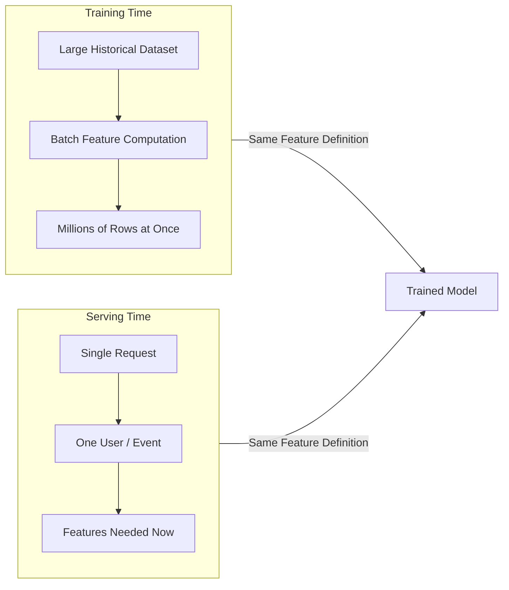

# Feature Engineering: From Notebook to Production

## The Core Message

Good features are necessary but not sufficient. They must be **computed consistently** in both training and serving. A brilliantly engineered feature that exists in two incompatible implementations is worse than a simpler feature with a single, shared definition.

---

## Feature Engineering in a Notebook

In exploratory and training workflows, feature engineering covers standard transformations:

| Category | Examples |
|----------|----------|
| Numeric scaling | Standardisation, min-max normalisation, log transforms |
| Categorical encoding | One-hot encoding, label encoding, target encoding |
| Bucketing | Age bins, income quartiles, recency tiers |
| Aggregations | Counts, sums, averages, ratios over a time window |

**Operational context**: local DataFrame, in-memory, static snapshot. No latency constraint. One code path. The model and features live in the same process.

This simplicity is deceptive. Teams often assume the notebook logic can be "ported" to production with minor edits. In practice, production introduces an entirely different execution model.

---

## The Two Worlds of Production ML

### Training Time

- Works on large historical datasets (months or years of events)
- Computes features for millions of entities in batch
- Feeds a training pipeline (Spark, SQL warehouse, pandas batch job)
- Optimised for **throughput**

### Serving Time

- Receives one request at a time (one user, one session, one transaction)
- Must compute or look up features within a strict latency budget
- Runs inside a prediction API or streaming pipeline
- Optimised for **per-request latency** and **freshness**

The architectural challenge: define each feature so it works in **both** contexts without semantic drift.

---

## Production Constraint 1: Consistency

Consider `customer_30d_spend` — average transaction amount over the last 30 days.

For this feature to be valid, the following must match exactly between training and serving:

- Aggregation window (30 days, not 7 or 60)
- Inclusion/exclusion filters (refunds, cancellations)
- Data source (same event stream or table)
- Edge-case handling (null amounts, timezone boundaries)
- Code path (same function or generated from same definition)

When any of these diverge, **training-serving skew** emerges. The model sees distribution $P_{\text{train}}(x)$ during training but receives $P_{\text{serve}}(x) \neq P_{\text{train}}(x)$ at inference. Learned weights and decision boundaries no longer align with input reality.

---

## Production Constraint 2: Performance and Freshness

| Aspect | Training | Serving |
|--------|----------|---------|
| Acceptable latency | Minutes to hours | 10–20 ms for all feature lookups |
| Join complexity | Multi-way joins on large tables | Precomputed lookups; no warehouse joins per request |
| Data freshness | As of last batch run | Last few minutes/hours of activity |
| Infrastructure | Data warehouse, Spark, Airflow | Redis, DynamoDB, in-memory cache |

Serving cannot rerun a Spark job for every prediction. The standard pattern is **precomputation + materialisation** into a low-latency store, refreshed by streaming or scheduled jobs.

---

## Why Ad Hoc Feature Logic Fails

Without a central system, feature logic fragments across:

- A data scientist's notebook
- A SQL script in the warehouse
- A slightly different Python function in the serving microservice
- An ETL pipeline updated in production but not in the training job

Each copy drifts independently. The fix is a **single source of truth** per feature: one definition, versioned, tested, documented, and reused for both training and serving. This is the motivation for **feature pipelines** and **feature stores**.

---

## Concrete Example: Customer Spend

**Training implementation**: 30-day window, all completed transactions, computed from warehouse history.

**Serving implementation (buggy)**: 7-day window, different refund filter, reimplemented from scratch by a separate team.

Both produce a column named `customer_30d_avg_spend`. The semantics differ. The model expects 30-day behavioural patterns; serving delivers 7-day snapshots. Scale, variance, and correlations with the target all shift. Business metrics degrade with no obvious error signal.

---

## Common Pitfalls / Exam Traps

- **"We use the same feature name, so we're consistent"** — Names do not guarantee semantics; windows, filters, and sources must match.
- **Copy-pasting notebook code into serving** — Serving needs precomputed lookups, not batch group-by per request.
- **Assuming batch freshness is acceptable for all use cases** — Fraud and personalisation often require near-real-time features.
- **Treating consistency as a testing problem only** — Architectural single-source-of-truth prevents skew; unit tests alone cannot catch all divergence paths.
- **Underestimating the cost of debugging skew** — Logs show features present; offline eval looks fine; only live KPIs reveal the mismatch.

---

## Quick Revision Summary

- Notebook FE: scaling, encoding, bucketing, aggregations on static in-memory data.
- Production introduces two worlds: batch training vs per-request serving.
- **Consistency** requires identical feature semantics across both worlds.
- **Performance/freshness** requires precomputation, caching, and online infrastructure for serving.
- Training-serving skew silently kills model performance despite strong offline metrics.
- Root cause: feature logic scattered across notebooks, SQL, and serving code.
- Solution direction: single source of truth → feature pipelines → feature stores.
