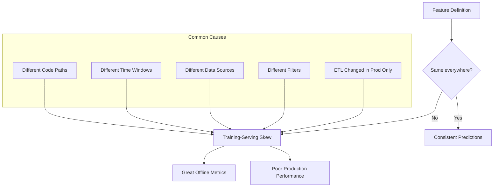
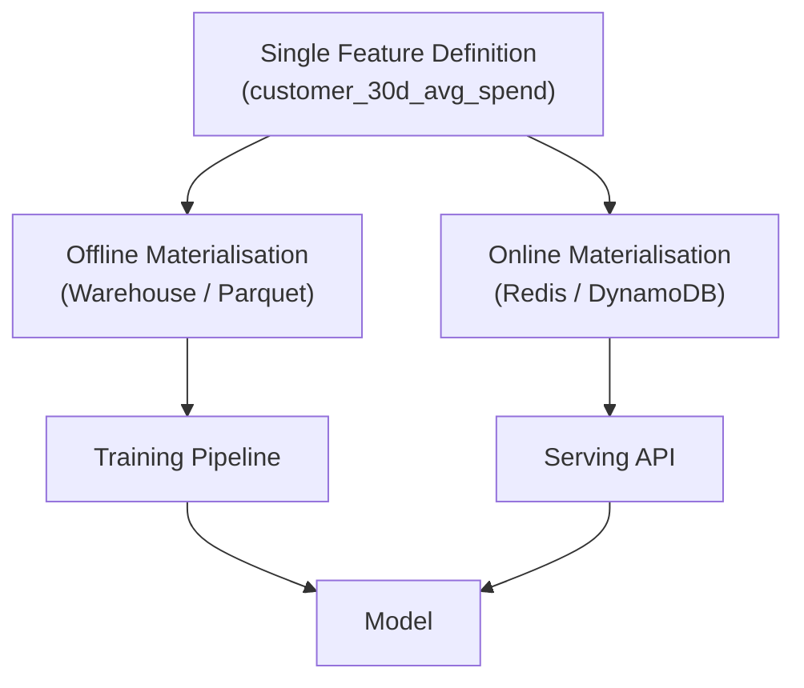

# Training-Serving Skew: Definition, Causes, and Consequences

## Naming the Problem

**Training-serving skew** occurs when a model encounters one distribution of features during training and a different distribution during serving — even when feature names, schemas, and logs appear correct.

$$\text{Skew exists when } P_{\text{train}}(\mathbf{x}) \neq P_{\text{serve}}(\mathbf{x})$$

This is among the most dangerous and hardest-to-debug failure modes in production ML.

---

## How Skew Arises

| Cause | Training | Serving | Result |
|-------|----------|---------|--------|
| Time window mismatch | 30-day aggregation | 7-day aggregation | Different scale and variance |
| Code path divergence | SQL in warehouse | Reimplemented Python | Subtle filter differences |
| Data source split | Batch ETL table | Live API stream | Missing or extra events |
| Filter logic | Excludes refunds | Includes refunds | Systematic value shift |
| Pipeline drift | Stale training job | Updated production ETL | Distribution shift without retraining |

---

## Worked Example: Customer 30-Day Average Spend

### Training Definition

- Feature: `customer_30d_avg_spend`
- Window: last 30 days of transactions
- Source: complete transaction history in the data warehouse
- Filters: completed transactions only

### Serving Definition (Buggy)

- Same feature name
- Window: last **7 days** (hardcoded mistake)
- Different refund/cancellation filter
- Reimplemented by a separate team under time pressure

### What the Model Experienced

| Aspect | Training | Serving (buggy) |
|--------|----------|-----------------|
| Window | 30 days | 7 days |
| Typical value range | Higher totals, stable averages | Lower totals, higher variance |
| Correlation with churn | Learned on 30-day patterns | 7-day snapshot breaks learned weights |
| Customer appearance | Active spender ($170 total) | Inactive spender ($0 — no txns in 7-day window) |

The model learned that certain spend levels correlate with churn risk. At serving time, active customers appear inactive. Predictions become unreliable. No HTTP errors fire. Features are present in logs. Offline evaluation remains strong.

---

## Why Skew Is Dangerous

1. **Distribution mismatch** — Model weights and thresholds were calibrated for $P_{\text{train}}$; $P_{\text{serve}}$ shifts scale, variance, and feature-target correlations.
2. **Silent failure** — No exceptions, no missing features, no obvious pipeline errors.
3. **Misleading offline metrics** — Training and validation used the correct (training) distribution; production uses the wrong one.
4. **Business impact** — Conversion rates, fraud detection, churn prevention, and personalisation all degrade.
5. **Debugging difficulty** — Teams investigate model quality, data drift, and infrastructure before discovering a feature logic mismatch.

---

## Root Cause: Fragmented Feature Logic

Skew is rarely a model problem. It is an **engineering organisation problem**:

- Feature logic lives in ad hoc notebooks, SQL scripts, and serving functions
- No single owner or version for each feature
- Teams reimplement "the same" feature independently
- Production ETL evolves without synchronised training pipeline updates

The architectural remedy: **one definition per feature**, reused consistently for training and serving — versioned, testable, and documented.

---

## The Single Source of Truth Principle

This pattern is implemented at scale by **feature pipelines** and **feature stores**. At minimum, a shared function (e.g., `compute_30d_features(customer_id, as_of_time)`) called from both batch and serving code eliminates an entire class of skew bugs.

---

## Detection Strategies

| Signal | What to Check |
|--------|---------------|
| Offline vs online feature comparison | Log training features and serving features for same entity/time |
| Distribution monitoring | Compare feature histograms: training set vs live traffic |
| Shadow serving | Run production requests through both pipelines; diff outputs |
| Feature contract tests | Assert serving output matches batch output for golden entities |
| Code audit | Trace feature definition to exactly one implementation |

---

## Common Pitfalls / Exam Traps

- **Confusing skew with data drift** — Drift is natural distribution change over time; skew is a pipeline implementation mismatch from day one.
- **"Features are present, so serving is fine"** — Presence does not imply correctness of values.
- **Retraining as the first fix** — Retraining on correct features does not help if serving still computes wrong values.
- **Assuming SQL and Python produce identical results** — Different null handling, timezone logic, or filter ordering causes subtle skew.
- **Ignoring ETL synchronisation** — Production pipeline updates without re-running training materialisation recreate skew silently.

---

## Quick Revision Summary

- Training-serving skew: model sees different feature distributions in training vs serving.
- Causes: different code, time windows, sources, filters, or unsynchronised ETL changes.
- Classic trap: 30-day feature in training, 7-day feature in serving — same name, different semantics.
- Consequences: silent production degradation; offline metrics remain misleadingly strong.
- Root cause: fragmented, ad hoc feature logic across teams and systems.
- Fix: single source of truth per feature, reused for offline and online materialisation.
- Feature stores architecturally enforce this pattern at organisational scale.
