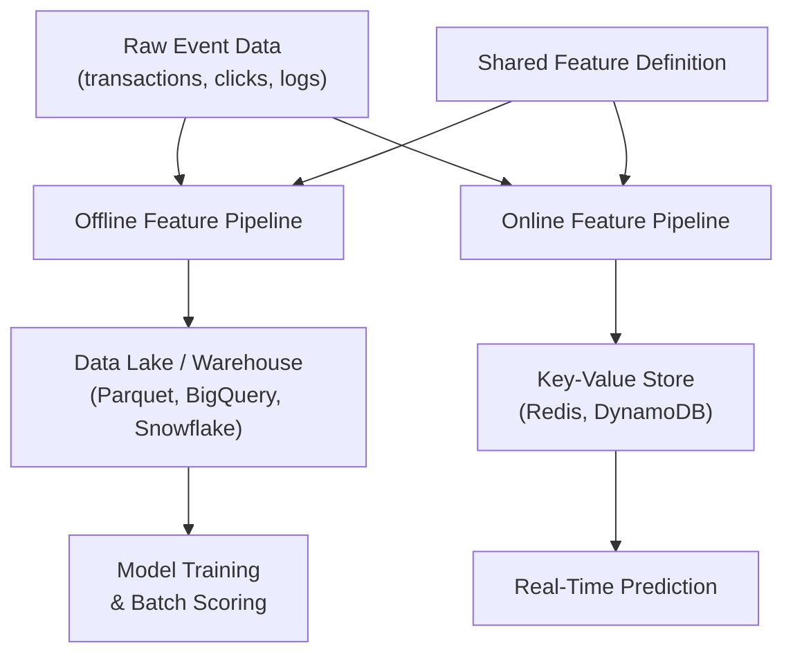

# Offline Features: Batch Computation for Training

## The Big Picture

The same feature concept operates in two distinct production contexts. **Offline features** serve the training and batch-scoring world — large historical datasets, heavy computation, throughput-optimised. **Online features** serve real-time prediction — single entities, millisecond latency, freshness-optimised.

Understanding this split is the foundation for feature store architecture and the primary mechanism for avoiding training-serving skew at scale.

---

## What Are Offline Features?

Offline features are computed over **large historical datasets** and stored in analytical systems:

- Data lakes (Parquet, ORC on S3/HDFS)
- Data warehouses (BigQuery, Snowflake, Redshift)
- Feature tables materialised by batch pipelines

**Primary use cases**:

- Training ML models on historical labels
- Batch scoring jobs (overnight churn predictions, weekly risk reports)
- Backtesting and offline evaluation
- Point-in-time correct dataset generation

**Design goal**: **throughput**, not per-row latency. Pipelines may run for minutes or hours, scanning billions of rows with heavy joins and aggregations.

---

## Offline Feature Pipeline: Customer Spend Example

### Step 1 — Raw Event Data

Start from transaction events:

| Column | Description |
|--------|-------------|
| `customer_id` | Entity key |
| `timestamp` | Event time |
| `amount` | Transaction value |
| `category` | Optional segmentation |

### Step 2 — Aggregation Job

Run a warehouse or Spark job to compute per-customer metrics over a 30-day window:

- `customer_30d_total_spend` — sum of amounts
- `customer_30d_txn_count` — transaction count
- `customer_30d_avg_ticket` — total spend / count

### Step 3 — Feature Table

Store results as a feature table with schema:

| customer_id | as_of_date | customer_30d_total | customer_30d_count | customer_30d_avg_ticket |
|-------------|------------|--------------------|--------------------|-------------------------|
| C001 | 2025-06-01 | 170.00 | 4 | 42.50 |
| C002 | 2025-06-01 | 320.00 | 8 | 40.00 |

**Key structural properties**:

- One row per entity per `as_of_date` (point-in-time snapshot)
- `as_of_date` enables traceability and point-in-time joins with labels
- Clean, aggregated columns ready for model consumption

### Step 4 — Training Join

Join the feature table with target labels on `(customer_id, as_of_date)`:

$$\text{training\_set} = \text{features} \bowtie_{\text{customer\_id, as\_of\_date}} \text{labels}$$

This produces the labelled dataset a training script consumes.

---

## Point-in-Time Correctness

Offline features must respect **temporal correctness** — a feature value at time $t$ must only use data available **before** $t$.

**Why it matters**: Using future information during training creates **data leakage**. The model learns patterns that will not exist at serving time.

| Approach | Correctness |
|----------|-------------|
| `as_of_date` column + lookback window | Point-in-time correct |
| Latest snapshot joined to all historical labels | Leakage risk |
| Feature computed from full dataset regardless of label date | Leakage risk |

Feature stores automate point-in-time joins; manual notebook pipelines often get this wrong.

---

## Offline vs Online: Preview

| Dimension | Offline | Online |
|-----------|---------|--------|
| Storage | Data lake / warehouse | Key-value store / cache |
| Use case | Training, batch scoring | Real-time prediction |
| Latency | Minutes to hours (job runtime) | Milliseconds (per lookup) |
| Freshness | As of last batch run | Near real-time |
| Compute | Heavy joins, aggregations | Fast lookups, light transforms |
| Scale pattern | Many rows at once | One entity at a time |

Both sides represent the **same feature concept** but are optimised for different infrastructure constraints.

---

## The Feature Store Connection

A feature store defines each feature once and **materialises** it into an offline store for training. This ensures:

- Training uses the canonical feature definition
- The same definition will later populate the online store for serving
- Point-in-time joins are supported through historical feature tables

---

## Real-World Context

An e-commerce churn model might compute offline features nightly:

- 30-day purchase frequency
- Days since last order
- Average cart value
- Category affinity scores

A Spark job reads six months of order events, writes a Parquet feature table to S3, and the training pipeline joins it with churn labels. The job takes 45 minutes — acceptable for offline. The same values must later be available via Redis lookup in under 10 ms at serving time.

---

## Common Pitfalls / Exam Traps

- **Treating offline tables as always fresh** — Batch features reflect the last pipeline run, not live state.
- **Skipping `as_of_date`** — Without a reference timestamp, point-in-time joins with labels are ambiguous or leaky.
- **Computing features on the full dataset without time bounds** — Leaks future information into training.
- **Assuming offline pipeline logic can run per request** — Warehouse-scale aggregations are incompatible with serving latency.
- **Confusing offline storage with offline *use*** — Offline features can also be used for batch scoring of new data, not only training.

---

## Quick Revision Summary

- Offline features: batch-computed, stored in data lake/warehouse, used for training and batch scoring.
- Optimised for throughput; pipelines run minutes to hours on billions of rows.
- Feature tables: one row per entity per `as_of_date` with aggregated columns.
- `as_of_date` enables point-in-time correct joins with labels — critical for avoiding leakage.
- Same feature concept as online features, but different storage, latency, and compute patterns.
- Feature stores materialise offline features from a single canonical definition.
- Example metrics: 30-day total spend, transaction count, average ticket size per customer.
