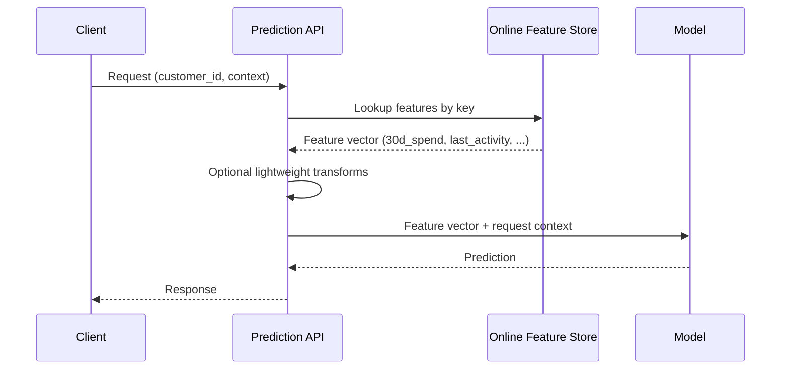
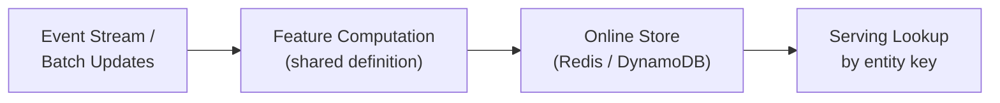

# Online Features: Low-Latency Serving

## Why Online Features Exist

During real-time prediction, a model receives one request at a time — one customer, one session, one item. It cannot wait for a Spark job or warehouse query. **Online features** are precomputed or cached values retrieved in milliseconds from a low-latency store.

The online path is where models actually live in production. Offline features build the training dataset; online features fuel every live inference call.

---

## Definition and Properties

Online features are computed or retrieved **at request time** for a **single entity**:

| Property | Requirement |
|----------|-------------|
| Latency | Few milliseconds per lookup (often 10–20 ms total for all features) |
| Availability | High uptime under heavy traffic |
| Freshness | Reflects recent events (minutes to hours, depending on use case) |
| Access pattern | Key-based lookup by entity ID |
| Storage | Low-latency key-value stores |

**Common storage backends**:

- Redis (in-memory cache)
- Amazon DynamoDB
- Apache Cassandra
- Embedded dictionaries (lab/demo only)

---

## Online Serving Flow



### Step-by-Step

1. **Request arrives** — contains entity key (e.g., `customer_id`) and optional context (session, device, geo).
2. **Feature lookup** — serving code queries the online store by key to retrieve precomputed features.
3. **Lightweight transforms** — combine stored features with request-time context (e.g., hour-of-day from request timestamp).
4. **Model inference** — feature vector passed to the model; prediction returned.

**Critical constraint**: no multi-way joins on large tables per request. Features must be **pre-materialised**.

---

## Materialisation

**Materialisation** is the process of computing feature values and pushing them into the online store:



Refresh strategies:

| Strategy | Freshness | Complexity |
|----------|-----------|------------|
| Scheduled batch push | Minutes to hours | Simple; nightly sync from offline table |
| Streaming updates | Seconds to minutes | Requires stream processing (Flink, Kafka consumers) |
| On-demand compute + cache | Variable | Compute on cache miss; higher tail latency |

---

## Online vs Offline Comparison

| Dimension | Offline Features | Online Features |
|-----------|-----------------|-----------------|
| **Data source** | Data lake / warehouse | Key-value store / cache |
| **Use case** | Training, batch scoring | Real-time prediction |
| **Scale** | Millions of rows per job | One entity per request |
| **Latency** | Minutes to hours (job) | Milliseconds (lookup) |
| **Freshness** | Last batch run | Near real-time |
| **Compute** | Heavy joins, aggregations | Fast lookups, light transforms |
| **Example store** | Parquet, BigQuery, Snowflake | Redis, DynamoDB, Cassandra |

Both represent the **same feature concept** — e.g., `customer_30d_spend` — optimised for different constraints.

---

## Worked Example: Customer Feature Lookup

**Online store contents** (keyed by `customer_id`):

```python
online_store = {
    "C001": {
        "customer_30d_total_spend": 170.0,
        "customer_30d_txn_count": 4,
        "customer_30d_avg_ticket": 42.5,
    }
}
```

**Serving call** for a live request:

```python
features = online_store["C001"]  # O(1) dictionary lookup
prediction = model.predict(features)
```

In production, this dictionary is Redis or DynamoDB, distributed across nodes, with TTL and refresh policies.

---

## API Requirements for Serving

A production online feature layer needs:

- **Stable API** — `get_online_features(entity_ids, feature_list)` with consistent schema
- **Low tail latency** — P99 within SLA (often < 20 ms)
- **Schema contract** — feature names, types, and defaults documented
- **Fallback behaviour** — defined handling for missing keys or stale values
- **Monitoring** — freshness, cache hit rate, lookup latency

---

## Real-World Context

A fraud detection API at a payment processor:

- Receives authorisation request with `customer_id` and transaction details
- Looks up 30-day spend, velocity features, and device fingerprint scores from Redis
- Total feature retrieval budget: 15 ms
- Features refreshed every 5 minutes via a streaming pipeline from transaction events
- Cannot query the Snowflake warehouse (200 ms+ query latency) per transaction

---

## Common Pitfalls / Exam Traps

- **Running batch aggregations per request** — Defeats the purpose of online features; use precomputation.
- **Assuming online store equals source of truth for training** — Training should use offline historical tables with point-in-time correctness.
- **Ignoring freshness SLAs** — Stale online features cause a different kind of production degradation (not skew, but drift).
- **No shared definition with offline path** — Reimplementing feature logic for online materialisation recreates training-serving skew.
- **Using online store for batch scoring at scale** — Key-value stores are optimised for point lookups, not scanning millions of entities.

---

## Quick Revision Summary

- Online features: precomputed values retrieved per entity at request time in milliseconds.
- Stored in low-latency key-value systems (Redis, DynamoDB, Cassandra).
- Serving flow: request → feature lookup by key → optional transforms → model inference.
- **Materialisation** pushes computed values into the online store via batch or streaming jobs.
- Optimised for latency and freshness; no heavy per-request joins.
- Must share the same feature definition as the offline path to avoid skew.
- Offline = throughput for training; online = latency for live prediction.
