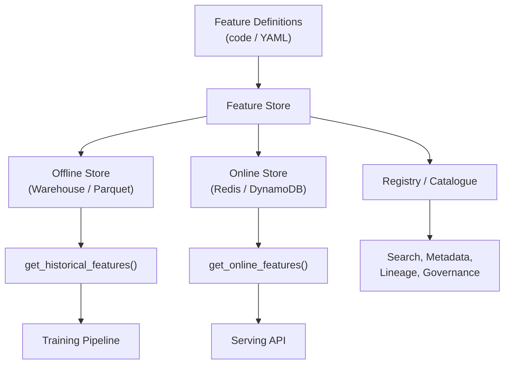
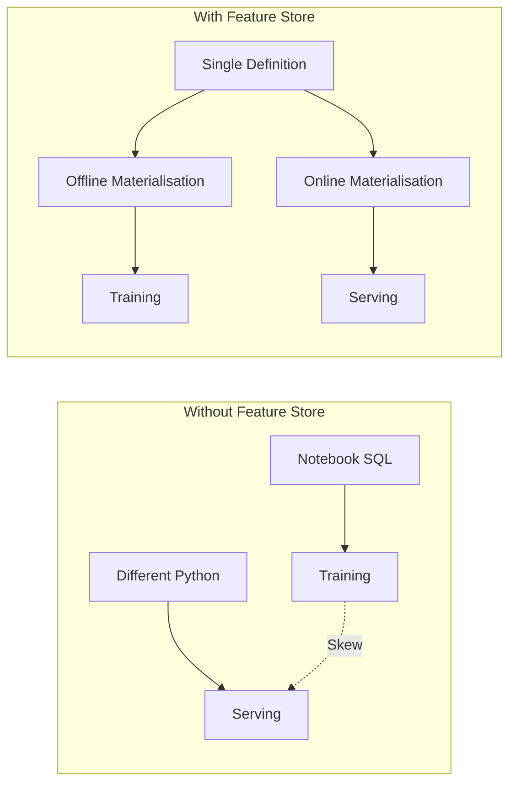

# What a Feature Store Provides

## Definition

A **feature store** is a central system that:

1. Lets you **define features once** in code or configuration
2. **Materialises** those features into both an offline store (training/batch scoring) and an online store (low-latency serving)
3. Exposes features through **APIs** and a **catalogue/registry** for discovery and reuse

**Core promise**: define a feature once, use it consistently offline and online, and avoid training-serving skew.

---

## Four Core Responsibilities

### 1. Feature Definition

Features are declared in code (Python) or configuration (YAML) specifying:

| Element | Purpose |
|---------|---------|
| Entity key | Primary lookup key (e.g., `customer_id`) |
| Event timestamp | Column for point-in-time correctness |
| Transformation logic | Aggregation, window, filters |
| Feature name & schema | Type, description, units |
| Source table/stream | Upstream data reference |

The definition is the **single source of truth**. Both offline and online materialisation derive from it.

### 2. Offline Materialisation

The feature store runs pipelines that:

- Read from source tables or streams
- Compute feature values over historical data
- Write feature tables to the data lake or warehouse
- Support **point-in-time correct joins** for training datasets

API example: `get_historical_features(entity_df, feature_refs, timestamp)` returns feature values as they existed at each entity's event time.

### 3. Online Materialisation

The feature store:

- Pushes latest feature values into a low-latency key-value store
- Keeps values fresh via streaming pipelines or scheduled sync jobs
- Enables serving code to call `get_online_features(entity_ids, feature_refs)`

### 4. Serving API and Catalogue

| Component | Function |
|-----------|----------|
| Historical features API | Build training datasets with temporal correctness |
| Online features API | Retrieve features for live inference |
| Registry / catalogue | Searchable index of all features with metadata |
| Discovery | Teams find and reuse existing features instead of reinventing |

---

## How a Feature Store Prevents Skew

One definition → two materialisation paths → identical semantics. The architectural guarantee is stronger than code review or testing alone.

---

## Feature Store vs Ad Hoc Pipelines

| Aspect | Ad Hoc Pipelines | Feature Store |
|--------|-------------------|---------------|
| Feature definition | Scattered across notebooks, SQL, services | Central, versioned registry |
| Training/serving sync | Manual; error-prone | Automated from same definition |
| Discovery | Tribal knowledge | Searchable catalogue |
| Point-in-time joins | Manual; leakage risk | Built-in support |
| Governance | None by default | Access control, versioning, lineage |
| Onboarding new models | Rebuild features from scratch | Reuse existing feature library |

---

## Ecosystem Preview

Concrete implementations of this pattern include:

- **Feast** — open-source baseline; self-hosted
- **Tecton** — managed enterprise platform
- **Hopsworks** — feature store within a broader ML platform

Vendor details differ; the four-responsibility pattern remains stable.

Organisational capabilities (reusability, metadata, lineage, governance) extend the technical foundation into company-wide ML infrastructure.

---

## Lab Preview

A minimal feature store can be simulated in a notebook:

- **Offline**: pandas DataFrame as warehouse feature table
- **Online**: Python dictionary as key-value cache
- **Shared function**: `compute_30d_features()` used by both paths
- **Skew demo**: intentionally mismatched window, then fix with shared definition

This makes the abstract architecture concrete and debuggable.

---

## Real-World Context

A ride-sharing company builds features for ETA prediction, surge pricing, and driver matching:

- `driver_7d_acceptance_rate` defined once in the feature store
- Offline: nightly Spark job writes historical table for model retraining
- Online: Redis updated every 2 minutes from trip event stream
- Three models (ETA, pricing, matching) reuse the same definition
- Registry shows owner, freshness SLA, and downstream model dependencies

Without a feature store, each team would reimplement acceptance rate with slightly different windows and filters.

---

## Common Pitfalls / Exam Traps

- **"Feature store = database"** — It is a system for definition, materialisation, serving, and governance — not just storage.
- **Defining features only in the offline store** — Online materialisation must derive from the same definition.
- **Ignoring the registry** — Without discovery, teams still reinvent features and reintroduce inconsistency.
- **Assuming a feature store replaces feature engineering** — It organises and serves features; transformation logic still must be correct.
- **Skipping point-in-time correctness** — Historical API must respect event timestamps, not just return latest values.

---

## Quick Revision Summary

- Feature store: central system to define features once and serve them offline and online.
- Four responsibilities: definition, offline materialisation, online materialisation, serving API + catalogue.
- Core promise: consistent features across training and serving → eliminates skew class.
- Offline store for training/batch scoring; online store for real-time prediction.
- Registry enables discovery, metadata, and reuse across teams and models.
- Implementations: Feast (OSS), Tecton (managed), Hopsworks (ML platform).
- Labs simulate the pattern with pandas + Python dict + shared function.
