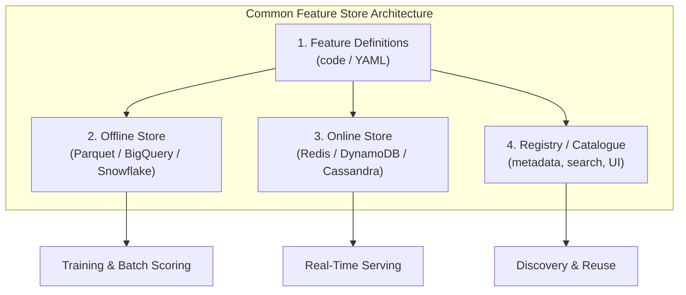

# Feature Store Ecosystem: Common Building Blocks

## Vendor-Agnostic Mental Model

Feature store products differ in branding, hosting model, and integrations — but the **core concepts remain remarkably stable**. Understanding the shared pattern matters more than memorising any specific vendor.

This section identifies the universal building blocks, uses **Feast** as an open-source mental baseline, and positions **Tecton** and **Hopsworks** as managed/enterprise implementations of the same architecture.

---

## Feature Store Recap

A feature store is a central system that:

- Defines features once
- Materialises them into offline stores (training/batch scoring) and online stores (low-latency serving)
- Exposes APIs plus a registry/catalogue for discovery and reuse

---

## Four Universal Building Blocks

### 1. Feature Definitions

Declared in code or configuration. Specify:

- **Entity key** — e.g., `customer_id`, `user_id`, `item_id`
- **Event time column** — for point-in-time correctness
- **Transformation logic** — aggregations, windows, filters
- **Source** — upstream table or stream reference

### 2. Offline Store

Historical feature tables in analytical storage:

- Parquet files on a data lake
- BigQuery, Snowflake, or Redshift tables
- Optimised for batch reads and point-in-time joins

### 3. Online Store

Low-latency key-value storage for serving:

- Redis, DynamoDB, Cassandra
- Keyed by entity ID
- Sub-millisecond to low-millisecond lookups

### 4. Registry / Catalogue

Metadata layer tracking:

- Feature owner and description
- Schema and data types
- Freshness and quality status
- Searchable UI for discovery

Prevents teams from reinventing features that already exist.

---

## Tool Landscape Overview

| Tool | Type | Positioning |
|------|------|-------------|
| **Feast** | Open-source, self-hosted | Conceptual baseline; Python/YAML definitions |
| **Tecton** | Managed enterprise platform | Infrastructure + pipelines + governance UI |
| **Hopsworks** | ML platform with feature store | Feature store + notebooks + model registry |

All implement the same four-block pattern with different depth in management, UI, and ecosystem integration.

---

## Why a Stable Pattern Matters

When evaluating any feature store — including custom internal platforms — ask:

1. Where do **feature definitions** live?
2. How are **offline and online views** kept in sync?
3. What does the **registry/catalogue** provide?
4. How are **new features added safely** (versioning, testing, rollout)?

These questions transfer across Feast, Tecton, Hopsworks, and bespoke systems.

---

## When Feature Stores Make Sense

| Signal | Description |
|--------|-------------|
| Repeated training-serving skew | Multiple incidents of offline/online mismatch |
| Feature duplication | Many teams reimplementing the same aggregations |
| Growing online feature demand | Need for low-latency features at scale |
| Multi-model reuse | Same features needed across churn, fraud, recommendation |
| Governance requirements | PII, access control, audit trails |

---

## Common Pitfalls / Exam Traps

- **Memorising vendor APIs instead of the pattern** — Exams test concepts (offline/online, registry, materialisation), not specific SDK calls.
- **Assuming all feature stores are fully managed** — Feast is self-hosted; operational burden differs significantly.
- **Ignoring the registry as optional** — Without discovery, the store becomes a silent data warehouse, not a shared platform.
- **Treating Hopsworks as "just" a feature store** — It bundles notebooks, orchestration, and model registry; scope is broader.
- **Believing vendor choice determines architecture** — The four building blocks are the architecture; vendors implement them differently.

---

## Quick Revision Summary

- All feature stores share four building blocks: definitions, offline store, online store, registry.
- Feast = open-source baseline; Tecton = managed enterprise; Hopsworks = broader ML platform.
- Vendor names change; core concepts (define once, materialise twice, serve via API) stay stable.
- Evaluate any feature store by asking about definitions, sync, registry, and safe feature addition.
- Use cases: skew prevention, feature reuse, online latency, governance.
- Pattern recognition matters more than tool expertise for model engineers.
