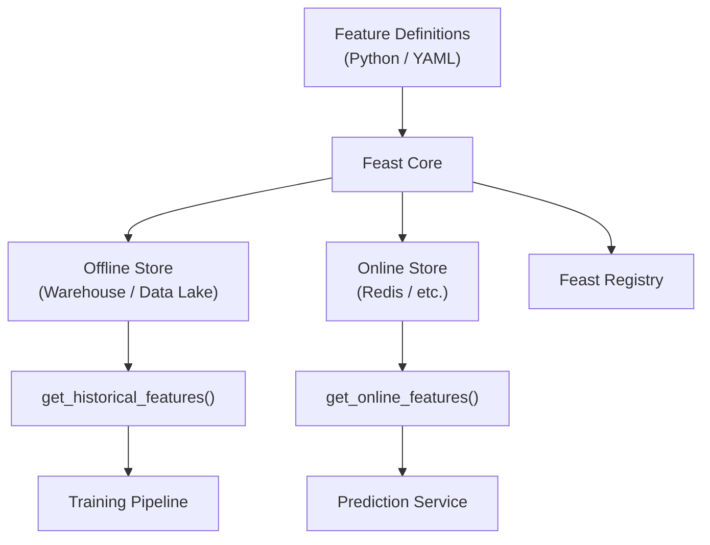
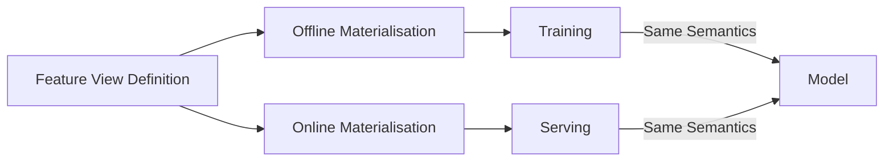

# Feast: Open-Source Feature Store Baseline

## Why Feast as a Reference

**Feast** (Feature Store) is an open-source feature store widely used as a starting point and conceptual reference. If you understand the Feast pattern — feature views, entities, offline/online materialisation, serving APIs — most other feature stores feel familiar.

Feast is **self-hosted**: your team manages infrastructure, pipelines, and operations. It provides the architectural skeleton without managed pipeline orchestration.

---

## Feast Core Concepts

| Concept | Description |
|---------|-------------|
| **Entity** | Key type for features (e.g., `customer_id`) |
| **Feature View** | A logical group of features derived from a source, with transformation logic |
| **Feature Service** | A curated bundle of features for a specific model or use case |
| **Data Source** | Upstream table, file, or stream reference |
| **Registry** | Metadata store tracking all definitions |

Features are defined in **Python** or **YAML**, specifying entities, feature views, and source tables.

---

## Feast Architecture



### Storage Backends

- **Offline**: connects to warehouse or data lake (BigQuery, Snowflake, Parquet on S3)
- **Online**: pushes fresh values to Redis or similar key-value stores

---

## Feast Workflow (Simplified)

### Step 1 — Define Features

Create feature views in code or YAML:

```python
# Conceptual Feast definition (illustrative)
customer_spend_view = FeatureView(
    name="customer_spend_30d",
    entities=["customer"],
    ttl=timedelta(days=30),
    schema=[
        Field(name="total_spend", dtype=Float64),
        Field(name="txn_count", dtype=Int64),
        Field(name="avg_ticket", dtype=Float64),
    ],
    source=transaction_source,
)
```

Specifies entities, time column, source table, and feature schema.

### Step 2 — Materialise Offline Features

Run materialisation jobs that:

- Read from the data warehouse
- Compute historical feature tables
- Make data available via `get_historical_features()` for training

This supports point-in-time correct training datasets.

### Step 3 — Materialise Online Features

Push latest feature values into the online store (e.g., Redis):

```python
# Conceptual serving call
features = store.get_online_features(
    features=["customer_spend_30d:total_spend", "customer_spend_30d:txn_count"],
    entity_rows=[{"customer_id": "C001"}],
)
```

Serving code calls `get_online_features(entity_ids)` for real-time lookup.

---

## The Anti-Skew Guarantee

Both offline and online views are computed from the **same feature definition**. The transformation logic is not reimplemented for serving — it is materialised differently (batch vs push), but the semantics are identical.



---

## Feast Strengths and Limitations

| Strengths | Limitations |
|-------------|-------------|
| Open-source, no vendor lock-in | Self-hosted ops burden |
| Clear mental model for feature stores | Pipeline orchestration is DIY |
| Flexible backend choices | No built-in enterprise governance UI |
| Good for learning and prototyping | Streaming materialisation requires extra setup |
| Widely adopted as reference architecture | Less opinionated than managed platforms |

---

## Feast vs Managed Platforms

| Aspect | Feast | Tecton / Hopsworks |
|--------|-------|---------------------|
| Hosting | Self-hosted | Managed / platform |
| Pipeline orchestration | Bring your own (Airflow, Spark) | Built-in |
| UI / governance | Minimal registry | Rich dashboards, access control |
| Streaming support | Configurable | Deep integration |
| Cost model | Infrastructure cost only | Platform licensing + infra |
| Best for | Learning, small teams, custom infra | Enterprise scale, multi-team governance |

---

## Real-World Context

A mid-size fintech team adopts Feast:

- Defines 40 features for credit risk models in Python
- Offline: nightly Spark job materialises to Parquet on S3
- Online: hourly sync pushes latest values to Redis
- Two models (application scoring, transaction monitoring) share feature views
- Registry YAML checked into Git for version control

The team owns all pipeline orchestration but gains consistent offline/online semantics.

---

## Common Pitfalls / Exam Traps

- **Confusing Feast registry with offline store** — Registry holds metadata/definitions; offline store holds computed historical values.
- **Skipping online materialisation** — Defining features in Feast without pushing to Redis leaves serving without a path.
- **Assuming Feast runs pipelines automatically** — Feast orchestrates materialisation commands; actual compute jobs (Spark, SQL) are external.
- **Treating Feast as production-complete out of the box** — Monitoring, governance, and streaming require additional engineering.
- **Different feature views for offline vs online** — Should be the same view, materialised to different stores.

---

## Quick Revision Summary

- Feast: open-source feature store; mental baseline for understanding all feature stores.
- Core concepts: entities, feature views, feature services, data sources, registry.
- Workflow: define → materialise offline → materialise online → serve via APIs.
- `get_historical_features()` for training; `get_online_features()` for serving.
- Same feature definition drives both materialisation paths → prevents skew.
- Self-hosted: flexible but requires own pipeline orchestration.
- Understanding Feast pattern transfers to Tecton, Hopsworks, and custom platforms.
