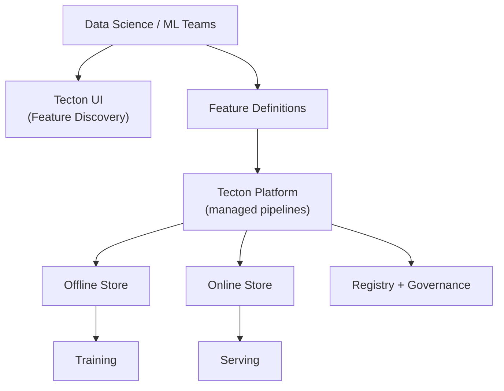
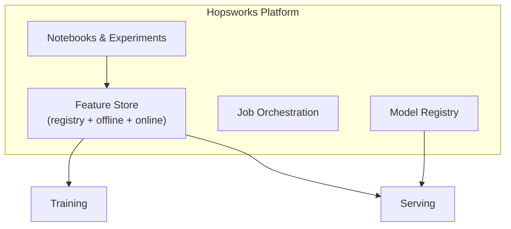

# Managed Feature Platforms: Tecton and Hopsworks

## Same Pattern, Different Packaging

**Tecton** and **Hopsworks** implement the identical feature store building blocks — feature definitions, offline store, online store, registry — but wrap them in managed, enterprise-oriented platforms with richer UI, pipeline automation, and deeper ecosystem integration.

Understanding Feast provides the baseline; these platforms show how the pattern scales to multi-team organisations.

---

## Tecton: Managed Enterprise Feature Platform

### Positioning

Tecton follows the standard feature store pattern but focuses on being a **fully managed enterprise platform**:

- Runs infrastructure and pipelines on behalf of teams
- Provides a rich UI for discovering and managing features
- Integrates deeply with warehouses, streaming systems, and model serving platforms
- Emphasises reliability, governance, and shared infrastructure

### Key Differentiators

| Capability | Tecton Approach |
|------------|-----------------|
| Pipeline management | Managed; teams define features, Tecton runs compute |
| UI | Rich feature discovery and management dashboard |
| Streaming | Deep integration with Kafka, Kinesis, etc. |
| Warehouse integration | Native connectors to Snowflake, BigQuery, Redshift |
| Model serving integration | Connects to SageMaker, Databricks, custom endpoints |
| Governance | Built-in access control, monitoring, SLAs |

### Mental Model

**Focus**: make feature engineering a **shared platform** for many teams, not a per-project activity.

---

## Hopsworks: ML Platform with Integrated Feature Store

### Positioning

Hopsworks combines a feature store with a **broader machine learning platform**. From a feature store perspective, it has the same ingredients:

- Feature registry
- Offline feature tables
- Online store
- Batch and streaming feature pipelines

But it also includes:

- Integrated notebooks and experiment tracking
- Job orchestration
- Model registry
- Full platform where data engineering and ML live closer together

### Architecture View

### Key Differentiators

| Capability | Hopsworks Approach |
|------------|-------------------|
| Scope | Full ML platform, not feature store only |
| Notebooks | Integrated development environment |
| Model registry | Versioned models linked to feature dependencies |
| Orchestration | Built-in pipeline scheduling |
| Feature store | First-class but within larger ecosystem |

---

## Three-Way Comparison

| Dimension | Feast | Tecton | Hopsworks |
|-----------|-------|--------|-----------|
| **Hosting** | Self-hosted OSS | Managed SaaS | Managed platform / self-hosted options |
| **Pipeline ops** | DIY (Airflow, Spark) | Fully managed | Built-in orchestration |
| **UI richness** | Minimal registry | Enterprise dashboard | Platform-wide UI |
| **Streaming** | Configurable | Deep native support | Supported |
| **Governance** | Basic (Git-based registry) | Enterprise (RBAC, audit) | Platform-level |
| **Scope** | Feature store only | Feature platform | Full ML lifecycle |
| **Best for** | Learning, custom infra | Large enterprise, multi-team | Teams wanting unified ML platform |
| **Cost** | Infra only | Platform license + usage | Platform license |

---

## What Stays the Same

Despite packaging differences, all three share:

1. **Feature definitions** in code or configuration
2. **Offline materialisation** for training and batch scoring
3. **Online materialisation** for low-latency serving
4. **Registry/catalogue** for discovery and metadata

The vendor-specific details — hosting, UI depth, streaming connectors, pricing — differ. The **core pattern is recognisable** across all implementations.

---

## Choosing a Platform: Decision Factors

| Factor | Lean Toward |
|--------|-------------|
| Small team, learning, budget-conscious | Feast (self-hosted) |
| Large org, many teams, governance needs | Tecton |
| Want notebooks + model registry + features together | Hopsworks |
| Existing heavy Spark/Airflow investment | Feast with existing orchestration |
| Real-time features at scale with SLAs | Tecton or Hopsworks (managed streaming) |
| Full control over infrastructure | Feast or self-hosted Hopsworks |

---

## Real-World Context

**Tecton**: A large bank uses Tecton for fraud features across 12 ML teams. Feature definitions are shared; Tecton manages streaming materialisation from Kafka into Redis with 2-minute freshness SLAs. Governance enforces that PII features require compliance-team approval.

**Hopsworks**: A healthcare analytics company uses Hopsworks for the full pipeline — feature engineering in notebooks, feature store for patient risk scores, model registry for versioned classifiers, orchestration for nightly retraining.

---

## Common Pitfalls / Exam Traps

- **"Tecton and Feast are completely different architectures"** — Same pattern; Tecton adds managed ops and enterprise UI.
- **Assuming managed = no engineering work** — Feature definitions, quality, and semantics still require domain expertise.
- **Choosing Hopsworks only for feature store** — Its value proposition is the integrated platform; using only the feature store may be over-engineering.
- **Ignoring self-hosted operational cost** — Feast is "free" but pipeline monitoring, scaling, and on-call are not.
- **Vendor lock-in vs pattern knowledge** — Understand the four building blocks so you can migrate or build custom solutions.

---

## Quick Revision Summary

- Tecton: managed enterprise feature platform; runs pipelines, rich UI, deep streaming/warehouse integration.
- Hopsworks: ML platform with integrated feature store, notebooks, model registry, orchestration.
- Both implement the same four building blocks as Feast with more management and governance.
- Differences: hosting model, UI depth, ecosystem integration, scope (feature-only vs full ML platform).
- Core pattern stable across all vendors: define → materialise offline + online → serve via API + registry.
- Platform choice depends on team size, governance needs, existing infra, and real-time requirements.
