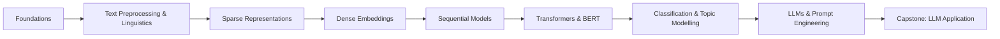

# Natural Language Processing and Understanding: Course Overview

## Why This Course Exists

Machines that read, interpret, and generate human language are no longer research curiosities — they are production infrastructure. Search engines rank billions of documents, translation systems bridge languages in milliseconds, keyboards predict the next word, and large language models draft code, summarise reports, and power conversational agents.

**Natural Language Processing (NLP)** sits at the centre of this shift. It is the discipline that turns unstructured text into actionable signals and fluent output. For postgraduate ML practitioners, NLP literacy is among the highest-leverage skills in modern AI engineering.

---

## 1. NLP as the Interface Layer of Modern AI

NLP has evolved from a narrow AI subfield into the **primary interface** between humans and intelligent systems.

| Application Area | NLP Role |
|------------------|----------|
| **Markets and analytics** | Sentiment analysis on news and social data drives trading and brand strategy |
| **Software development** | LLMs co-author code, documentation, and test cases |
| **Customer experience** | Chatbots, ticket routing, and personalised responses at scale |
| **Knowledge work** | Summarisation, Q&A, and semantic search over enterprise documents |

The ability to **process text computationally** is now a core engineering competency — not an optional specialisation.

---

## 2. Course Learning Arc

The curriculum progresses from linguistic foundations to state-of-the-art generative systems:

### Phase 1 — Foundations

- What NLP, NLU, and NLG are and how they relate
- Linguistic concepts: morphology, ambiguity, polysemy, synonymy
- Text preprocessing: tokenisation, noise removal, stemming, lemmatisation

### Phase 2 — Representing Words as Numbers

- **Sparse methods:** one-hot encoding, Bag of Words, TF-IDF
- **Dense embeddings:** Word2Vec, GloVe, static vs contextual representations
- Visualising and interpreting embedding spaces

### Phase 3 — Sequential Modelling

- Sequence-to-sequence framing for language tasks
- Recurrent Neural Networks (RNNs) and their limitations
- **LSTM** and **GRU** — gated architectures that preserve long-range context
- Vanishing gradient problem and why gates matter

### Phase 4 — The Transformer Revolution

- Self-attention and the *Attention Is All You Need* architecture
- Encoder-decoder and decoder-only model families (GPT, BERT)
- Hugging Face ecosystem for pretrained model access
- BERT: pre-training objectives, fine-tuning, and variants (RoBERTa, ALBERT, DistilBERT)

### Phase 5 — Applied NLP

- Text classification and sentiment analysis (NLTK, BERT, Flair, spaCy)
- Topic modelling: LDA, BERTopic, GSDMM
- Large Language Models: how they generate text, output control, prompting strategies

### Phase 6 — Capstone Project

- End-to-end LLM-powered application (quiz generation)
- Prompt templates, API integration, backend/frontend architecture

---

## 3. Hands-On Projects

Theory is paired with implementation throughout:

| Project | Skills Practised |
|---------|------------------|
| **Semantic search engine** | Embeddings, similarity, retrieval |
| **Sentiment classifier** | Feature engineering, transformer fine-tuning, tool comparison |
| **Quiz app powered by LLMs** | Prompt engineering, API integration, full-stack deployment |

Hands-on work solidifies the **why** (linguistic and architectural reasoning) alongside the **how** (library usage and pipeline construction).

---

## 4. Learning Outcomes

By course completion, a student should be able to:

- Explain why human language is hard for machines and how preprocessing addresses it
- Choose between sparse and dense representations for a given task
- Describe RNN → LSTM → Transformer evolution and when each paradigm applies
- Fine-tune or prompt pretrained models for classification and generation tasks
- Design and deploy a practical NLP application using modern LLM APIs

The trajectory moves from **AI consumer** to **AI engineer** — understanding mechanisms, not just invoking APIs.

---

## 5. Technology Stack Preview

| Layer | Tools / Concepts |
|-------|------------------|
| Preprocessing | NLTK, spaCy, Flair, regex |
| Classical ML features | scikit-learn, TF-IDF, BoW |
| Embeddings | Gensim (Word2Vec), GloVe |
| Deep learning | TensorFlow/Keras (RNN, LSTM, GRU) |
| Transformers | Hugging Face Transformers, BERT |
| Topic modelling | LDA (Gensim), BERTopic |
| LLMs | Gemini, OpenAI APIs, Google AI Studio |
| Capstone | Python backend + frontend, prompt templates |

---

## Common Pitfalls / Exam Traps

- Treating NLP as only "ChatGPT usage" — classical preprocessing and representations remain foundational and examinable
- Skipping early modules to jump to transformers — attention mechanisms assume understanding of sequences, embeddings, and task framing
- Confusing **tool familiarity** with **conceptual mastery** — knowing Hugging Face API syntax ≠ explaining why BERT uses masked language modelling
- Underestimating **linguistic ambiguity** — it motivates the entire arc from rule-based systems to contextual embeddings

---

## Quick Revision Summary

- NLP is the interface layer of modern AI — search, translation, sentiment, LLMs
- Course arc: foundations → sparse/dense representations → RNNs/LSTMs → transformers/BERT → applications → LLM capstone
- Sparse: one-hot, BoW, TF-IDF; Dense: Word2Vec, GloVe; Contextual: BERT, LLMs
- Sequential models (RNN, LSTM, GRU) precede transformers; vanishing gradients motivate gated architectures
- Hands-on: semantic search, sentiment classifier, LLM quiz application
- Goal: understand both the *why* behind language AI and the *how* of implementation
