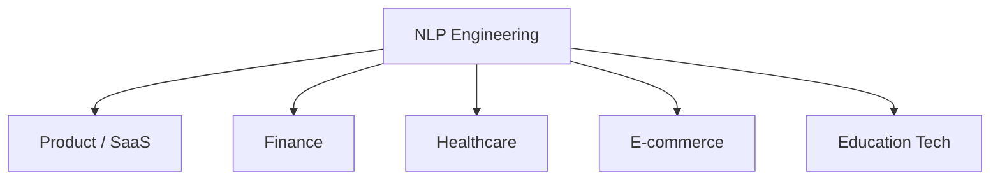

# Practitioner-Led NLP Education: What to Expect

## Intuition First

Academic NLP curricula often emphasise theory and benchmark datasets. Industry NLP work demands something additional: shipping pipelines that handle messy production text, integrating pretrained models with business APIs, and iterating under latency and cost constraints. A course led by an experienced **AI engineer** bridges that gap — grounding concepts in patterns seen across real product deployments.

This note frames what practitioner-led instruction typically emphasises and how students should engage to maximise transfer to professional work.

---

## 1. Industry Experience vs Pure Academia

| Dimension | Academic Focus | Practitioner Focus |
|-----------|----------------|-------------------|
| **Data** | Clean benchmark corpora (IMDB, CoNLL) | Noisy user-generated text, domain jargon, PII |
| **Success metric** | Accuracy, F1, BLEU on test sets | Latency, cost per request, maintainability, user satisfaction |
| **Model choice** | State-of-the-art novelty | Fit-for-purpose: VADER vs BERT vs LLM by constraint |
| **Delivery** | Notebook experiments | APIs, monitoring, versioning, failure handling |

A practitioner-led NLP course does not replace theoretical rigour — it **contextualises** it. Every architecture choice (TF-IDF vs embedding vs fine-tuned BERT vs prompted LLM) maps to a deployment trade-off students will face in industry.

---

## 2. Cross-Industry Exposure

Experienced NLP practitioners typically work across multiple domains:

Each domain imposes different constraints:

- **Finance** — compliance, audit trails, low tolerance for hallucination
- **Healthcare** — specialised vocabulary, HIPAA-style privacy, high precision for NER
- **Product/SaaS** — scale, multilingual support, A/B testing of model versions
- **E-commerce** — real-time sentiment, search relevance, personalisation

Exposure to varied industries teaches **transferable patterns** (preprocessing pipelines, evaluation discipline) while highlighting where domain adaptation is non-negotiable.

---

## 3. Mentorship-Oriented Learning

Effective practitioner instruction often includes:

- **Worked examples** from production-adjacent scenarios, not only textbook datasets
- **Tool literacy** — NLTK, spaCy, Flair, Hugging Face, LLM APIs — with guidance on when each fits
- **Debugging mindset** — why a sentiment model fails on sarcasm, why LDA topics are incoherent, why prompts drift
- **Career-relevant framing** — how NLP skills compose with MLOps, data engineering, and full-stack delivery

Students benefit by treating labs as **portfolio artefacts**, not checkbox exercises.

---

## 4. How to Engage With This Course

| Practice | Rationale |
|----------|-----------|
| **Implement, don't only read** | NLP intuition comes from seeing tokenisation edge cases and embedding failures firsthand |
| **Compare approaches** | Week 10's NLTK vs BERT vs Flair vs spaCy comparison mirrors real tool-selection decisions |
| **Build the capstone end-to-end** | QuizGenius exercises prompt design, API integration, and architecture — skills directly transferable to LLM product work |
| **Document trade-offs** | For each technique, note accuracy, speed, cost, and interpretability — the dimensions practitioners optimise |

---

## 5. From Student to Practitioner

The course trajectory aligns with a common professional path:

Practitioner-led delivery accelerates the final steps — students see how pretrained models and APIs compress time-to-value while still requiring solid fundamentals for debugging and customisation.

---

## Common Pitfalls / Exam Traps

- Assuming industry experience means skipping theory — exams test **conceptual understanding** (LSTM gates, attention, LDA assumptions), not just API usage
- Believing one tool wins everywhere — practitioners constantly trade off VADER speed vs BERT accuracy vs LLM flexibility
- Ignoring **mentorship value** — asking why a design choice was made beats memorising code snippets
- Conflating years of experience with infallibility — validate recommendations against documentation and reproducible experiments

---

## Quick Revision Summary

- Practitioner-led NLP education emphasises production trade-offs alongside theory
- Industry work spans domains with different compliance, vocabulary, and latency needs
- Mentorship adds worked examples, tool selection guidance, and debugging mindset
- Engage by implementing, comparing approaches, and building the capstone as a portfolio piece
- Course path mirrors professional growth: fundamentals → pipelines → models → transformers → LLM deployment
- Balance practitioner insights with exam-focused conceptual mastery
