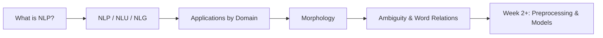

# Introduction to Natural Language Processing

## The Core Question

How do machines work with human language? Text and speech are everywhere — search queries, support tickets, clinical notes, social posts — yet computers natively operate on numbers, not words. **Natural Language Processing (NLP)** is the discipline that bridges that gap: it gives machines the ability to read, interpret, and respond in human language.

This opening module establishes the vocabulary, scope, and linguistic foundations needed for every technique that follows — from tokenisation and tagging to transformers and large language models.

---

## 1. What This Module Covers

The module is organised around three pillars:

| Pillar | Focus |
|--------|-------|
| **Core NLP concepts** | What NLP is, what problems it solves, and where it appears in production systems |
| **NLP, NLU, and NLG** | How understanding and generation relate under the NLP umbrella |
| **Linguistic foundations** | Morphology, ambiguity, polysemy, and synonymy — why language is hard for machines |

---

## 2. Why Language Is a Distinct Engineering Problem

Unlike structured database fields, natural language is:

- **Unstructured** — no fixed schema; meaning emerges from word order, punctuation, and context
- **Ambiguous** — the same surface form can carry multiple interpretations
- **Context-dependent** — word meaning shifts with domain, culture, and surrounding text

NLP systems must therefore handle noise, variation, and implicit meaning — not just pattern-match strings.

---

## 3. Module Learning Path

1. Define NLP and its high-level goals (read, extract, generate)
2. Distinguish **NLU** (understanding) from **NLG** (generation)
3. Survey real-world applications across search, healthcare, finance, and education
4. Introduce **morphology** — how words are built from roots and affixes
5. Examine **ambiguity**, **polysemy**, and **synonymy** — core reasons embedding-based methods eventually replace naive dictionary lookups

---

## Common Pitfalls / Exam Traps

- Treating NLP as only "chatbots" — it spans search ranking, fraud monitoring, clinical summarisation, and more
- Assuming NLP = NLG — **NLU** (classification, NER, sentiment) is equally central and often the upstream step
- Believing rule-based dictionary lookup suffices — **context** is required to resolve polysemy and domain-specific senses
- Ignoring linguistic foundations — morphology directly motivates stemming, lemmatisation, and vocabulary reduction in preprocessing pipelines

---

## Quick Revision Summary

- NLP enables machines to understand, process, and interact using human language
- Language is unstructured, ambiguous, and context-dependent — unlike typical tabular data
- This module covers NLP scope, NLU/NLG relationship, applications, morphology, and ambiguity
- Morphology studies word structure; it motivates preprocessing and vocabulary management
- Polysemy and synonymy explain why context-aware representations (embeddings) are essential
- Foundation concepts here underpin every later week: preprocessing, tagging, embeddings, transformers, and LLMs
