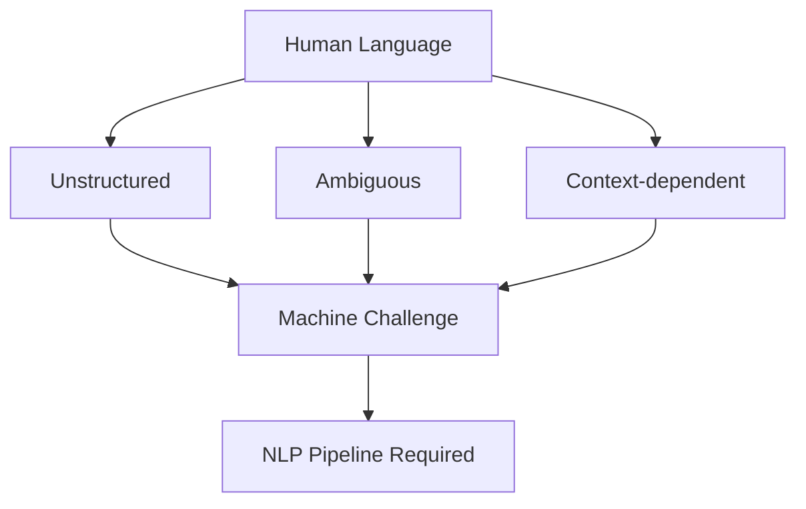

# What Is Natural Language Processing?

## Intuition First

Every day, billions of people type queries, send messages, and speak to devices. Computers, however, only manipulate bits and floating-point numbers. **Natural Language Processing (NLP)** is the field of artificial intelligence devoted to closing that representational gap — enabling machines to **understand**, **process**, and **interact** using human language as humans do.

NLP sits at the intersection of computer science, artificial intelligence, and linguistics. Its goal is not merely to store text, but to extract meaning and act on it.

---

## 1. Formal Definition

**Natural Language Processing (NLP)** is the branch of AI that focuses on enabling computers to:

1. **Read and interpret** text or speech
2. **Extract** structured, useful information from unstructured language
3. **Generate** meaningful responses in natural language

At a high level, NLP bridges **human communication** and **machine computation**.

---

## 2. Why Human Language Is Hard

Human language carries properties that make naive string processing insufficient:

| Property | Meaning | Machine Impact |
|----------|---------|----------------|
| **Unstructured** | No rigid schema; free-form sentences | Requires parsing, segmentation, and feature extraction |
| **Ambiguous** | Multiple valid interpretations per utterance | Context and world knowledge needed to disambiguate |
| **Context-dependent** | Meaning shifts with speaker, domain, prior sentences | Models must track discourse and situational cues |

These properties explain why NLP pipelines are multi-stage (tokenise → tag → embed → classify/generate) rather than single-regex solutions.

---

## 3. What NLP Aims to Achieve

At the highest level, NLP systems pursue three capabilities:

- **Read and interpret** — assign structure and meaning to raw text
- **Extract information** — pull entities, intents, sentiments, and facts into machine-usable form
- **Generate responses** — produce human-readable output (summaries, answers, translations)

These map to downstream tasks: search ranking, spam detection, dialogue, summarisation, and machine translation.

---

## 4. Everyday NLP Applications

| Domain | Example System | NLP Task |
|--------|----------------|----------|
| **Search** | Google, Bing | Query understanding, document ranking |
| **Voice** | Siri, Alexa | Speech recognition + language understanding |
| **Email** | Gmail spam filter | Text classification (spam vs not spam) |
| **Mobile keyboards** | Next-word prediction | Language modelling |
| **Generative AI** | ChatGPT, Gemini | Large-scale language understanding and generation |

Each application combines multiple NLP sub-tasks — tokenisation, classification, generation — often in a single production pipeline.

---

## Common Pitfalls / Exam Traps

- Defining NLP as only "text generation" — **understanding and extraction** are equally core
- Ignoring **ambiguity** when designing systems — rule-only approaches fail on real corpora
- Confusing NLP with **speech recognition** — ASR converts audio to text; NLP operates on the resulting (or typed) language
- Assuming one model solves all tasks — production stacks combine specialised components (retrieval, classification, generation)

---

## Quick Revision Summary

- NLP = AI field enabling machines to understand, process, and generate human language
- It spans computer science, AI, and linguistics
- Language is unstructured, ambiguous, and context-dependent — the root difficulty
- High-level goals: read/interpret, extract information, generate responses
- Real examples: search engines, voice assistants, spam filters, autocomplete, LLM chat apps
- NLP bridges human communication and machine computation
