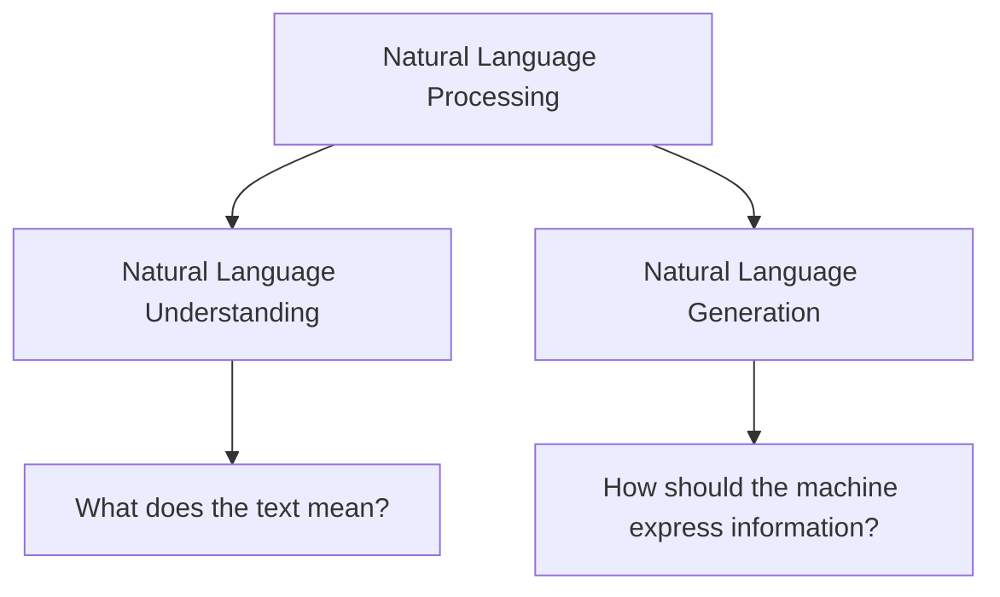
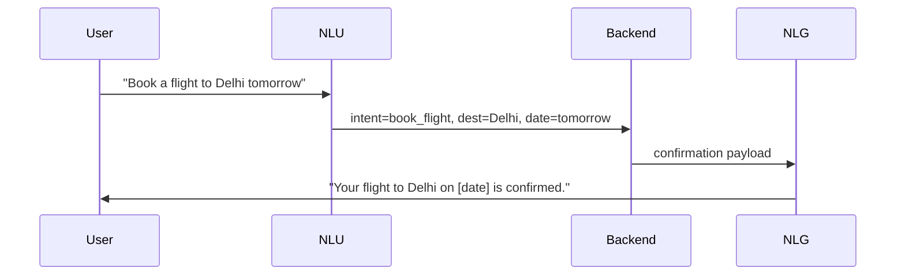

# NLP, NLU, and NLG: Understanding the Relationship

## Intuition First

Not every language task asks the same question. Sometimes the machine must **figure out what a human meant**; other times it must **say something useful back**. These two directions — comprehension and production — are the twin engines of practical NLP systems.

**Natural Language Processing (NLP)** is the umbrella. Under it sit **Natural Language Understanding (NLU)** and **Natural Language Generation (NLG)**. Most production applications use both, often in sequence.

---

## 1. The Hierarchy

| Term | Core Question | Direction |
|------|---------------|-----------|
| **NLP** | How do we process human language computationally? | Umbrella — includes both understanding and generation |
| **NLU** | What does the input text **mean**? | Input → structured meaning |
| **NLG** | How should the machine **express** information? | Structured data → human-readable text |

---

## 2. Natural Language Understanding (NLU)

NLU focuses on **comprehending** text: extracting intent, entities, sentiment, and other semantic signals.

**Primary concern:** *What does the text mean?*

### Typical NLU Tasks

- **Sentiment analysis** — classify opinion polarity (positive, negative, neutral)
- **Named Entity Recognition (NER)** — locate and type entities (person, organisation, date)
- **Text classification** — assign documents or utterances to predefined categories
- **Intent detection** — map user utterances to actions in dialogue systems

NLU transforms unstructured language into **machine-actionable representations** — labels, entity spans, embedding vectors, or structured slots.

---

## 3. Natural Language Generation (NLG)

NLG focuses on **producing** human-like language from data or internal representations.

**Primary concern:** *How can a machine communicate information clearly in human language?*

### Typical NLG Tasks

- **Text summarisation** — condense long documents into concise summaries
- **Chatbots and question answering** — formulate natural responses to user queries
- **Report generation** — turn analytics or database records into narrative prose
- **Machine translation** — render content in another human language

NLG transforms structured or semi-structured input into **fluent, readable output**.

---

## 4. How NLU and NLG Work Together

Real-world systems rarely stop at understanding or generation alone.

| Stage | Component | Role |
|-------|-----------|------|
| Input | NLU | Parse intent and slots from user text |
| Reasoning | Backend / KB | Execute business logic, retrieve data |
| Output | NLG | Render results as natural language |

Examples: customer-support bots (classify ticket → draft reply), search assistants (understand query → summarise results), clinical tools (extract entities from notes → generate discharge summary).

---

## 5. Comparison Table

| Aspect | NLU | NLG |
|--------|-----|-----|
| **Input** | Human language (text/speech) | Structured data, prompts, or internal state |
| **Output** | Labels, entities, embeddings, parsed meaning | Sentences, paragraphs, dialogue turns |
| **Evaluation** | Accuracy, F1, entity-level metrics | Fluency, coherence, factual correctness |
| **Example stack** | BERT classifier, spaCy NER | GPT-style decoder, template + LLM hybrid |

---

## Common Pitfalls / Exam Traps

- Claiming NLU and NLG are disjoint — **most applications combine both** (understand → act → respond)
- Equating NLG only with chatbots — summarisation, translation, and report generation are equally NLG
- Treating NLP as synonymous with NLU — NLP is the **superset**
- Forgetting that modern LLMs blur the boundary — a single decoder-only model can perform both understanding-style and generation-style tasks, but the conceptual distinction remains useful for system design

---

## Quick Revision Summary

- NLP is the umbrella; NLU and NLG are its two major branches
- NLU asks *what does the text mean?* — sentiment, NER, classification, intent
- NLG asks *how should the machine express information?* — summarisation, QA, reports, translation
- NLU = understanding; NLG = generation
- Production pipelines typically chain NLU → backend logic → NLG
- Conceptual split remains valuable even when one model handles multiple tasks
