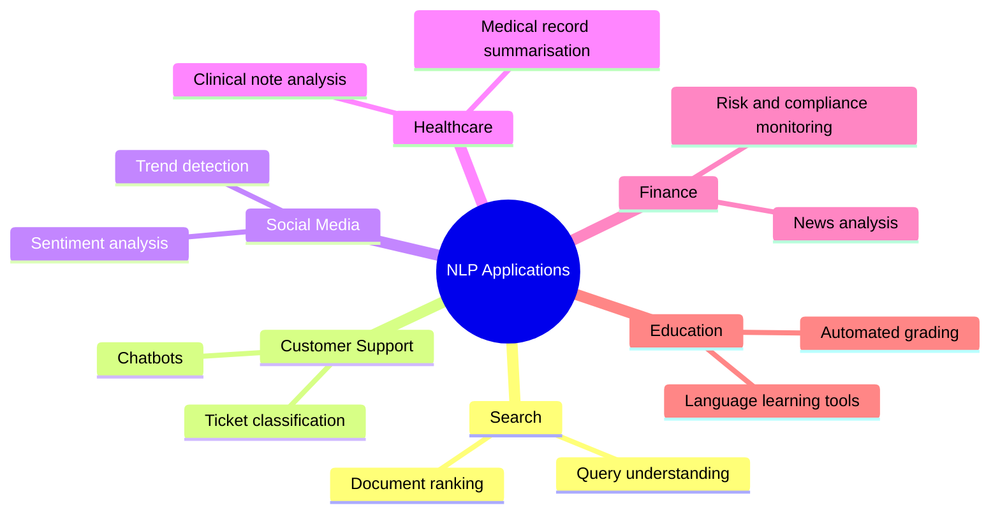
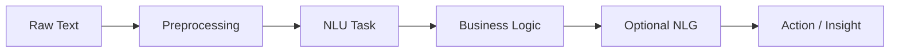

# Applications of Natural Language Processing by Domain

## Intuition First

NLP is not a single product — it is a **toolkit** applied wherever unstructured text must be understood or produced at scale. The same underlying techniques (classification, entity extraction, summarisation, retrieval) reappear across industries; only the data, labels, and compliance constraints change.

Mapping applications by **domain** clarifies which NLP tasks matter in practice and how they compose into production systems.

---

## 1. Application Landscape Overview

---

## 2. Search and Information Retrieval

Search engines must interpret vague, misspelled, or conversational queries and return relevant documents from billions of pages.

| Application | What It Does | NLP Techniques |
|-------------|--------------|----------------|
| **Query understanding** | Parse intent, expand synonyms, correct spelling | Tokenisation, embeddings, intent classification |
| **Document ranking** | Order results by relevance to query | TF-IDF, neural rankers, transformer encoders |

**Example:** A user searches *"cheapest GPU for LLM inference"* — query understanding maps to product-search intent; ranking uses textual similarity and click signals.

---

## 3. Customer Support

Support organisations process high volumes of repetitive, semi-structured text (tickets, chats, emails).

| Application | What It Does | NLP Techniques |
|-------------|--------------|----------------|
| **Chatbots** | Answer FAQs, route complex issues | Intent detection (NLU) + response generation (NLG) |
| **Ticket classification** | Auto-label urgency, product area, sentiment | Text classification, NER for product mentions |

**Example:** A SaaS platform classifies incoming tickets as *billing*, *bug*, or *feature request* before human agents see them — reducing mean time to resolution.

---

## 4. Social Media Analysis

Social platforms generate continuous streams of short, informal, multimodal text.

| Application | What It Does | NLP Techniques |
|-------------|--------------|----------------|
| **Sentiment analysis** | Gauge public opinion toward brands, events, policies | Polarity classification, aspect-based sentiment |
| **Trend detection** | Surface emerging topics and hashtags | Topic modelling, clustering, time-series aggregation |

**Example:** A brand monitors Twitter/X during a product launch — sentiment dashboards flag negative spikes tied to a specific feature complaint.

---

## 5. Healthcare

Clinical and administrative text is dense, domain-specific, and regulated.

| Application | What It Does | NLP Techniques |
|-------------|--------------|----------------|
| **Clinical note analysis** | Extract diagnoses, medications, procedures | NER, relation extraction, medical ontologies |
| **Medical record summarisation** | Condense lengthy charts for handoffs | Abstractive/extractive summarisation |

**Example:** An NLP pipeline scans discharge summaries to flag patients at readmission risk — entities and temporal relations feed downstream predictive models.

---

## 6. Finance

Financial institutions consume news, filings, earnings calls, and internal compliance documents.

| Application | What It Does | NLP Techniques |
|-------------|--------------|----------------|
| **News analysis** | Extract market-moving events from headlines | NER, event extraction, sentiment |
| **Risk and compliance monitoring** | Detect policy violations in communications | Classification, anomaly detection on text |

**Example:** A trading desk NLP system tags merger-related headlines in real time to trigger analyst review.

---

## 7. Education

Educational technology applies NLP to both **assessment** and **personalised learning**.

| Application | What It Does | NLP Techniques |
|-------------|--------------|----------------|
| **Automated grading** | Score short answers and essays | Similarity to rubrics, coherence metrics, classifier ensembles |
| **Language learning tools** | Correct grammar, suggest vocabulary | POS tagging, error detection, generation of exercises |

**Example:** A MOOC platform auto-grades thousands of short-answer responses using semantic similarity to reference answers — scaling human review.

---

## 8. Cross-Domain Pattern

Despite surface differences, most domain deployments follow a common architecture:

The **NLU task** (classify, extract, rank) and optional **NLG step** (summarise, reply) vary by domain; preprocessing and evaluation discipline stay constant.

---

## Common Pitfalls / Exam Traps

- Listing applications without linking to **underlying NLP tasks** — exam questions often ask which technique (NER vs classification vs summarisation) fits a scenario
- Assuming one model generalises across domains — **medical NER** requires domain-specific corpora and ontologies
- Ignoring **compliance** in finance and healthcare — accuracy alone is insufficient; auditability and privacy matter
- Confusing **trend detection** with sentiment — trends are topical/clustering problems; sentiment is polarity classification

---

## Quick Revision Summary

- NLP applications span search, support, social media, healthcare, finance, and education
- Search: query understanding + document ranking
- Customer support: chatbots + ticket classification
- Social media: sentiment analysis + trend detection
- Healthcare: clinical note analysis + record summarisation
- Finance: news analysis + risk/compliance monitoring
- Education: automated grading + language learning tools
- Most deployments follow preprocess → NLU → business logic → optional NLG
