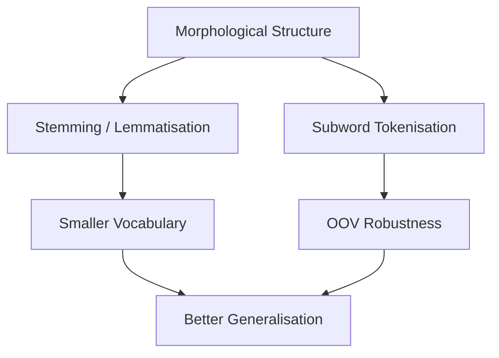

# Morphology of Text: Stems, Roots, and Affixes

## Intuition First

Consider the words *running*, *runner*, *runs*, and *ran*. Humans instantly recognise these as variants of the same core idea — *run*. **Morphology** is the linguistic study of how words are built from smaller meaningful parts. For NLP systems, this matters because treating every surface form as a unique token explodes vocabulary size and prevents generalisation.

Morphology directly motivates text preprocessing choices: stemming, lemmatisation, and subword tokenisation all exist to exploit word-internal structure.

---

## 1. What Is Morphology?

**Morphology** is the branch of linguistics that studies:

- The **internal structure** of words
- How words are **formed** from morphemes (minimal meaning-bearing units)
- **Relationships** between word variants (inflection, derivation)

In NLP, morphology answers: *Why does the same concept appear as many different strings, and how should a model treat them?*

---

## 2. Building Blocks of Words

| Unit | Definition | Example |
|------|------------|---------|
| **Root** | Core lexical meaning; often not a standalone word in English | `struct` in *structure*, *construct*, *destruct* |
| **Stem** | Reduced form produced by chopping affixes (algorithmic, not always linguistic) | *comput* from *computing*, *computed*, *computer* |
| **Affix** | Prefix or suffix attached to a root/stem | *un-* (prefix), *-ing* (suffix) in *unhappiness* |
| **Lemma** | Dictionary base form | *run* for *running*, *ran*, *runs* |

```mermaid
flowchart LR
    subgraph "Word: unhappiness"
        P[Prefix: un-] --> R[Root: happy]
        R --> S[Suffix: -ness]
    end
    R --> L[Lemma: happy]
    R --> ST[Stem (algo): happi]
```

---

## 3. Inflection vs Derivation

| Process | Changes | Example | Same part of speech? |
|---------|---------|---------|----------------------|
| **Inflection** | Grammatical features (tense, number, case) | *walk* → *walked*, *walks* | Yes |
| **Derivation** | Creates new word, often new POS | *happy* → *happiness* (adj → noun) | Often no |

NLP pipelines must decide whether to collapse inflected forms (usually yes for IR/classification) while being cautious with derivations ( *compute* vs *computer* are related but not identical).

---

## 4. Why Morphology Matters for NLP

### Vocabulary explosion

Without morphological awareness, a corpus containing *run*, *runs*, *running*, and *ran* allocates four separate dimensions in a bag-of-words vector — sparse and redundant.

### Generalisation

Models that recognise shared roots generalise better to **unseen inflections**. A spam filter trained on *"click"* should ideally recognise *"clicking"* and *"clicked"*.

### Preprocessing design

Morphology motivates two core preprocessing operations:

| Operation | Approach | Trade-off |
|-----------|----------|-----------|
| **Stemming** | Heuristic chop (Porter, Snowball) | Fast; may produce non-words (*studies* → *studi*) |
| **Lemmatisation** | Dictionary + POS lookup | Slower; linguistically correct (*studies* → *study*) |

Both reduce vocabulary size and align with how humans perceive word families.

---

## 5. Morphology and Modern Tokenisation

Even transformer-era models use morphology implicitly:

- **Subword tokenisation** (BPE, WordPiece) splits rare words into frequent morpheme-like pieces — *unhappiness* → `un`, `happi`, `ness`
- This handles **out-of-vocabulary** words without treating every inflection as atomic



---

## Common Pitfalls / Exam Traps

- Confusing **stem** and **lemma** — stems are algorithmic truncations; lemmas are canonical dictionary forms
- Assuming stemming always improves performance — over-stemming can merge unrelated words (*university* / *universe* with naive Porter)
- Ignoring **POS** in lemmatisation — *running* as verb → *run*; as noun (a running) → *running*
- Believing transformers eliminate morphology concerns — subword splitting is itself a morphological strategy

---

## Quick Revision Summary

- Morphology studies word internal structure and word-formation relations
- Roots carry core meaning; affixes modify it; lemmas are dictionary base forms
- Inflection adjusts grammar; derivation often changes word class
- Morphology motivates vocabulary reduction and better generalisation in NLP
- Stemming is fast/heuristic; lemmatisation is slower/linguistically grounded
- Subword tokenisation in modern models handles morphology via learned splits
