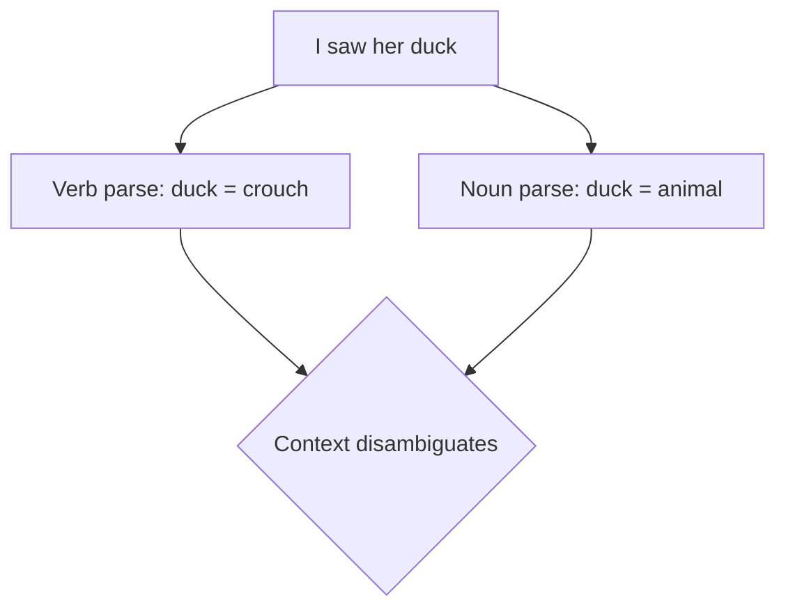
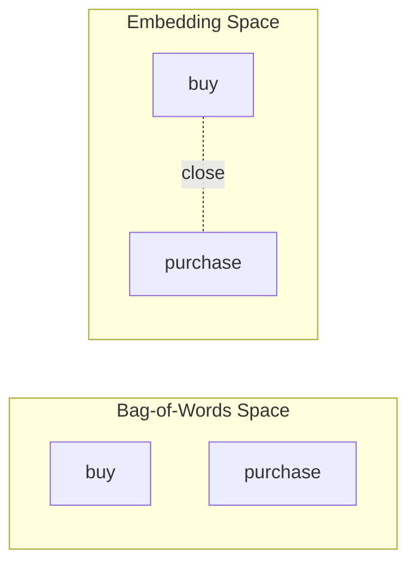

# Ambiguity in Language: Polysemy and Synonymy

## Intuition First

Humans resolve ambiguous language effortlessly using context, tone, and world knowledge. Machines start with only character sequences. **Ambiguity** — multiple valid interpretations for the same surface form — is therefore one of the central challenges in NLP.

Two especially important phenomena are **polysemy** (one word, many related meanings) and **synonymy** (many words, similar meanings). Together they explain why dictionary lookups fail and why **context-aware embeddings** became the dominant representation strategy.

---

## 1. Linguistic Ambiguity

**Ambiguity** occurs when a word, phrase, or sentence admits more than one valid interpretation.

Humans disambiguate using:

- Surrounding words and sentences
- Domain and situational context
- Pragmatic and cultural knowledge

Machines lack this unless explicitly modelled — making ambiguity a first-class engineering problem.

### Classic Example: *"I saw her duck."*

| Interpretation | Meaning |
|----------------|---------|
| **Verb reading** | I saw her bend down quickly (duck as verb) |
| **Noun reading** | I saw her pet bird (duck as animal) |

Same tokens, different syntactic parses and semantic frames — the model must choose correctly.

---

## 2. Levels of Ambiguity

Ambiguity is not limited to single words:

| Level | Example | Challenge |
|-------|---------|-----------|
| **Word** | *bank* (financial vs river) | Lexical disambiguation |
| **Phrase** | *"telescope man"* (man with telescope vs man visible through telescope) | Attachment ambiguity |
| **Sentence** | *"I saw her duck"* | Structural/syntactic ambiguity |
| **Discourse** | Pronoun *"it"* referring to multiple antecedents | Coreference resolution |

Rule-based systems that map each token to a single dictionary sense struggle at every level.

---

## 3. Polysemy

**Polysemy** is when a **single word** has multiple **related** meanings — senses share an etymological or conceptual connection.

| Word | Sense 1 | Sense 2 | Sense 3 |
|------|---------|---------|---------|
| **bank** | Financial institution | River edge | — |
| **paper** | Writing material | Academic article | — |
| **run** | Jog physically | Manage (*run a team*) | Execute (*run a program*) |

Polysemy is **extremely common** in natural language. The correct sense is almost always determined by **context**, not the word alone.

### Implication for NLP

- Static one-hot or dictionary lookups assign one sense per type — insufficient
- Contextual embeddings (ELMo, BERT) produce **different vectors for the same word in different sentences**
- Word Sense Disambiguation (WSD) remains an explicit sub-task in knowledge-heavy pipelines

---

## 4. Synonymy

**Synonymy** is when **different words** express **similar or equivalent** meanings.

| Word A | Word B | Relation |
|--------|--------|----------|
| big | large | Near-synonyms |
| buy | purchase | Near-synonyms |
| happy | joyful | Near-synonyms |

Synonyms are rarely perfectly interchangeable — register, collocations, and nuance differ — but they are close enough to confuse naive string matching.

### Challenges Synonymy Creates

| Challenge | Explanation |
|-----------|-------------|
| **Vocabulary sparsity** | *buy* and *purchase* occupy separate dimensions in one-hot/BoW — splitting statistical evidence |
| **Matching difficulty** | Retrieval systems miss relevant documents that use different but equivalent terms |
| **Training data fragmentation** | Supervised labels spread across lexical variants |

This is a primary motivation for **embedding-based representations**: words with similar usage contexts map to nearby points in vector space.

---

## 5. Why Traditional Rule-Based Systems Struggle

| Limitation | Effect |
|------------|--------|
| **No explicit context** | Cannot pick among polysemous senses |
| **Fixed lexicon** | Misses synonyms and paraphrases |
| **Domain blindness** | *"tablet"* means medicine in healthcare, device in retail |
| **Cultural variation** | Idioms and regional usage break hand-crafted rules |

Statistical and neural methods learn sense distinctions from **co-occurrence patterns** in large corpora rather than from static rules alone.

---

## 6. Polysemy vs Synonymy

| Aspect | Polysemy | Synonymy |
|--------|----------|----------|
| **Pattern** | One word → many meanings | Many words → similar meaning |
| **Relation among senses/terms** | Related senses of same lemma | Distinct words, overlapping semantics |
| **Core problem** | Which sense applies? | How to unify equivalent expressions? |
| **Representation fix** | Contextual embeddings, WSD | Word2Vec, GloVe, distributional similarity |

---

## Common Pitfalls / Exam Traps

- Treating polysemy and homonymy as identical — **homonyms** (*bank* river vs bank money) are historically unrelated; polysemous senses are related
- Assuming synonyms are perfectly interchangeable in all contexts — *big* vs *large* have different collocations (*big mistake* vs ?*large mistake*)
- Believing stemming fixes synonymy — *purchase* and *buy* share no common stem
- Ignoring **sentence-level** ambiguity when only studying word senses — exam scenarios often use syntactic ambiguity (*"I saw her duck"*)

---

## Quick Revision Summary

- Ambiguity = multiple valid interpretations; humans use context, machines must learn it
- Ambiguity exists at word, phrase, sentence, and discourse levels
- Polysemy: one word, multiple related meanings (*bank*, *run*, *paper*) — context selects sense
- Synonymy: different words, similar meaning (*big/large*, *buy/purchase*) — causes sparsity and matching issues
- Dictionary lookups alone are insufficient for both phenomena
- Embedding-based and contextual representations address polysemy and synonymy via distributional context
- Rule-based systems fail on implicit context, domain senses, and lexical variation
