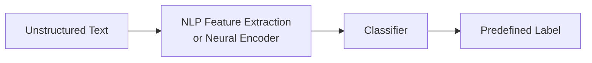

# Text Classification: Motivation and Real-World Applications

## The Scale of Unstructured Text

Modern organizations generate enormous volumes of unstructured text every minute:

- Email and messaging
- Social media posts and product reviews
- Support tickets and chat logs
- Video titles, descriptions, and transcripts
- Internal documents and knowledge bases

Manual reading and labeling cannot keep pace. **Text classification** automates the assignment of predefined **categories or labels** to text documents using NLP and machine learning.

## Manual vs Automated Approaches

| Approach | How it works | Limitation |
|----------|--------------|------------|
| Manual | Human reads each document and assigns a label | Impossible at scale; slow, expensive, inconsistent |
| Automated | Model predicts label from text features | Requires training data and model maintenance; scales horizontally on cloud infrastructure |

**Example — Gmail spam filtering:** Every incoming email must be classified as **spam** or **not spam** in milliseconds. A human-in-the-loop for each message is infeasible; a classifier runs on Google's infrastructure for every user simultaneously.

## What Text Classification Is

Text classification is the process of mapping an input text document $x$ to a label $y$ from a fixed set:

$$y \in \{c_1, c_2, \ldots, c_k\}$$

Variants include **multi-class** (exactly one label) and **multi-label** (zero or more labels per document).

## Major Application Types

### Spam detection
Binary or multi-class filtering of unwanted email, comments, or messages.

### Language identification
Detect document language to trigger translation UI ("Translate this page?") — used by browsers and global content platforms.

### Topic labeling (thematic classification)
Assign themes such as **sports**, **politics**, **finance** to articles for news aggregators and recommendation engines.

### Intent recognition
Classify **user goal** from utterances in chatbots and voice assistants:

- "Book a flight to Delhi" → `book_flight`
- "Cancel my reservation" → `cancel_booking`

Critical for dialog systems on AWS Lex, Google Dialogflow, and Azure Bot Service.

### Sentiment analysis
Classify emotional tone (positive, negative, neutral) in reviews, tweets, and feedback — covered in depth in subsequent notes.

## Business Value

Text classification is among the **highest-ROI NLP applications** because it:

- Automates repetitive triage workflows
- Enables real-time routing (support queues, moderation pipelines)
- Powers analytics dashboards (topic trends, sentiment over time)
- Reduces operational cost vs human-only review

**Cloud ML context:** Models deploy as REST endpoints (SageMaker, Vertex AI) or stream processors (Kafka → classifier → alert) for continuous ingestion.

## Common Pitfalls / Exam Traps

- **Trap:** Treating sentiment analysis as separate from text classification — it **is** a type of text classification with emotion labels.
- **Trap:** Assuming text classification only means topic labeling — intent, spam, and language ID are equally valid exam categories.
- **Trap:** Ignoring **class imbalance** (99% not-spam, 1% spam) — accuracy alone is misleading; precision/recall on minority class matters.
- **Trap:** Confusing **topic modeling** (unsupervised discovery) with **topic labeling** (supervised assignment to predefined categories).

## Quick Revision Summary

- Unstructured text grows faster than humans can label it — automation is mandatory at scale.
- Text classification assigns predefined categories using NLP + ML.
- Core applications: spam detection, language ID, topic labeling, intent recognition, sentiment analysis.
- Gmail spam filtering is the canonical scale example.
- Intent recognition powers chatbots and virtual assistants in cloud dialog platforms.
- Text classification delivers direct business value through workflow automation and routing.
- Sentiment analysis is a specialized subset of text classification focused on emotional tone.
