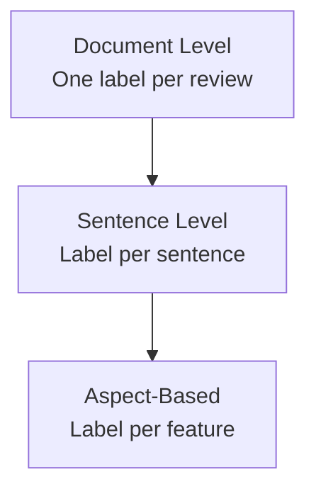

# Sentiment Analysis: Levels, Examples, and Challenges

## Definition

**Sentiment analysis** is a specialized form of text classification whose goal is to determine the **emotional tone** or **polarity** expressed in text. Standard labels:

- **Positive** — approval, satisfaction, enthusiasm
- **Negative** — dissatisfaction, criticism, anger
- **Neutral** — factual or mixed without clear polarity

**Example review:**
> "I absolutely love the screen resolution, but the battery life is terrible."

This sentence mixes positive and negative clauses — resolving the **overall** label requires aggregation strategy (often negative or neutral depending on method and granularity).

## Granularity Levels

### 1. Document-level
One label for the **entire** document.

- Entire movie review → positive / negative / neutral
- Single tweet → polarity of whole post

**Use case:** App store rating trend dashboards aggregating thousands of reviews per day.

### 2. Sentence-level
Each **sentence** receives its own label within a longer document.

- Multi-sentence product review: sentence 1 positive, sentence 2 negative

**Use case:** Fine-grained monitoring of long-form feedback where different sentences express different opinions.

### 3. Aspect-Based Sentiment Analysis (ABSA)
The most advanced level: identify **what** the sentiment targets and assign polarity **per aspect**.

**Example:**
> "The food was great, but the service was slow."

| Aspect | Sentiment |
|--------|-----------|
| food | positive |
| service | negative |

**Use case:** Restaurant chains and e-commerce platforms track sentiment per feature (battery, camera, delivery speed) rather than one score per review.

## Inherent Challenges

Human language nuance breaks naive lexicon-based systems. Key challenge categories:

### Sarcasm
Surface words may be positive while intended meaning is negative.

> "Oh great! My flight is delayed again."

Words like "great" are positive in isolation; context flips polarity to negative.

### Negation and double negatives
Negators invert polarity; stacked negatives invert again.

> "The movie was **not** bad." → effectively positive

Both "not" and "bad" carry negative valence individually; together they yield positive sentiment.

### Domain-dependent context
The same adjective carries opposite sentiment by domain.

| Text | Domain | Sentiment |
|------|--------|-----------|
| "The plot was unpredictable." | Thriller movie | Positive (engaging) |
| "The plot was unpredictable." | Driving manual | Negative (confusing) |

### Polysemy (same word, different senses)
> "The battery life is **long**." → positive (duration is good)
> "The wait time was **long**." → negative (delay is bad)

**Long** is not inherently positive or negative — context determines valence.

## Why These Challenges Favor Contextual Models

Rule-based lexicons (VADER) encode heuristics for negation, intensifiers, and contrast conjunctions but struggle with sarcasm and domain polysemy. **Contextual models (BERT, Flair)** encode full-sentence meaning and generally handle complex cases better — at higher compute cost.

| Challenge | Lexicon difficulty | Contextual model advantage |
|-----------|-------------------|---------------------------|
| Sarcasm | High | Moderate (still not perfect) |
| Negation | Moderate (rules help) | Strong |
| Domain context | High | Strong with domain fine-tuning |
| Polysemy | High | Strong |

## Common Pitfalls / Exam Traps

- **Trap:** Labeling mixed reviews as purely positive or negative without specifying **granularity level** — document-level vs ABSA yields different correct answers.
- **Trap:** Treating "not bad" as negative because it contains "bad" — double negation flips to positive.
- **Trap:** Assuming "long" is always positive or always negative — **polysemy** makes valence context-dependent.
- **Trap:** Confusing **subjectivity** (opinion vs fact) with **polarity** (positive vs negative) — TextBlob reports both separately.
- **Trap:** Expecting 100% accuracy on sarcastic social media — even BERT fails on subtle irony without domain-specific training.

## Quick Revision Summary

- Sentiment analysis classifies emotional tone: positive, negative, or neutral.
- Three granularity levels: document, sentence, aspect-based (ABSA).
- ABSA assigns polarity per feature ("food" positive, "service" negative).
- Sarcasm inverts surface word polarity — lexicons often fail here.
- Negation and double negatives require compositional handling ("not bad" → positive).
- Domain and polysemy make the same word positive or negative depending on context.
- Mixed reviews expose limitations of single document-level labels.
- Contextual Transformer models generally outperform rule-based lexicons on hard cases.
