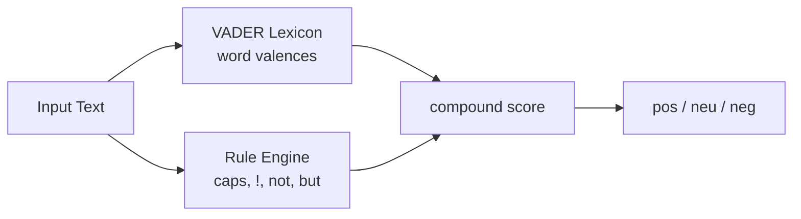

# Sentiment Analysis with NLTK VADER: Rule-Based Lexicon Approach

## Two Approaches in Contrast

Sentiment analysis can be implemented via:

1. **Traditional rule-based / lexicon methods** — fast, interpretable, lightweight
2. **Modern deep learning (Transformer) methods** — context-aware, higher accuracy, heavier compute

This note covers the first approach using **NLTK's VADER** (Valence Aware Dictionary and sEntiment Reasoner).

## VADER Overview

VADER is a **lexicon-based**, **rule-based** model tuned for **social media text**. It ships with:

- A dictionary of words with **valence scores** (positive/negative intensity)
- Hand-crafted rules for capitalization, punctuation, degree modifiers, negation, and contrast conjunctions

| Word | Example valence |
|------|----------------|
| good | +1.9 (approximate scale in lexicon) |
| horrible | -2.5 |

Unlike static embeddings, VADER scores are designed for sentiment — not general semantics.

## Setup and Lexicon Download

```python
import nltk
from nltk.sentiment import SentimentIntensityAnalyzer

nltk.download('vader_lexicon')
sia = SentimentIntensityAnalyzer()
```

The **VADER lexicon** is a specialized dictionary mapping words (and some phrases) to sentiment intensities.

## Scoring Output

For each input sentence, `sia.polarity_scores(text)` returns:

| Key | Meaning |
|-----|---------|
| `neg` | Proportion of negative tone |
| `neu` | Proportion of neutral tone |
| `pos` | Proportion of positive tone |
| `compound` | Normalized aggregate score in $[-1, 1]$ |

### Classification thresholds (customizable)

Typical defaults used in coursework:

- `compound > 0.05` → **positive**
- `compound < -0.05` → **negative**
- otherwise → **neutral**

```python
scores = sia.polarity_scores(sentence)
compound = scores['compound']
if compound > 0.05:
    label = 'positive'
elif compound < -0.05:
    label = 'negative'
else:
    label = 'neutral'
```

## Worked Examples

| Sentence | compound (approx.) | Label |
|----------|-------------------|-------|
| "I love this product." | +0.67 | positive |
| "This is the worst experience ever." | strongly negative | negative |
| "The movie was OK. Nothing special." | moderately negative | negative |
| "I usually hate waiting, but this was worth it." | ~0.0 | neutral |
| "The food was good, but the service was terrible." | negative | negative |

**Mixed sentence note:** VADER applies a **contrast rule** — words after **"but"** receive higher weight, partially explaining why the food/service example trends negative overall.

## VADER Rule Features

VADER goes beyond summing word scores:

- **Capitalization:** "GOOD" is more intense than "good"
- **Punctuation:** "good!!!" > "good"
- **Degree modifiers:** "extremely good" > "good"
- **Negation:** "not good" flips valence
- **Conjunctions:** "good but bad" shifts weight toward the clause after **but**



## When to Use VADER

**Strengths:**

- No GPU required — runs on CPU edge devices
- **Interpretable** — inspect lexicon to explain scores
- Fast enough for high-throughput social media streams
- Reasonable on informal short text (tweets, reviews)

**Weaknesses:**

- Struggles with sarcasm, deep context, domain polysemy
- "I usually hate waiting, but this was worth it." → **neutral** (compound ~0) while humans and BERT often label **positive**

**Real-world use:** Brand monitoring dashboards polling Twitter firehoses often start with VADER for speed, escalating uncertain cases to Transformer models.

## Common Pitfalls / Exam Traps

- **Trap:** Using `pos` alone instead of **`compound`** for final classification — compound is the standard aggregated score.
- **Trap:** Forgetting thresholds are **configurable** — 0.05 / -0.05 are conventions, not universal constants.
- **Trap:** Expecting VADER to match human judgment on **contrast sentences** — "but" weighting can yield neutral when overall intent feels positive.
- **Trap:** Confusing VADER with **TextBlob** — different libraries, different scoring scales.
- **Trap:** Skipping `nltk.download('vader_lexicon')` — analyzer fails without lexicon file.

## Quick Revision Summary

- VADER = Valence Aware Dictionary and sEntiment Reasoner (NLTK); rule + lexicon based.
- Returns `neg`, `neu`, `pos`, and **`compound`** — classify using compound thresholds (±0.05).
- Lexicon assigns valence scores; rules handle caps, punctuation, intensifiers, negation, "but".
- Fast, CPU-friendly, interpretable — ideal for social media monitoring at scale.
- Weak on sarcasm and nuanced contrast; mixed sentences may score neutral incorrectly.
- Contrasts with BERT: VADER = traditional; BERT = contextual deep learning (next notes).
- Always download `vader_lexicon` before initializing `SentimentIntensityAnalyzer`.
