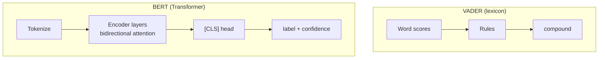

# Sentiment Analysis with BERT via Hugging Face Pipeline

## Why BERT for Sentiment?

**VADER** scores individual words and applies rules — it never builds a deep representation of full sentence meaning.

**BERT** applies **bidirectional self-attention** over the entire sentence. Every token's representation incorporates context from all neighbors, enabling better handling of:

- Sarcasm and irony (partially)
- Complex negation ("not uninteresting")
- Contrast structures ("hate waiting, but worth it")
- Polysemy ("long battery" vs "long wait")

BERT for sentiment uses a **fine-tuned classification head** on top of pre-trained encoders — weights already adapted on millions of labeled reviews available on Hugging Face.

## Setup: Hugging Face Token

1. Generate token at `huggingface.co/settings/tokens`
2. Store as `HF_TOKEN` in Colab Secrets
3. Grant notebook access

The token enables downloading fine-tuned sentiment checkpoints from the hub.

## Implementation with `pipeline`

```python
from transformers import pipeline

sentiment_pipeline = pipeline(
    "sentiment-analysis",
    truncation=True  # required for texts > 512 tokens
)

sentences = [
    "I love this product.",
    "This is the worst experience ever.",
    "The movie was OK. Nothing special.",
    "I usually hate waiting, but this was worth it.",
    "The food was good, but the service was terrible.",
]

for text in sentences:
    result = sentiment_pipeline(text)[0]
    label = result['label']      # POSITIVE or NEGATIVE (model-dependent casing)
    score = result['score']      # confidence in [0, 1]
    print(text, label, score)
```

### Key parameter: `truncation=True`

BERT-family models typically accept **512 tokens** maximum. Longer inputs are truncated (usually from the end or with a strategy defined by the tokenizer). Without truncation, pipeline calls may error on long documents.

## Expected Results on Standard Test Sentences

| Sentence | BERT label | Confidence (typical) |
|----------|------------|---------------------|
| "I love this product." | positive | ~0.999+ |
| "This is the worst experience ever." | negative | ~0.99+ |
| "The movie was OK. Nothing special." | negative | ~0.99 (slightly lower) |
| "I usually hate waiting, but this was worth it." | positive | ~0.999+ |
| "The food was good, but the service was terrible." | negative | high (~0.9+) |

**Contrast with VADER:** The contrast sentence ("hate waiting, but worth it") is labeled **neutral** by VADER (compound ≈ 0) but **positive** by BERT — illustrating contextual understanding.



## Architecture Recap

1. Tokenizer converts text → subword IDs
2. BERT encoder produces contextual embeddings
3. `[CLS]` token embedding passes through a linear classification layer
4. Softmax yields label probabilities; highest wins

The Hugging Face `sentiment-analysis` pipeline wraps tokenizer, model, and post-processing — no manual forward pass required for inference.

## Practical Notes

- Default checkpoint (e.g., `distilbert-base-uncased-finetuned-sst-2-english`) is English review sentiment — other languages need multilingual models.
- Labels may appear as `POSITIVE`/`NEGATIVE` or `LABEL_0`/`LABEL_1` depending on checkpoint — check model card.
- Confidence reflects model probability, not calibrated human uncertainty.

**Real-world use:** Automated support ticket routing with high accuracy requirements often uses fine-tuned BERT served on GPU endpoints — acceptable latency trade-off for reduced mis-routing cost.

## Common Pitfalls / Exam Traps

- **Trap:** Claiming BERT "looks at individual words like VADER" — BERT uses **full-sentence contextual** representations.
- **Trap:** Omitting `truncation=True` on long texts — silent truncation failures or errors on >512 tokens.
- **Trap:** Assuming three-way positive/neutral/negative — many HF sentiment models are **binary** (pos/neg only); neutral must come from low confidence or a 3-class fine-tune.
- **Trap:** Hardcoding API keys in notebook cells instead of Colab Secrets.
- **Trap:** Expecting identical labels across all BERT checkpoints — SST-2 fine-tunes differ from 3-star review models.

## Quick Revision Summary

- BERT sentiment uses bidirectional context — superior to lexicon methods on negation and contrast.
- Hugging Face `pipeline("sentiment-analysis")` downloads a pre-fine-tuned review classifier.
- Set `truncation=True` for inputs longer than 512 subword tokens.
- Output: `label` + `score` (confidence); typically binary positive/negative.
- BERT correctly labels "hate waiting, but worth it" as positive; VADER often neutral.
- Requires HF token for gated models; heavier GPU compute than VADER.
- Best for high-accuracy production routing (support tickets, compliance triage).
