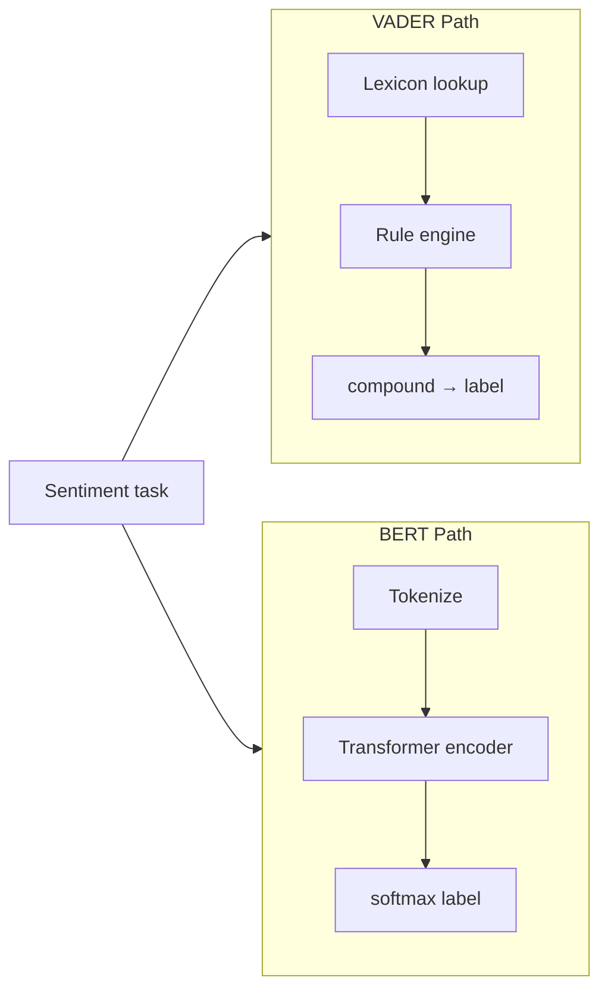

# Comparing VADER and BERT for Sentiment Analysis

## Two Paradigms

After implementing sentiment analysis with **NLTK VADER** (rule-based lexicon) and **BERT** (fine-tuned Transformer), the natural question is: **when should each be used?**

They differ across speed, hardware, interpretability, accuracy, and deployment context.

## Side-by-Side Comparison

| Dimension | VADER (NLTK) | BERT (Hugging Face) |
|-----------|--------------|---------------------|
| Approach | Lexicon + hand rules | Deep learning, contextual embeddings |
| Context | Word-level + rule composition | Full-sentence bidirectional attention |
| Speed | Very fast | Slower |
| Hardware | CPU sufficient | GPU recommended for batch inference |
| Interpretability | High — inspect lexicon & rules | Low — "black box" neural weights |
| Sarcasm / complex negation | Weak | Stronger (not perfect) |
| Mixed/contrast sentences | Often neutral or wrong | Generally better ("but" clauses) |
| Setup complexity | `pip install nltk` + lexicon download | HF token, large model download |
| Training required | None (pre-built) | Uses pre-fine-tuned checkpoint |

## Strengths and Best Use Cases

### VADER — choose when:

- **Social media monitoring** at high throughput (Twitter/X firehose, Reddit streams)
- **Edge / mobile** deployment with no GPU
- **Explainability** is required (regulatory, audit trails — "word X scored -2.5")
- **Prototyping** before investing in GPU infrastructure
- Latency budget is **milliseconds** on cheap CPU instances

**Example:** Real-time brand mention dashboard classifying 10k tweets/minute on a single cloud VM without GPU.

### BERT — choose when:

- **High accuracy** is critical — misclassification has real cost
- **Automated support ticket routing** (wrong queue = delayed resolution)
- **Complex language** — negation, contrast, informal mixed sentiment
- GPU budget available (cloud inference endpoints, batch nightly processing)
- Willing to sacrifice interpretability for F1 score

**Example:** Enterprise helpdesk auto-assigning P1 vs P3 priority from customer email bodies.

## Observed Behavioral Differences (Same Test Set)

| Sentence | VADER | BERT |
|----------|-------|------|
| "I love this product." | positive | positive |
| "This is the worst experience ever." | negative | negative |
| "The movie was OK. Nothing special." | negative | negative |
| "I usually hate waiting, but this was worth it." | **neutral** | **positive** |
| "The food was good, but the service was terrible." | negative | negative |

The contrast sentence exposes the core trade-off: VADER's **but** rule and compound aggregation miss overall positive intent; BERT's contextual encoding captures that the second clause dominates speaker intent.

## Hybrid Production Pattern

Many systems combine both:

1. Run VADER on all incoming text (fast filter)
2. Escalate low-confidence or high-stakes items to BERT
3. Human review for remaining edge cases

This optimizes **cost vs accuracy** on cloud billing — GPU time only where needed.

## Common Pitfalls / Exam Traps

- **Trap:** "BERT is always better" — VADER wins on **speed, cost, interpretability** for social media at scale.
- **Trap:** "VADER is not ML" — it is ML-adjacent rule-based NLP; exams contrast it with **deep learning**, not with "non-computational."
- **Trap:** Ignoring **black box** as a deployment constraint — regulated industries may require lexicon explainability despite lower accuracy.
- **Trap:** Using BERT on a CPU-only Lambda with strict latency SLA — may timeout; VADER or DistilBERT better fit.
- **Trap:** Forgetting VADER is **tuned for social media** — formal legal prose may score poorly.

## Quick Revision Summary

- VADER: fast, CPU, interpretable lexicon+rules — best for social media monitoring.
- BERT: slower, GPU-heavy, black box — best for high-accuracy ticket routing and complex sentences.
- BERT handles contrast ("hate X but worth it") better; VADER often returns neutral.
- VADER explainability = inspect word valences; BERT = no simple dictionary explanation.
- Choose by accuracy requirements, hardware budget, latency, and explainability needs.
- Hybrid pipelines: VADER first pass, BERT for uncertain/high-value cases.
- Neither solves sarcasm perfectly; BERT is materially stronger on negation and context.
