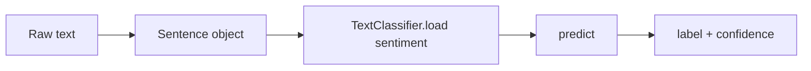

# Sentiment Analysis with Flair

## What Flair Is

**Flair** is a PyTorch-based NLP library supporting sequence labeling tasks including **POS tagging**, **NER**, and **sentiment analysis**. Like BERT-based pipelines, Flair uses **deep learning** and contextual embeddings — not hand-written lexicon rules.

Flair models often download weights from Hugging Face (may require `HF_TOKEN` for PyTorch checkpoints).

## Installation and Imports

```python
# Install: pip install flair

from flair.data import Sentence
from flair.models import TextClassifier
```

Package size is **large** — first install and model download take noticeable time compared to NLTK VADER.

## Single-Sentence Workflow

```python
text = "I love Delhi"
sentence = Sentence(text)

classifier = TextClassifier.load('sentiment')
classifier.predict(sentence)

print(sentence)  # shows labels and confidence
# Example: Sentence[...] - positive (0.9912)
```

**Steps:**

1. Wrap raw string in `Sentence` object
2. Load pre-trained `TextClassifier` with `'sentiment'` tag
3. Call `classifier.predict(sentence)`
4. Read predicted label and probability from sentence annotations

## Batch Processing on Test Sentences

```python
sentences = [
    "I love this product.",
    "This is the worst experience ever.",
    "The movie was OK. Nothing special.",
    "I usually hate waiting, but this was worth it.",
    "The food was good, but the service was terrible.",
]

classifier = TextClassifier.load('sentiment')

for text in sentences:
    sent = Sentence(text)
    classifier.predict(sent)
    print(text, sent.labels)
```

## Results on Standard Benchmark Sentences

| Sentence | Flair prediction | Confidence |
|----------|------------------|------------|
| "I love this product." | positive | ~99% |
| "This is the worst experience ever." | negative | ~100% |
| "The movie was OK. Nothing special." | negative | ~99.9% |
| "I usually hate waiting, but this was worth it." | positive | ~99% |
| "The food was good, but the service was terrible." | negative | ~99% |

Flair aligns with **BERT** (not VADER) on the contrast sentence — labeling "worth it" dominance as **positive**.



## Flair vs Other Libraries

| Library | Backend | Speed | Contextual? |
|---------|---------|-------|-------------|
| VADER | Lexicon + rules | Fastest | No |
| TextBlob | Pattern + TextBlob lexicon | Fast | Limited |
| Flair | PyTorch neural tagger | Slow (large download) | Yes |
| BERT pipeline | Transformers | Moderate–slow | Yes |

## When to Use Flair

**Strengths:**

- Unified API for NER, POS, and sentiment (same library as earlier course modules)
- Strong accuracy on contextual sentences
- Pre-trained models readily available

**Weaknesses:**

- Heavy dependencies (PyTorch + model weights)
- Slow cold start (download + load)
- Less ecosystem breadth than Hugging Face `transformers` for arbitrary checkpoints

**Real-world use:** Research prototypes and coursework pipelines where Flair is already used for NER/POS and sentiment is added with one consistent API — less common in large-scale production than raw Hugging Face serving.

## Common Pitfalls / Exam Traps

- **Trap:** Forgetting to wrap strings in `Sentence` before `predict()` — plain strings won't work.
- **Trap:** Expecting instant startup — first `load('sentiment')` downloads weights; plan for cache or pre-baked Docker images in production.
- **Trap:** Assuming Flair = rule-based because it's "another alternative to BERT" — Flair sentiment is **neural**, like BERT.
- **Trap:** Not granting HF token access when Flair pulls gated PyTorch checkpoints from the hub.
- **Trap:** Confusing `TextClassifier` with sequence labeling taggers used for NER — different loaded model names.

## Quick Revision Summary

- Flair: PyTorch NLP library with pre-trained sentiment `TextClassifier`.
- Pipeline: `Sentence(text)` → `TextClassifier.load('sentiment')` → `predict()` → label + confidence.
- Large package; slow download but strong contextual accuracy.
- Matches BERT on contrast sentences (positive for "hate waiting, but worth it").
- Same ecosystem as Flair NER/POS from earlier modules — consistent API.
- Requires HF token when downloading certain hub-hosted weights.
- Trade-off: heavier than VADER/TextBlob; more unified than ad-hoc multi-library stacks.
