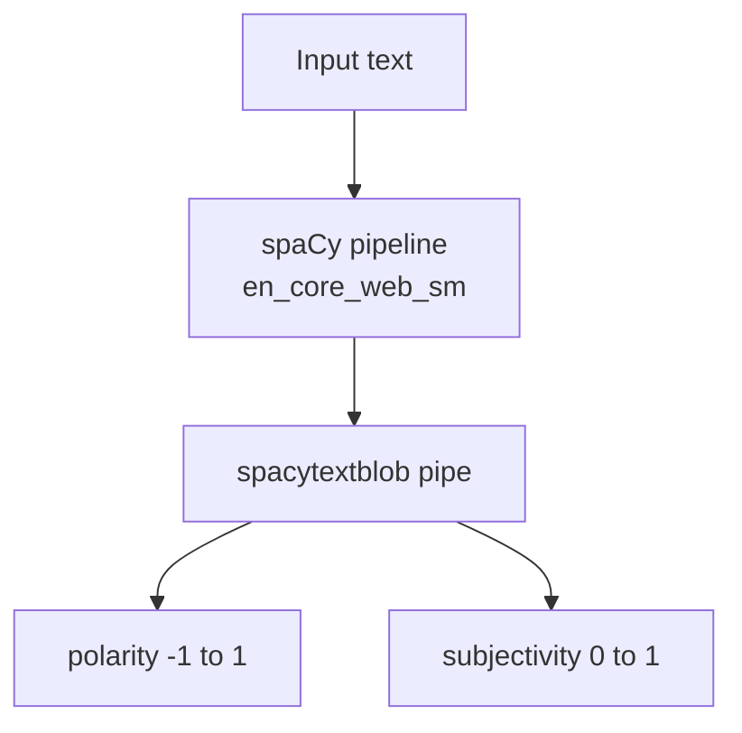

# Sentiment Analysis with spaCy and TextBlob

## Overview

**spaCy** is an industrial-strength NLP library focused on efficient pipelines (tokenization, tagging, parsing, NER). Sentiment analysis is **not native** to core spaCy — it is added via the **`spacytextblob`** extension, which integrates **TextBlob** polarity and subjectivity into spaCy `Doc` objects.

This provides a **third lightweight alternative** alongside VADER (NLTK) and Transformer models (BERT, Flair).

## Installation

```python
# Quiet install of English model + extension
# pip install spacy spacytextblob
# python -m spacy download en_core_web_sm

import spacy
from spacytextblob.spacytextblob import SpacyTextBlob

nlp = spacy.load('en_core_web_sm')
nlp.add_pipe('spacytextblob')
```

Requires:

- `en_core_web_sm` (or larger English pipeline)
- `spacytextblob` pipe registered on the `nlp` object

## Polarity and Subjectivity

TextBlob exposes **two distinct scores** per document:

### Polarity
Emotional tone from negative to positive.

- Range: **$-1$ to $+1$**
- $-1$ = very negative
- $+1$ = very positive
- $0$ = neutral

### Subjectivity
Opinion vs factual content.

- Range: **$0$ to $1$**
- $0$ = objective / factual
- $1$ = highly subjective / opinion-based

| Score | Measures | Range |
|-------|----------|-------|
| Polarity | Sentiment direction | $[-1, 1]$ |
| Subjectivity | Opinion vs fact | $[0, 1]$ |

**Important:** Subjectivity is **independent** of polarity — a factual negative news headline can have negative polarity but low subjectivity.

## Single-Sentence Example

```python
text = "I am feeling very good."
doc = nlp(text)

print(doc._.polarity)       # e.g., 0.90 (positive)
print(doc._.subjectivity)   # e.g., 0.78 (subjective opinion)
```

Access via `doc._.` extension attributes after processing through the pipeline.

## Batch Implementation on Test Sentences

```python
sentences = [
    "I love this product.",
    "This is the worst experience ever.",
    "The movie was OK. Nothing special.",
    "I usually hate waiting, but this was worth it.",
    "The food was good, but the service was terrible.",
]

for text in sentences:
    doc = nlp(text)
    print(f"{text}")
    print(f"  Polarity: {doc._.polarity:.2f}")
    print(f"  Subjectivity: {doc._.subjectivity:.2f}")
```

## Observed Results vs Other Libraries

| Sentence | spaCy/TextBlob polarity | Other libraries |
|----------|------------------------|-----------------|
| "I love this product." | ~0.62 (moderate positive) | VADER/BERT/Flair: strong positive |
| "This is the worst experience ever." | ~-1.0 (very negative) | All agree: negative |
| "The movie was OK. Nothing special." | ~-0.42 (neutral–negative) | BERT/Flair: negative |
| "I usually hate waiting, but this was worth it." | ~**-0.21** (negative) | BERT/Flair: **positive**; VADER: neutral |
| "The food was good, but the service was terrible." | ~-0.15 (negative) | All tend negative |

**Key divergence:** TextBlob/spaCy misclassifies the contrast sentence as **negative** while BERT and Flair label it **positive** — demonstrating that lightweight Pattern-based TextBlob lacks sophisticated contrast handling.



## When to Use spaCy + TextBlob

**Strengths:**

- Integrates sentiment into existing **spaCy pipelines** (same `Doc` as entities, POS tags)
- Returns **subjectivity** — useful for filtering opinion reviews vs factual reports
- Lighter than BERT/Flair

**Weaknesses:**

- Polarity often **underconfident** on clearly positive short praise
- Poor on **contrast clauses** compared to contextual models
- TextBlob backend is older Pattern-based logic — not Transformer-grade

**Real-world use:** Content moderation pipeline using spaCy NER + TextBlob polarity to flag subjective negative reviews mentioning product defects — subjectivity score helps separate opinion from spec-sheet comparisons.

## Comparing All Four Implementations

| Sentence | VADER | BERT/Flair | spaCy/TextBlob |
|----------|-------|------------|----------------|
| "I love this product." | positive | positive | weak positive (0.62) |
| "hate waiting, but worth it" | neutral | positive | **negative** |
| Subjectivity score | No | No | **Yes** |

## Common Pitfalls / Exam Traps

- **Trap:** Treating polarity and subjectivity as the same — **subjectivity ≠ sentiment**; factual text can be objective with zero polarity.
- **Trap:** Forgetting `nlp.add_pipe('spacytextblob')` — without it, `doc._.polarity` doesn't exist.
- **Trap:** Expecting spaCy core to include sentiment — must install **spacytextblob** extension explicitly.
- **Trap:** Assuming all libraries agree on mixed sentences — TextBlob often disagrees with BERT on "but" constructions.
- **Trap:** Polarity ranges: TextBlob/spaCy uses **$-1$ to $1$**; VADER compound also $[-1,1]$ but VADER also outputs separate pos/neu/neg ratios — scales differ conceptually.

## Quick Revision Summary

- spaCy sentiment via `spacytextblob` extension integrating TextBlob into `Doc` objects.
- Install `en_core_web_sm` + register `spacytextblob` pipe on `nlp`.
- **Polarity** ($[-1,1]$): negative ↔ positive emotional tone.
- **Subjectivity** ($[0,1]$): factual ↔ opinion-based — unique among methods covered.
- Access scores: `doc._.polarity`, `doc._.subjectivity`.
- TextBlob backend: fast, integrated with spaCy NER pipeline, but weaker on contrast sentences.
- "hate waiting, but worth it" → TextBlob negative; BERT/Flair positive; VADER neutral — classic exam comparison.
- Compare all libraries on same test set when choosing a production approach.
