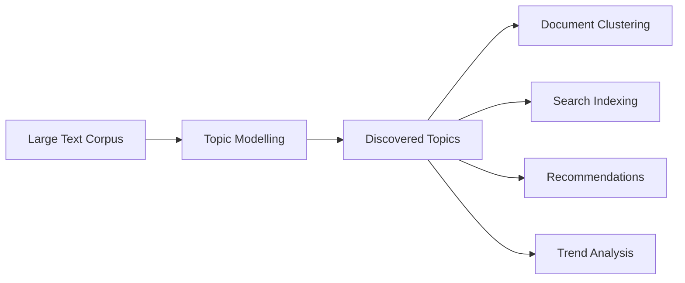

# Introduction to Topic Modelling

## What Is Topic Modelling?

Topic modelling is an **unsupervised** machine learning technique that discovers hidden themes in a collection of documents without requiring human labels. Instead of reading thousands of texts manually, the algorithm finds groups of words that tend to co-occur and treats each group as a latent "topic."

A topic is not a single word — it is a **probability distribution over words**. Words like *software*, *data*, *system*, *network*, and *algorithm* might cluster into a technology topic, each with a different weight within that theme.

### Intuition: One Document, Multiple Themes

Consider a travel review that mentions monuments, hiking, restaurants, transport, and words like *great* and *bad*. A single document can simultaneously express:

| Topic | Representative Words |
|-------|---------------------|
| Tourism | monuments, adventure, hiking, scenic |
| Facilities | restaurants, transport, hotels |
| Feedback | great, good, bad, awesome |

Topic modelling recovers these overlapping themes automatically.

---

## Why Topic Modelling Matters

Modern systems generate text continuously — news feeds, research papers, customer reviews, social media posts, support tickets. Manual categorisation does not scale.

Topic modelling helps organisations:

- **Summarise** large document collections at a glance
- **Identify** recurring themes without predefined labels
- **Group** similar documents by latent theme
- **Support** downstream tasks such as search, recommendation, and trend monitoring

The central question it answers: **What are the main themes present in this corpus?**

---

## Topic Modelling vs Text Classification

Both work with text, but they solve different problems.

| Aspect | Text Classification | Topic Modelling |
|--------|---------------------|-----------------|
| Learning type | Supervised | Unsupervised |
| Labels required | Yes — predefined classes | No |
| Output | Assigns documents to **known** categories | Discovers **unknown** structure |
| Example | Spam vs non-spam email | Themes in news articles |

**Classification** answers: "Which of these predefined buckets does this document belong to?"

**Topic modelling** answers: "What hidden themes exist, and how is each document composed of them?"

---

## Common Use Cases

- **Document clustering** — group similar documents by recurrent themes (e.g., clustering AWS support tickets by issue type)
- **Exploratory data analysis** — quickly understand an unfamiliar corpus before building a classifier
- **Trend analysis** — track how topic prevalence shifts over time (e.g., COVID-related themes in news from 2020–2022)
- **Information retrieval** — improve search with topic-based indexing instead of keyword-only matching
- **Content recommendation** — suggest articles sharing latent topics with what a user has already read

---

## Common Pitfalls / Exam Traps

- **Confusing topic modelling with classification** — topic modelling does not need labels and does not use predefined classes; exam questions often swap these properties.
- **Assuming one topic per document** — many algorithms (including LDA) model documents as *mixtures* of topics, not single assignments.
- **Expecting semantic understanding from all topic models** — classical methods like LDA use bag-of-words and ignore word order; they find co-occurrence patterns, not deep meaning.
- **Skipping preprocessing** — stop-word removal, tokenisation, and normalisation strongly affect topic quality for traditional models.

---

## Quick Revision Summary

- Topic modelling is unsupervised discovery of latent themes in text corpora.
- A topic is a distribution over words, not a single keyword.
- Documents can express multiple topics in different proportions.
- Unlike classification, no labelled data or predefined categories are required.
- Industrial use cases include clustering, EDA, trend tracking, search, and recommendations.
- LDA is the most widely used classical algorithm; embedding-based alternatives address its limitations.
