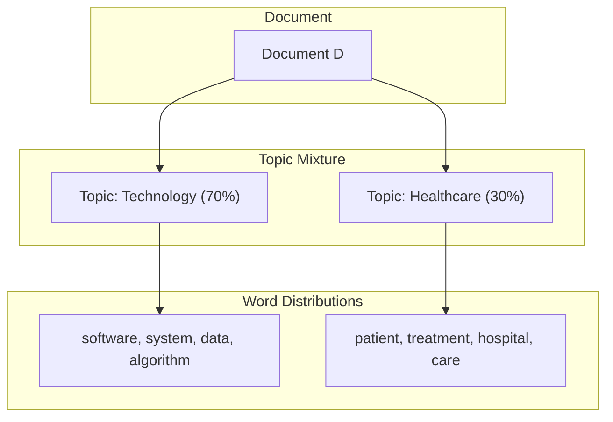

# Latent Dirichlet Allocation (LDA)

## Why LDA Dominates Classical Topic Modelling

Latent Dirichlet Allocation (LDA) is the most widely used algorithm for topic modelling because it is:

- **Probabilistic** — outputs interpretable probability distributions, not hard labels
- **Interpretable** — topics are described by their top-weighted words
- **Scalable** — handles large document collections efficiently

LDA answers two questions about a corpus:

1. What topics exist?
2. How is each document composed of those topics?

---

## Two Core Ideas

LDA rests on two simple but powerful assumptions:

### 1. Documents Are Mixtures of Topics

A single document rarely discusses only one subject. A tech-health article might be 70% technology and 30% healthcare. LDA assigns **topic proportions** (not a single label) to each document.

### 2. Topics Are Distributions Over Words

Each topic is defined by a set of words with associated probabilities. The technology topic might weight *software*, *system*, *data*, and *algorithm* highly; the healthcare topic might weight *patient*, *treatment*, and *hospital*.

---

## Worked Example

| Entity | Composition |
|--------|-------------|
| Document | 70% technology + 30% healthcare |
| Technology topic | software, system, data, algorithm, ... |
| Healthcare topic | patient, treatment, hospital, care, ... |

**Critical distinction:** LDA does **not** assign one topic per document. It outputs a vector of proportions such as $(0.70, 0.30)$ for a two-topic model.

---

## How to Read LDA Output

For a document with topic proportions $(0.07, 0.86, 0.06)$ across three topics:

- The document is **primarily** about topic 1 (86% weight)
- Topics 0 and 2 contribute minimally
- Topic labels (e.g., "finance", "sports") must be inferred by inspecting the top words per topic — LDA does not name topics automatically

---

## Common Pitfalls / Exam Traps

- **"LDA assigns one topic per document"** — false; it assigns proportions. The highest-proportion topic is often used as a proxy label, but that is a post-hoc simplification.
- **Confusing LDA with LSA** — both are topic-modelling families, but LDA is generative and probabilistic; LSA uses matrix factorisation (SVD).
- **Expecting topic count to be automatic** — the number of topics $K$ must be specified manually and tuned.
- **Ignoring that topics are unlabelled** — exam answers listing "topic 0, topic 1" without interpreting top words miss the interpretability requirement.

---

## Quick Revision Summary

- LDA is probabilistic, interpretable, and scales to large corpora.
- Documents = mixtures of topics; topics = distributions over words.
- Output is topic **proportions** per document, not a single hard assignment.
- Topic names are inferred manually from top-weighted words per topic.
- $K$ (number of topics) is a hyperparameter set by the practitioner.
- LDA is the baseline classical algorithm before embedding-based alternatives like BERTopic.
