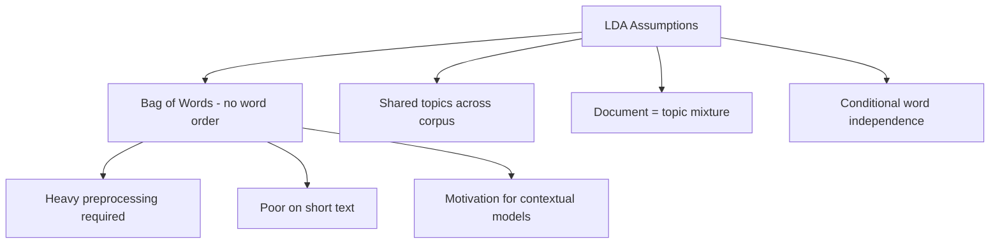

# Key Assumptions of LDA

## Why Assumptions Matter

Every machine learning model simplifies reality to make inference tractable. LDA's assumptions explain both its strengths and its well-known failure modes. Understanding them is essential for preprocessing decisions and for knowing when to switch to modern alternatives.

---

## The Four Core Assumptions

### 1. Word Order Does Not Matter (Bag of Words)

LDA treats a document as an unordered collection of words — identical to the bag-of-words (BoW) representation. *"The dog bit the man"* and *"The man bit the dog"* produce the same input.

**Consequence:** No syntactic or sequential context is preserved.

### 2. Topics Are Shared Across Documents

The same set of latent topics appears throughout the entire corpus. A "finance" topic discovered in one document is the same "finance" topic used to explain another.

**Consequence:** LDA builds a global topic vocabulary; it does not create document-specific topic sets.

### 3. Documents Are Mixtures of Topics

Each document can contain multiple topics in varying proportions. A news article might be 60% politics and 40% economics.

**Consequence:** LDA is well-suited to long, multi-theme documents but poorly suited to very short texts that express a single idea.

### 4. Words Are Generated Independently Given a Topic

Once a topic is chosen, each word is drawn independently from that topic's word distribution. Co-occurrence is modelled at the topic level, not at the word-sequence level.

**Consequence:** Phrases and collocations (*"New York"*, *"machine learning"*) are not natively captured.

---

## Practical Implications

| Assumption | Practical Impact |
|------------|------------------|
| Bag of words | Tokenisation, stop-word removal, and normalisation are critical |
| Shared topics | Topic count $K$ must be chosen carefully for the whole corpus |
| Topic mixtures | Works on articles and reports; struggles on tweets and captions |
| Word independence | Synonyms and paraphrases are not recognised unless they co-occur |

### Why Preprocessing Matters

Because LDA ignores context, the signal comes entirely from **which words appear and how often**. Noisy tokens (stop words, punctuation, casing variants) dilute topic structure. A clean BoW representation directly improves topic coherence.

### Why LDA Struggles with Short Text

A tweet with 15 words provides too few co-occurrence statistics for LDA to infer a meaningful topic mixture. Models like GSDMM (which assume one topic per short document) address this gap.

### Why Context-Aware Models Emerged

LDA's inability to capture semantics, word order, and synonymy motivated embedding-based approaches (Word2Vec, BERT) and modern topic models like BERTopic that cluster documents in semantic embedding space.

---

## Common Pitfalls / Exam Traps

- **Claiming LDA preserves context** — it explicitly does not; word order is discarded.
- **Using LDA on tweets without preprocessing or alternative models** — short text violates the mixture assumption in practice and yields incoherent topics.
- **Skipping preprocessing because "LDA is unsupervised"** — unsupervised does not mean preprocessing-free; BoW quality directly determines output quality.
- **Confusing "topics are shared" with "one topic per document"** — topics are global, but each document draws from multiple of them.

---

## Quick Revision Summary

- LDA assumes bag of words: no word order or syntactic context.
- Topics are shared globally across all documents in the corpus.
- Each document is a mixture of topics, not a single-topic assignment.
- Words are conditionally independent given the assigned topic.
- These assumptions make preprocessing essential and explain LDA's weakness on short text.
- Context-aware and embedding-based models were developed to overcome LDA's semantic blindness.
