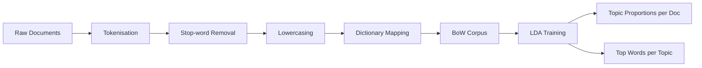

# Implementing Topic Modelling with LDA

## Overview

This lab implements classical topic modelling using **Gensim's LDA** on a small custom corpus. The pipeline covers preprocessing, bag-of-words vectorisation, model training, and topic interpretation — the standard workflow used in production analytics pipelines before deploying transformer-based alternatives.

---

## Pipeline Architecture



---

## Step 1: Environment Setup

Required libraries:

| Library | Role |
|---------|------|
| **Gensim** | `Dictionary`, `LdaModel` for BoW and LDA |
| **NLTK** | Stop words, tokenisation |

```python
from gensim import corpora
from gensim.models import LdaModel
from nltk.corpus import stopwords
from nltk.tokenize import word_tokenize
```

---

## Step 2: Corpus Preparation

A sample corpus might contain sentences about stock markets, machine learning, and football:

- *"Stock markets reacted to inflation news."* → themes: finance, economics
- *"Deep learning models require large datasets."* → themes: ML, data
- *"The football team is preparing for the World Cup."* → themes: sports

Before running the model, manually hypothesise 2–3 themes per sentence — then compare against LDA output to build intuition.

---

## Step 3: Text Preprocessing

Standard steps applied to each document:

1. **Tokenise** into words
2. **Remove stop words** (the, is, to, ...)
3. **Lowercase** all tokens (normalisation)

Output: a list of token lists, one per document.

---

## Step 4: Bag-of-Words Vectorisation

```python
dictionary = corpora.Dictionary(processed_docs)
corpus = [dictionary.doc2bow(doc) for doc in processed_docs]
```

- `Dictionary` maps each unique word to an integer ID
- `doc2bow` converts each document into a sparse vector of `(word_id, count)` pairs

This is the input representation LDA expects.

---

## Step 5: Train the LDA Model

```python
lda_model = LdaModel(
    corpus=corpus,
    id2word=dictionary,
    num_topics=3,  # K — must be set manually
    random_state=42
)
```

**`num_topics=3`** is a hyperparameter. There is no automatic way to choose $K$; practitioners experiment or use coherence metrics.

---

## Step 6: Interpret Document-Topic Assignments

```python
for doc_bow in corpus:
    print(lda_model.get_document_topics(doc_bow))
```

Example output for document 0: `[(0, 0.07), (1, 0.86), (2, 0.06)]`

| Topic Index | Confidence | Interpretation |
|-------------|------------|----------------|
| 0 | 7% | Minor contribution |
| 1 | 86% | **Dominant topic** |
| 2 | 6% | Minor contribution |

The dominant topic (highest probability) is often used as a proxy label, but the full distribution is the true output.

---

## Step 7: Inspect and Label Topics

```python
lda_model.print_topics(num_words=5)
# or
lda_model.show_topics(num_words=10)
```

Example discovered topics from a mixed corpus:

| Topic | Top Words | Inferred Label |
|-------|-----------|----------------|
| 0 | learning, datasets, model, deep, large | Machine Learning |
| 1 | markets, reacted, inflation, news, stock | Finance / Economics |
| 2 | football, team, World, Cup, preparing | Sports |

**Topic labels are manual** — inspect top words and assign meaningful names. This is standard practice in industry dashboards.

---

## Self-Assessment Questions

After running the model, evaluate quality:

- Do topics look **clean** and semantically distinct?
- Are the same words **repeated across multiple topics** (topic overlap)?
- Do the inferred labels match your manual hypotheses from Step 2?
- Does changing `num_topics` improve or degrade coherence?

---

## Extension Exercise

Replace the sample corpus with your own dataset (e.g., product reviews, news headlines) and rerun the full pipeline. Compare topic quality across domains.

---

## Common Pitfalls / Exam Traps

- **Forgetting to set `num_topics`** — LDA requires $K$ upfront; there is no default optimal value.
- **Treating confidence scores as classification probabilities** — they are topic proportions within a generative model, not calibrated class probabilities.
- **Expecting automatic topic names** — `print_topics` shows words; human interpretation is required.
- **Skipping stop-word removal** — function words dominate BoW counts and produce meaningless topics.
- **Using raw text without lowercasing** — *"Stock"* and *"stock"* become separate dictionary entries.

---

## Quick Revision Summary

- LDA pipeline: preprocess → dictionary → BoW corpus → train → interpret.
- Gensim `LdaModel` takes `corpus`, `id2word`, and `num_topics`.
- `get_document_topics()` returns proportional weights, not hard labels.
- `print_topics()` / `show_topics()` reveal top words for manual labelling.
- Preprocessing (tokenise, stop words, lowercase) is mandatory for clean topics.
- Always validate topic quality and experiment with $K$ on your own corpus.
