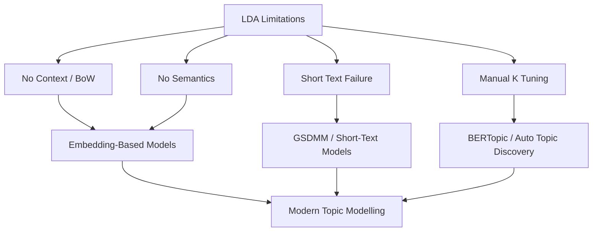

# Why Alternatives to LDA Are Needed

## LDA's Strengths and Ceiling

LDA remains widely deployed in industry for exploratory analysis on large document collections. Its probabilistic framework, interpretability, and scalability made it the default topic model for over a decade. However, as NLP advanced and text sources diversified, LDA's simplifying assumptions became limiting rather than enabling.

---

## Core Limitations of LDA

| Limitation | What It Means | Real-World Impact |
|------------|---------------|-------------------|
| **Bag of words** | No context retained | *"bank"* (river) and *"bank"* (finance) treated identically unless co-occurrence differs |
| **No word order** | Sentence structure ignored | Negation and phrasing lost (*"not good"* ≈ *"good"*) |
| **No semantic similarity** | Synonyms not linked unless co-occurring | *"automobile"* and *"car"* may split across topics |
| **Manual topic count** | $K$ must be tuned by hand | Wrong $K$ produces merged or fragmented topics |
| **Short text failure** | Too few words for mixture inference | Tweets, captions, product reviews yield incoherent topics |
| **General-purpose design** | Not optimised for domain-specific language | Legal, medical, or social-media corpora need specialised handling |

---

## Why Embedding-Based Methods Emerged

As NLP evolved from statistical co-occurrence to distributed representations, a new class of topic models emerged:

- **Sentence/document embeddings** (from BERT and similar transformers) capture semantic meaning
- **Clustering in embedding space** groups semantically similar documents without bag-of-words assumptions
- **Classical TF-IDF on clusters** still provides interpretable topic words

This hybrid approach — deep embeddings for grouping, classical NLP for labelling — powers models like **BERTopic**.

---

## Choosing the Right Tool

| Scenario | Recommended Approach |
|----------|---------------------|
| Long articles, reports, research papers | LDA (with careful preprocessing) |
| Short social media posts, reviews | GSDMM or BERTopic |
| Need semantic grouping of customer feedback | BERTopic |
| Large corpus, need fast baseline | LDA |
| Domain with rich contextual language | Embedding-based models |

---

## Common Pitfalls / Exam Traps

- **Assuming LDA is always the best topic model** — it is a strong baseline for long text, not a universal solution.
- **Applying LDA to tweets without acknowledging limitations** — exam scenarios involving short text should trigger GSDMM or BERTopic as answers.
- **Confusing "unsupervised" with "no preprocessing needed"** — LDA's limitations make preprocessing even more critical.
- **Listing only one alternative** — know at least GSDMM (short text) and BERTopic (semantic embeddings).

---

## Quick Revision Summary

- LDA ignores context, word order, and semantic similarity (bag-of-words assumption).
- Topic count $K$ must be manually tuned — no automatic selection.
- LDA performs poorly on short text (< 50 words): tweets, captions, reviews.
- Embedding-based methods address LDA's semantic blindness.
- GSDMM targets short-text, single-topic documents; BERTopic uses transformer embeddings.
- Model choice depends on text length, domain, and whether semantic grouping is required.
