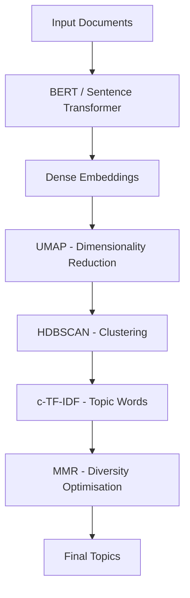
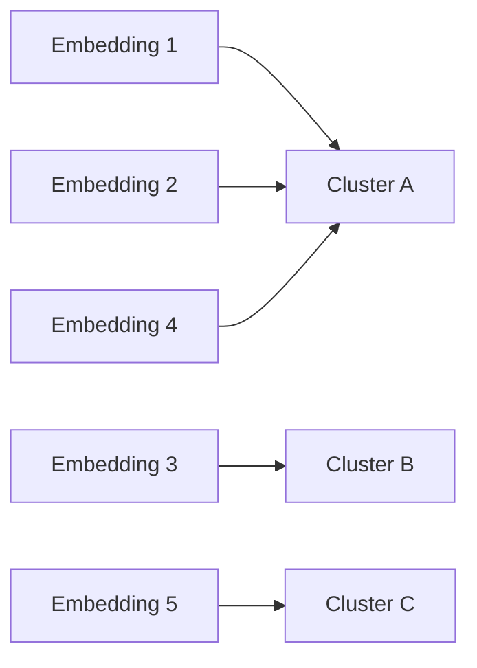

# BERTopic Architecture: End-to-End Pipeline

## High-Level Flow

BERTopic transforms raw documents into named, interpretable topics through five sequential stages. Each stage solves a specific problem: semantic representation, computational tractability, grouping, labelling, and diversity optimisation.

---

## Stage 1: Embedding Generation

**Component:** Pretrained transformer (e.g., BERT, Sentence-BERT)

**Purpose:** Convert each document into a dense vector that encodes semantic meaning.

- Captures context, synonyms, and paraphrases
- Output: high-dimensional embedding per document (e.g., 384 or 768 dimensions)

**Intuition:** Documents about "Kubernetes scaling" and "container orchestration autoscaling" land near each other in vector space even if they share few exact words.

---

## Stage 2: Dimensionality Reduction (UMAP)

**Component:** UMAP (Uniform Manifold Approximation and Projection)

**Purpose:** Compress high-dimensional embeddings into a lower-dimensional space suitable for clustering.

| Property | UMAP | PCA |
|----------|------|-----|
| Preserves local structure | Yes (emphasised) | Global variance |
| Non-linear | Yes | No |
| Clustering-friendly | Yes | Moderate |

UMAP keeps semantically similar documents close together while reducing computational cost for the clustering step.

---

## Stage 3: Clustering (HDBSCAN)

**Component:** HDBSCAN (Hierarchical Density-Based Spatial Clustering)

**Purpose:** Group documents by semantic similarity using density-based clustering.

- Documents in the same cluster discuss similar themes
- **No fixed $K$ required** — the number of topics emerges from data density
- Uses **cosine similarity** on reduced embeddings
- Outlier documents may be assigned to no cluster (noise points)

---

## Stage 4: Topic Representation (c-TF-IDF)

**Component:** Class-based TF-IDF (c-TF-IDF)

**Purpose:** Extract the most representative words for each cluster.

Standard TF-IDF scores words across all documents. **c-TF-IDF** computes term frequency and inverse document frequency **per cluster**:

- Words frequent in one cluster but rare in others become top topic terms
- Produces human-readable topic descriptions (e.g., *markets, inflation, stock, reacted*)

---

## Stage 5: MMR (Optional)

**Component:** Maximal Marginal Relevance

**Purpose:** Optimise topic word lists for **diversity** — reduce redundant or near-duplicate terms in the top-$N$ words.

- Not present in all BERTopic variants
- Enhances readability of topic labels in dashboards and reports

---

## End-to-End Data Flow Summary

| Step | Input | Output | Key Algorithm |
|------|-------|--------|---------------|
| 1 | Raw text | Dense vectors | Sentence Transformer |
| 2 | Dense vectors | Reduced vectors | UMAP |
| 3 | Reduced vectors | Cluster assignments | HDBSCAN |
| 4 | Clusters + documents | Top words per topic | c-TF-IDF |
| 5 | Top words | Diversified word list | MMR (optional) |

---

## Common Pitfalls / Exam Traps

- **Listing only "BERT + clustering"** — the full pipeline includes UMAP, HDBSCAN, c-TF-IDF, and optionally MMR.
- **Confusing UMAP with PCA** — UMAP is non-linear and preserves local neighbourhood structure; PCA is linear.
- **Assuming HDBSCAN requires preset $K$** — unlike LDA, topic count emerges from density; this is a key exam differentiator.
- **Calling it "TF-IDF" without the "c-"** — c-TF-IDF computes IDF per cluster, not globally.
- **Treating MMR as mandatory** — it is optional; smaller BERTopic configurations may omit it.

---

## Quick Revision Summary

- BERTopic pipeline: Embed → UMAP → HDBSCAN → c-TF-IDF → MMR (optional).
- BERT/sentence transformers produce semantic document embeddings.
- UMAP reduces dimensionality while preserving local structure for clustering.
- HDBSCAN clusters by density using cosine similarity; topic count is data-driven.
- c-TF-IDF extracts representative words per cluster for interpretability.
- MMR optionally diversifies top topic words to reduce redundancy.
