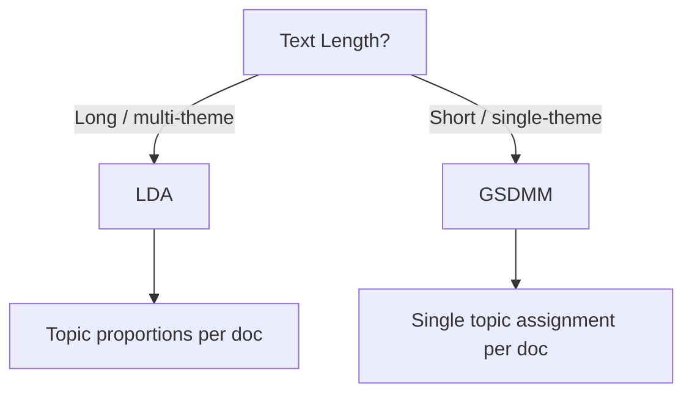

# GSDMM: Topic Modelling for Short Text

## The Short-Text Problem

LDA assumes each document is a **mixture of topics**. Long articles naturally satisfy this — a 2,000-word report might discuss technology, regulation, and market impact simultaneously. Short texts violate this assumption in practice:

- Tweets (≤ 280 characters)
- Product reviews (1–3 sentences)
- Image captions on social media

These snippets typically express **one theme**. With fewer than 50 words, LDA lacks sufficient co-occurrence signal to infer meaningful topic mixtures.

**GSDMM** (Gibbs Sampling Dirichlet Multinomial Mixture) was designed specifically for this scenario.

---

## LDA vs GSDMM: Core Assumption Difference

| Property | LDA | GSDMM |
|----------|-----|-------|
| Document-topic model | Mixture of topics | **One topic per document** |
| Best for | Long documents, articles | Short text, tweets, reviews |
| Text length | Hundreds+ words | < 50 words typical |
| Algorithm | Variational inference | Gibbs sampling |



---

## GSDMM Overview

- **Full name:** Gibbs Sampling Dirichlet Multinomial Mixture
- **Key class:** `MovieGroupProcess` (from the GSDMM Python library)
- **Assumption:** Each short document belongs to exactly one topic
- **Method:** Gibbs sampling over document-cluster assignments

This one-topic-per-document assumption aligns with how people write tweets and reviews — one thought, one theme.

---

## Implementation Pipeline

### 1. Data Source

Short-text corpus example: tweets from a public archive (JSON format with a `text` column containing tweet content and metadata columns).

### 2. Setup

```bash
git clone <gsdmm-repo>  # provides MovieGroupProcess class
```

Dependencies: `pandas`, `numpy`, `json`, `nltk`

### 3. Preprocessing

| Step | Purpose |
|------|---------|
| Drop missing values | Ensure clean input |
| Unicode normalisation | Handle encoding variants (UTF-8, ASCII) |
| Lowercasing | Normalise case |
| Regex cleaning | Remove non-alphanumeric characters |
| Stop-word removal | Filter function words |
| Stemming (Porter) | Reduce *elections* → *elect*, *remembered* → *rememb* |

### 4. Model Training

```python
from gsdmm import MovieGroupProcess

mgp = MovieGroupProcess(
    K=15,           # number of topics (manual)
    alpha=0.1,      # cluster-document hyperparameter
    beta=1.0,       # cluster-word hyperparameter
    n_iters=30      # Gibbs sampling iterations
)
mgp.fit(docs, vocab_size)
```

**Hyperparameters:**

| Parameter | Role | Tuning |
|-----------|------|--------|
| `K` | Number of topics | Set based on domain knowledge |
| `alpha` | Document-cluster density | Experiment per dataset |
| `beta` | Word-cluster density | Experiment per dataset |
| `n_iters` | Sampling iterations | Increase until convergence |

### 5. Interpreting Clusters

Rank clusters by **document count** (most populated = most important theme):

```
Cluster index 4: 630 documents → Topic: Elections/Voting
Cluster index 10: 233 documents → Topic: Vaccination/Health
Cluster index 8: 45 documents → Topic: National Security
```

Inspect top words per cluster via `mgp.cluster_word_distribution()`:

- Cluster 4: *elect, vote, state, Georgia, people* → Elections
- Cluster 10: *great, thank, news, vaccine, get* → Vaccination
- Cluster 8: *nation, section, defence, security* → National Security

### 6. Packaging Results

Build a DataFrame with columns: `text`, `topic`, `stems`

```python
def create_topics_dataframe(data_text, mgp, threshold=0.3, topic_dict, stem_texts):
    # Assign topic if probability >= threshold, else "Other"
    ...
```

- **`threshold=0.3`**: documents below 30% confidence are grouped into an "Other" category
- **`topic_dict`**: maps cluster indices to human-readable names

---

## Example Output

| Topic Name | Document Count |
|------------|----------------|
| Elections | 654 |
| Vaccination | 233 |
| National Security | 29 |
| Other | (below threshold) |

---

## Common Pitfalls / Exam Traps

- **Using LDA for tweets in an exam** — the correct short-text answer is GSDMM (or BERTopic).
- **Confusing GSDMM's one-topic assumption with LDA's mixture assumption** — this is the primary differentiator.
- **Skipping stemming for short text** — with few words per document, normalising word forms improves cluster coherence.
- **Ignoring hyperparameter tuning** — `alpha`, `beta`, and `n_iters` require experimentation; defaults may not converge.
- **Misreading cluster importance** — rank by document count, not cluster index order.

---

## Quick Revision Summary

- GSDMM = Gibbs Sampling Dirichlet Multinomial Mixture, designed for short text.
- Assumes one topic per document (opposite of LDA's mixture assumption).
- Best for tweets, captions, and product reviews (< 50 words).
- Implemented via `MovieGroupProcess` class from the GSDMM library.
- Pipeline: load JSON → clean → stem → stop words → fit → inspect clusters → package DataFrame.
- Rank clusters by document count; label topics from top word distributions manually.
- Use probability threshold to filter low-confidence assignments into "Other".
