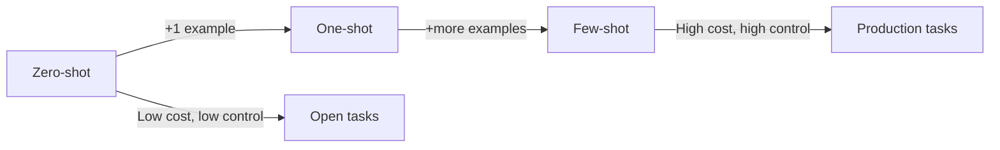

# Zero-Shot, One-Shot, and Few-Shot Prompting

## What "Shot" Means

In prompting terminology, **"shot"** refers to the number of **examples** provided in the prompt. More shots = stronger format guidance, but higher token cost.

---

## Zero-Shot Prompting

**Definition:** No examples provided — only instructions.

```
Explain the concept of overfitting in machine learning.
```

| Advantage | Limitation |
|-----------|------------|
| Simple and fast | Output format may vary |
| Low token cost | Ambiguous for structured tasks |
| Often effective for open-ended tasks | Inconsistent for classification with specific labels |

Best for: explanations, brainstorming, general Q&A where format flexibility is acceptable.

---

## One-Shot Prompting

**Definition:** One example demonstrates the desired input-output pattern before the actual task.

```
Classify the sentiment of the following text as positive, negative, or neutral.

Example:
Text: "The movie was absolutely fantastic."
Sentiment: positive

Now classify:
Text: "The new restaurant's food was delicious but the service was terribly slow."
Sentiment:
```

| Advantage | Limitation |
|-----------|------------|
| Model infers desired format from example | Slightly higher token cost |
| More consistent output structure | One example may not cover edge cases |
| More control than zero-shot | Still not guaranteed correct |

Best for: classification, formatting tasks where output structure matters.

---

## Few-Shot Prompting

**Definition:** Multiple examples (typically 2–5) demonstrate the pattern.

```
Classify the sentiment as positive, negative, or neutral.

Example 1:
Text: "The movie was absolutely fantastic."
Sentiment: positive

Example 2:
Text: "I waited for 3 hours and nobody ever called me back."
Sentiment: negative

Example 3:
Text: "The package arrived on Tuesday as scheduled."
Sentiment: neutral

Now classify:
Text: "The new restaurant's food was delicious but the service was terribly slow."
Sentiment:
```

| Advantage | Limitation |
|-----------|------------|
| Strong guidance on style and format | Longer prompts, higher token cost |
| More reliable, less ambiguous | Still no correctness guarantee |
| Common in production NLG systems | Diminishing returns beyond ~5 examples |

Best for: production classification, structured extraction, consistent formatting.

---

## Comparison Table

| Technique | Examples | Token Cost | Consistency | Control |
|-----------|----------|------------|-------------|---------|
| Zero-shot | 0 | Lowest | Variable | Lowest |
| One-shot | 1 | Low | Better | Moderate |
| Few-shot | 2+ | Higher | Best | Highest |



---

## Trade-Off: Cost vs Reliability

Few-shot prompts consume more tokens per request → higher API cost. In production, balance example count against consistency requirements. For a sentiment API handling millions of requests, 3 well-chosen examples often suffice.

---

## Common Pitfalls / Exam Traps

- **Confusing "shot" with "turn"** — shot = examples in prompt; turn = conversation exchange.
- **Claiming few-shot guarantees correctness** — it improves format consistency, not accuracy.
- **Using zero-shot for strict JSON output** — few-shot or explicit format constraints work better.
- **Too many examples wasting context window** — diminishing returns and higher cost beyond ~5 shots.
- **Inconsistent example format** — examples must match the exact output format expected.

---

## Quick Revision Summary

- "Shot" = number of examples in the prompt.
- Zero-shot: no examples; simple, fast, but format may vary.
- One-shot: one example; better format consistency.
- Few-shot: multiple examples; strongest guidance, highest token cost.
- Few-shot is common in production but does not guarantee correctness.
- Choose based on format strictness, cost budget, and task complexity.
