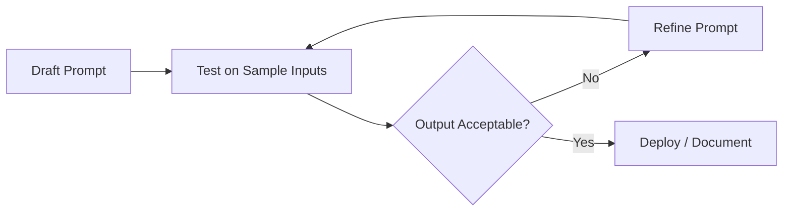

# Practical Prompt Engineering Guidelines

## Prompting Is Experimental

No prompt works perfectly on the first attempt. Prompt engineering is an **iterative experimental process** — write, test, evaluate, refine, repeat. The guidelines below accelerate convergence but do not replace testing on your specific task and model.

---

## Five Core Guidelines

### 1. Be Explicit About the Task

Describe exactly what you want the model to do. Vague tasks produce vague outputs.

| Weak | Strong |
|------|--------|
| "Analyse this text" | "Classify this product review as positive, negative, or neutral" |
| "Write about AI" | "Write a 200-word introduction to supervised learning for beginners" |

### 2. Specify the Desired Output Format

State format requirements precisely:

- "Respond in 3 bullet points"
- "Return raw JSON with keys: title, summary, tags"
- "Use uppercase labels A, B, C, D only"

The more specific the format, the closer the output matches requirements.

### 3. Avoid Vague Instructions

| Vague | Specific |
|-------|----------|
| "Be brief" | "Limit response to 100 words" |
| "Make it professional" | "Use formal tone, no contractions, third person" |
| "Summarise well" | "Summarise in 3 sentences covering cause, effect, and recommendation" |

Specificity increases determinism and reduces unwanted variation.

### 4. Add Constraints When Needed

When output must meet strict requirements, enumerate every constraint:

- Difficulty level (easy / intermediate / hard)
- Number of items (exactly 3 questions)
- Option format (A, B, C, D uppercase only)
- Include explanations for correct answers
- JSON schema with required keys

### 5. Test and Iterate

- Create multiple prompt versions
- Run each against the same inputs
- Compare outputs for accuracy, format compliance, and tone
- Keep the best version; document what changed and why

---

## Checklist Before Finalising a Prompt

- [ ] Role defined (who the model is, who the audience is)
- [ ] Task stated explicitly
- [ ] Output format specified (structure, length, tone)
- [ ] Constraints listed (difficulty, count, labels)
- [ ] Examples included if format is complex (one-shot / few-shot)
- [ ] Tested on at least 3 diverse inputs
- [ ] Edge cases handled (empty input, off-topic requests)

---

## Common Pitfalls / Exam Traps

- **Treating prompt design as a one-time step** — it requires iteration.
- **Adding constraints verbally but not in the prompt** — unstated constraints will not be followed.
- **Over-constraining creative tasks** — too many rules on brainstorming prompts stifles useful output.
- **Not testing edge cases** — empty inputs, very long inputs, and off-topic requests reveal prompt weaknesses.
- **Changing multiple variables at once during iteration** — change one element per iteration to understand what helps.

---

## Quick Revision Summary

- Prompt engineering is iterative and experimental, not one-and-done.
- Be explicit about the task with detailed instructions.
- Specify output format precisely (structure, length, tone).
- Avoid vague language — specificity improves determinism.
- Add constraints when format or content must be exact.
- Test multiple prompt versions and refine based on results.
