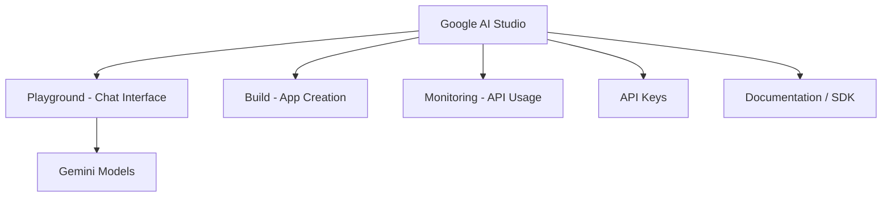

# Google AI Studio Playground

## What Is Google AI Studio?

Google AI Studio is Google's platform for testing Gemini models, generating API keys, and prototyping LLM applications. Beyond text generation, it supports image/video generation, vibe-coding, and app building — but for NLG workflows, the **Playground** is the primary interface.



---

## Playground Features

### Chat Interface

- Enter prompts and receive generated responses (Ctrl+Enter to send)
- **Thoughts / Chain-of-thought**: expandable panel showing reasoning steps the model took (more steps for complex prompts)
- Model selection dropdown (e.g., Gemini Flash, Pro variants)

### Single-Turn vs Multi-Turn

| Mode | Behaviour |
|------|-----------|
| Multi-turn (default in Playground) | Prior messages retained; "What is his age?" resolves to the previously mentioned person |
| Single-turn (API design) | Each request is independent; no pronoun resolution |

**Knowledge cutoff:** Models answer based on training data up to a cutoff date. A model trained before a leadership change may give outdated facts (e.g., answering "Joe Biden" when the current president has changed).

---

## Configuration Panel

| Setting | Purpose | Recommended |
|---------|---------|-------------|
| **Model** | Select Gemini variant | Flash for speed/cost; Pro for quality |
| **System instructions** | Persistent behaviour (same as system prompt) | e.g., "Always respond in a poem" |
| **Temperature** | Creativity control (0–2) | Stay 0–1; ~0.65 for balanced |
| **Top-P** | Nucleus sampling threshold | ~0.95 default |
| **Output length** | Max response tokens | Set to control cost |
| **Stop sequence** | Halt generation at specific string | Optional |
| **Structured outputs** | Enforce JSON schema | Enable for API integrations |
| **Thinking level** | Reasoning depth for complex puzzles | High for multi-step problems |
| **Grounding with Google Search** | Fact-check via live search | Reduces hallucination |
| **Safety settings** | Block harassment, hate speech, etc. | Configure per use case |

### Tools and Integrations

- **Function calling** — attach external tools (weather API, database queries)
- **Code execution** — run generated code in sandbox
- **URL context** — browse URLs while generating
- **Google Maps grounding** — verify location data

---

## Other Platform Sections

| Section | Purpose |
|---------|------|
| **Build** | Vibe-code full applications |
| **Dashboard** | Monitor API usage and costs |
| **Documentation** | SDK examples in Python, JavaScript |
| **Get API Key** | Generate keys for programmatic access |

---

## SDK Integration (Python)

```python
from google import genai

client = genai.Client(api_key="YOUR_KEY")
response = client.models.generate_content(
    model="gemini-2.5-flash",
    contents="Explain how AI works in a few words"
)
print(response.text)
```

Documentation provides copy-paste code snippets for quick integration.

---

## Common Pitfalls / Exam Traps

- **Trusting Playground answers as current facts** — knowledge cutoff causes outdated responses.
- **Setting temperature > 1 in production** — produces incoherent output.
- **Confusing system instructions with user prompt** — system instructions persist across turns; user prompt is per-message.
- **Ignoring API costs** — Playground usage counts toward billing once API key is linked.
- **Assuming single-turn in Playground** — the chat UI is multi-turn by default; API calls are typically single-turn unless history is passed.

---

## Quick Revision Summary

- Google AI Studio: test Gemini models, get API keys, monitor usage.
- Playground provides chat UI with model, temperature, top-P, and safety settings.
- System instructions = persistent system prompt across the session.
- Multi-turn chat retains context; single-turn API calls do not.
- Knowledge cutoff causes outdated factual answers.
- Structured outputs, grounding, and function calling support production workflows.
- Python SDK: `google.genai` with `Client` and `generate_content`.
